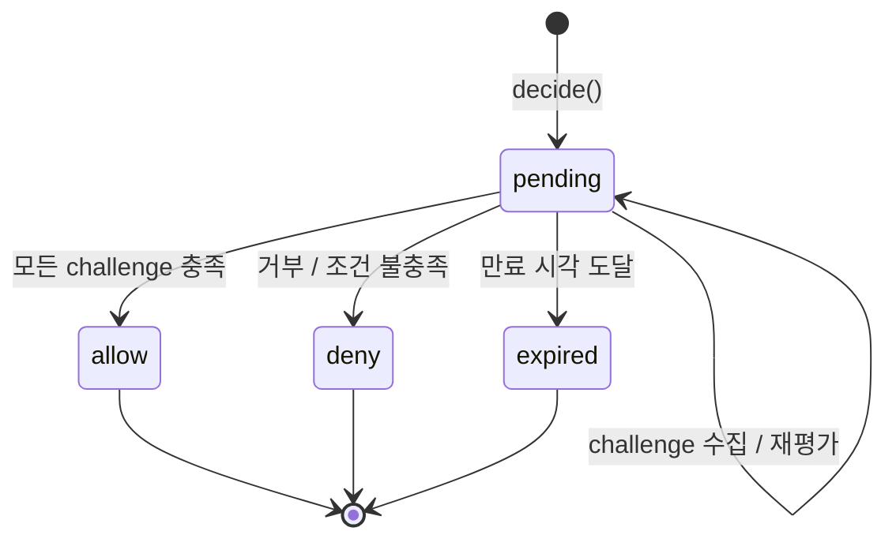
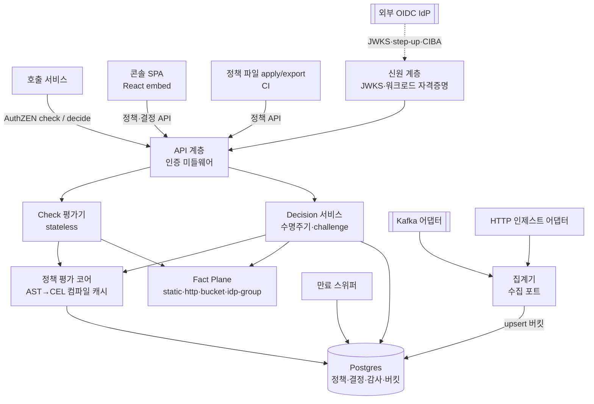
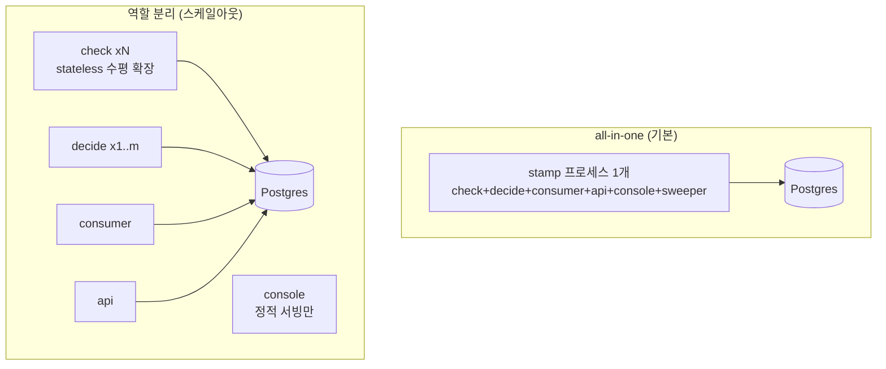
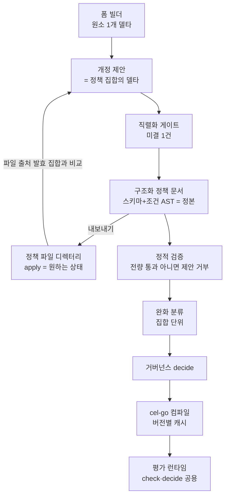
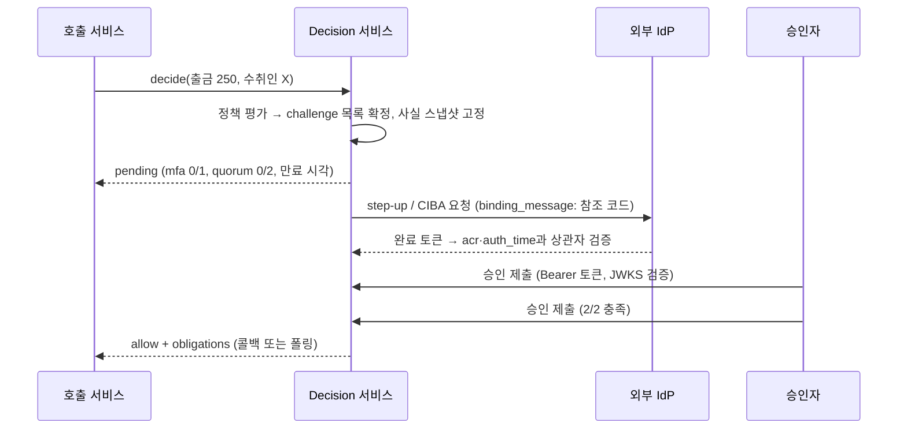
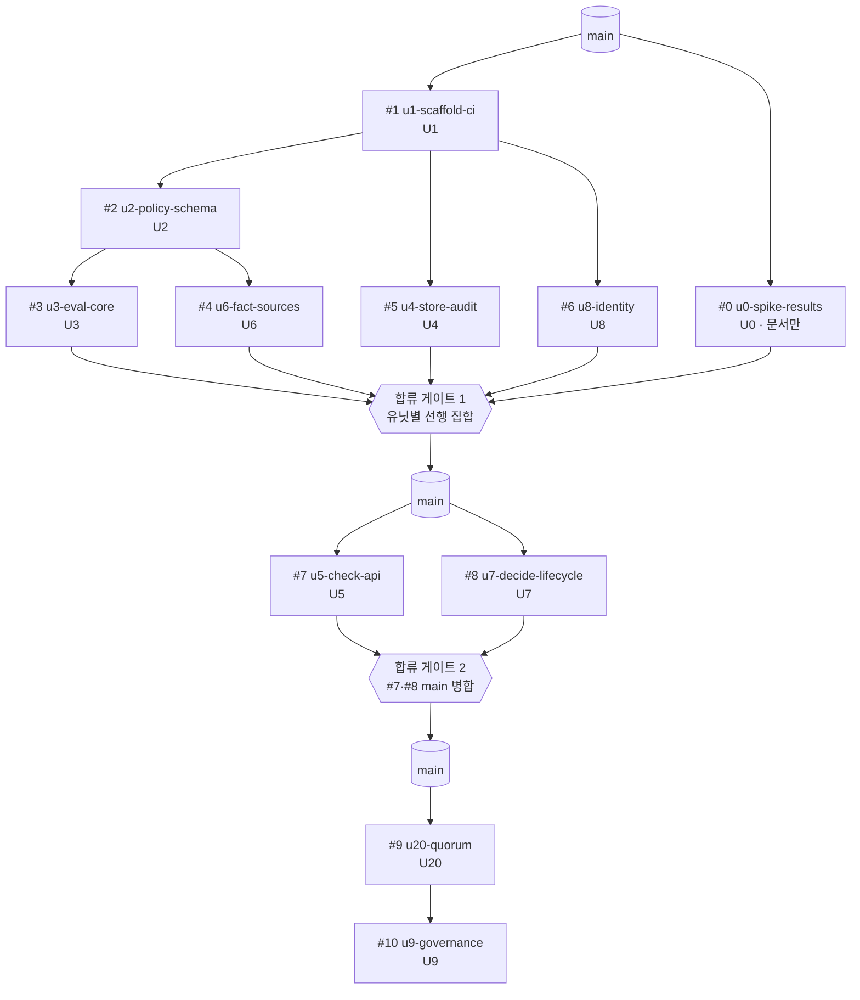

# STAMP Feature Map - Plan

## Goal Capsule

- **Objective:** STAMP(STateful Authorization for Multi-Party approvals) v1을 완결된 오픈소스 제품으로 구현한다 — Go 단일 이미지(역할 선택 실행), challenge 4종, 저작 경로 2종(폼·파일), Fact Plane 4종 source, 배포·릴리즈 체계까지.
- **Authority:** `STRATEGY.md`(제품 방향) → 이 문서의 Product Contract(무엇을) → Planning Contract(어떻게). 충돌 시 상위가 이긴다. 되돌리기 비싼 선택의 근거와 기각한 대안은 `docs/decisions/stamp-decision-log.md`에 있다 — 이 문서는 그 결정들이 이미 내려진 것으로 전제하고 쓰였다.
- **Execution profile:** M1 엔진 코어(반증 스파이크 포함) → M2·M3·M4 병행 → M5 릴리즈. M4는 콘솔과 파일 두 저작 경로를 함께 소유한다.
- **Stop conditions:** 요구사항의 의미를 바꾸는 발견, 보안 결함(인가 우회 경로), cel-go·AuthZEN 호환성의 계획 전제 붕괴 — 구현을 멈추고 계획을 개정한다.
- **Open blockers:** 없음.

---

## Product Contract

### Summary

정책 평가를 두 경로 — stateless `check()`(고QPS 즉시 판정, AuthZEN 호환)와 stateful `decide()`(pending 결정 생성, challenge 수집 후 확정) — 로 제공하는 self-hosted 엔진과, 그 위의 저작 경로 2종(폼 빌더·파일 apply)·승인함·감사 콘솔, 데모 번들을 포함한 배포 체계를 v1 완결 릴리즈로 정의한다. challenge 4종(quorum·mfa·delay·external)과 source 4종(정적 리스트·동기 HTTP·비동기 윈도 집계·IdP 그룹)을 모두 갖추고 MIT로 공개한다.

### Problem Frame

기존 정책 엔진(OPA·Cedar·Cerbos)은 stateless 판정만 제품화한다. 거래 승인·어드민 액션처럼 정족수·MFA·만료가 개입하는 고위험 인가에서는, 판정에 필요한 사실 조달과 승인 절차 조율이 전부 사용자 몫으로 남는다. 실제 OPA 운영 경험에서 이 조율 계층이 엔진보다 커졌고, Rego는 고정 kernel이 JSON을 해석하는 메타순환 구조로 퇴화했다. 이 비용 구조가 STAMP가 존재하는 이유다.

### How This Work Fits Together

<!-- ce-section: work-relationships -->

이 플랜이 v1 전 영역을 소유한다. 아래는 마일스톤 간 빌드 순서 관계다.

- **M1 엔진 코어** — 반증 스파이크·스키마·평가기·저장·신원·check/decide·quorum·거버넌스.
  M2–M5 전부를 가능하게 한다. 접점은 공개 계약 3종이다. 반증 스파이크의 결과가 위임 MFA·적합성 범위·성능 목표와 데모 번들 구성의 확정 또는 개정으로 이어진다.
- **M2 challenge 완결** — mfa(위임)·delay·external. M1의 결정 수명주기에만 의존하며 M3·M4와 독립이다.
- **M3 Fact Plane 확장** — 이벤트 수집 포트와 어댑터 2종, IdP 그룹 source. M1의 source 계약에만 의존한다.
- **M4 저작 경로 2종** — 콘솔 셸·폼 빌더·승인함·감사, 그리고 파일 apply/export. M1의 정책 스키마·결정 API·거버넌스에 의존한다. 두 경로가 같은 개정 시맨틱을 공유하므로 한 마일스톤이 소유한다.
- **M5 릴리즈** — 벤치 CI·패키징·데모 번들. 패키징 골격은 M1 직후 병행 착수 가능하되 릴리즈 게이트는 전 영역 완결이다.

### Actors

- **A1. 정책 작성자** — 두 부류가 같은 역할을 나눠 갖는다. 폼 저작자는 컴플라이언스·운영 담당 등 비개발자를 포함하며 콘솔 빌더로 저작한다. 파일 저작자는 플랫폼 엔지니어 또는 그가 구성한 CI로, 정책 파일 집합을 apply로 제출한다. 어느 쪽이든 개정 시 적용 방식을 선택하고 같은 거버넌스 결정을 통과한다.
- **A2. 요청자** — 결정을 발생시키는 서비스 또는 어드민. 정책 발동 조건의 입력이며 MFA challenge의 대상이 될 수 있다.
- **A3. 승인자** — quorum challenge의 대상. 승인함에서 pending 결정을 승인하거나 거부한다.
- **A4. 호출 서비스(PEP)** — check/decide API를 호출하고 obligation을 집행하는 애플리케이션.
- **A5. 감사자** — 컴플라이언스 담당. 감사 콘솔에서 결정 이력·정책 버전·사실 스냅샷을 조회한다.

### Requirements

#### 결정 커널

- **R1.** `check()`는 stateless 단일 요청-응답 평가를 제공하며, 요청/응답 표면은 AuthZEN Access Evaluation 단건 API와 호환된다. 판정은 AuthZEN 정본 boolean으로 반환하고, STAMP 고유 정보는 응답 컨텍스트의 네임스페이스 키(`stamp.reason`, `stamp.obligations`, `stamp.policy_version`)에만 싣는다 — 표준 소비자가 컨텍스트를 무시해도 판정 해석이 동일해야 한다.
- **R2.** `decide()`는 결정 객체를 생성한다. 결정 객체는 상태(pending / allow / deny / expired), 요구 challenge 목록과 수집 현황, 만료 시각, obligation 목록을 노출한다.
- **R3.** challenge는 플러그인 계약으로 정의된다. 계약에는 quorum(m-of-n), mfa(위임 모드 — RFC 9470 step-up과 CIBA로 외부 IdP에 위임한 뒤 `acr`와 `auth_time`을 검증하고 `amr`은 존재할 때만 대조 / direct 모드 — WebAuthn에 결정 컨텍스트 바인딩), delay(대기 시간, 지정 권한자의 취소 가능), external(외부 시스템 webhook 왕복)이 포함된다. v1 구현은 quorum·mfa(위임)·delay·external이며 direct 모드는 계약만 정의한다.
- **R4.** 결정 수명주기는 pending에서 allow / deny / expired로 전이하며, 만료 타이머와 승인 수집 API를 포함한다.
- **R5.** 정책 개정 시 작성자는 즉시 재평가와 grandfather 중 선택하며 기본값은 재평가다. 재평가는 기수집 승인 중 신규 정족수 집합에 유효한 것을 보존하고 부족분만 추가 수집한다. **재평가는 결정 생성 시점에 고정된 사실 스냅샷을 재사용하며 source를 다시 조회하지 않는다.** 신 정책이 스냅샷에 없는 source를 새로 참조하는 경우에만 그 source를 조회해 스냅샷에 추가하며, 이때는 승인 바인딩 해시가 달라져 기존 승인이 전부 무효화되고 재수집된다.
- **R6.** 정책 생성·수정·삭제는 STAMP 자신의 `decide()` 결정을 통과한다 — 저작 경로와 무관하게 같은 문을 지난다. 개정의 단위는 정책 하나 또는 정책 집합이며, 집합 개정은 단일 결정으로 처리해 부분 승인이 성립하지 않는다. 최초 설치 시 단독 관리자 모드로 시작하고, 명시적 잠금 액션 이후에는 정책 개정이 정족수를 요구한다.
- **R7.** 모든 결정은 평가에 사용된 정책 버전, 사실 스냅샷, 반환된 obligation 목록을 고정해 append-only 감사 로그에 기록한다.
- **R8.** 결정 응답은 obligation 목록을 반환한다. 집행은 호출 서비스 책임이며 v1은 반환까지만 담당한다.
- **R30.** challenge를 가진 정책은 check 경로에서 allow가 될 수 없다 — check는 `requires_decision` 사유의 deny를 반환한다. 정책별 설정이 아니라 평가기 불변식이다.
- **R53.** 요청에 매칭되는 정책이 하나도 없으면 판정은 `no_matching_policy` 사유의 deny다. check와 decide 양쪽에 적용되는 평가기 불변식이며 설정으로 뒤집을 수 없다. 정책 삭제나 최초 설치 직후처럼 정책 집합이 비는 상태의 실패 방향을 fail-closed로 고정한다.
- **R31.** 승인은 승인자가 검토한 자료의 해시에 바인딩된다. 해시 입력은 결정 컨텍스트, 사실 스냅샷, challenge 명세 중 정족수 임계값을 제외한 부분(대상 집합·challenge 종류·조건), obligation 목록이다. **정책 버전 식별자와 정족수 숫자는 입력에서 제외한다** — 임계값만 올리는 개정에서 이미 받은 승인이 불필요하게 증발하지 않게 하기 위해서다. 재평가는 이 해시가 동일할 때만 기존 승인을 보존하고, 다르면 무효화 후 재수집한다.
- **R32.** 감사 로그는 변조 탐지가 가능해야 한다. writer별 세그먼트 해시 체인과, 각 시점 전 writer의 head 해시를 함께 묶는 주기적 체크포인트, 그리고 검증 절차를 제공한다. 체크포인트는 DB 쓰기 권한만으로 위조할 수 없도록 앱 전용 키로 서명해 DB 밖으로 내보낸다 — **기본 싱크는 append-only 로컬 파일이고 선택적으로 webhook 발신을 지원하며, 싱크 경로와 서명 키는 배포 설정 표면에 노출된다.** decide와 거버넌스 감사는 상태 전이와 같은 트랜잭션에 기록한다. check 경로의 감사 유실은 체인에 유실 구간 마커(시각 범위·건수)로 남겨 검증 시 공백이 드러나게 하며, 운영자는 버퍼 포화 시 check를 deny하는 fail-closed 모드를 선택할 수 있다.
- **R33.** 거버넌스 개정은 diff를 완화 여부로 분류한다. 완화에 해당하는 것은 정족수 감소, 승인자 집합 확대, source 오류 동작 완화, challenge 제거, **정책 삭제**, **정책 발동 조건의 축소**다. 정책 삭제는 그 정책의 모든 challenge를 제거하는 것과 같으므로 항상 완화이며, 정책 추가는 비완화다. 완화 개정은 구·신 정책 중 엄격한 쪽의 요구를 충족해야 하며, 운영자가 설정한 하한(최소 승인자 수, 제안자 ≠ 승인자)을 위반할 수 없다.
- **R34.** 승인자 집합이 충족 불가능해지는 개정은 거부한다. 잠금 이전의 거버넌스 액션은 최초 기동 시 1회 출력되는 부트스트랩 토큰을 요구하며, 토큰은 잠금 성공 시 소멸하고 미사용 상태로 남으면 주기적으로 최고 심각도 감사 경고를 남긴다. 잠금 이후의 복구는 서비스 리스너가 기동하지 않은 상태에서만 실행 가능한 오프라인 break-glass 절차로만 제공하며, 최고 심각도 감사 이벤트를 남긴다.

#### 정책 언어와 계약

- **R9.** 정책은 타입 있는 스키마(entity·action·source 선언)와 구조화된 조건(필드·연산자·값)으로 구성되며, 표현력은 폼 빌더가 렌더링할 수 있는 범위로 한정한다.
- **R10.** 정책의 교환 포맷은 파일이며, 폼 저작과 파일 저작이 같은 포맷으로 왕복 가능해야 한다. 저장의 진리 원천은 엔진이고 파일은 교환·저작 매체다. **포맷은 사람이 직접 작성하고 diff로 읽을 수 있어야 한다** — AST 직렬화 덤프는 이 요구를 충족하지 않는다.
- **R11.** 공개 계약 3종 — 정책 스키마, challenge 인터페이스, 결정 API — 는 첫 릴리즈부터 semver로 버전 관리하며, 각 계약의 스펙 문서를 버전 명시와 함께 `docs/`에 둔다.
- **R12.** 정책 로드 시 스키마·타입·source 참조를 정적 검증하고, 실패한 정책은 로드를 거부한다.
- **R44.** 미저장 정책과 샘플 입력으로 시험 평가를 수행해 매칭 여부·조건별 참/거짓·발동될 challenge를 반환한다. 저장이나 개정 승인 없이 실행된다. 샘플 입력은 entity·action 선언에서 렌더링된 폼으로 받는다 — 자유 형식 JSON 입력이 아니다.
- **R45.** 파일 저작 경로는 선언적이다. 디렉터리 하나가 정책 집합의 원하는 상태이며, apply는 그 집합 전체를 하나의 개정 제안으로 만든다. **원하는-상태 비교의 대상은 저작 출처가 파일인 정책으로 한정된다** — 폼 출처 정책은 디렉터리에 없어도 삭제 제안이 되지 않는다. 파일 출처이면서 집합에 없는 정책만 삭제 제안으로 포함된다. 정적 검증에 하나라도 실패하면 제안 전체가 거부되고 부분 적용은 없다. 완화 분류는 집합 단위로 계산해 하나라도 완화면 개정 전체를 완화로 취급한다. apply 페이로드는 명시적 상한(문서 수, 문서별 바이트 크기, 조건 AST 노드 수와 깊이)을 가지며 상한 초과는 파싱 이전에 거부된다.
- **R46.** apply는 기본으로 개정 제안 식별자를 반환하고 즉시 종료한다. 대기 옵션을 주면 확정까지 블록하고 결과를 종료 코드로 반영한다 — 거버넌스가 비동기이므로 "적용됨"을 동기 반환하지 않는다.
- **R47.** 미결 개정이 존재하는 동안 새 개정 제안은 저작 경로와 무관하게 거부되고, 진행 중인 제안의 식별자와 수집 현황을 함께 알린다 — 승인자는 항상 현 발효 상태 대비 diff 하나만 검토한다. 잠금은 네 경로로 해소되며, 넷이 모두 있어야 서로 다른 교착이 각각 풀린다.
  - **제안자 철회** — 제안자는 자신의 미결 제안을 철회할 수 있다. 현 발효 상태로 되돌릴 뿐이므로 정족수를 요구하지 않으며 감사 이벤트를 남긴다.
  - **정족수 철회** — 거버넌스 정족수를 충족한 승인자 집합은 타인의 제안을 철회할 수 있다. 승인될 리 없는 제안으로 거버넌스를 점유하는 경로를 닫는다.
  - **미결 수명 상한** — 개정 제안 결정은 운영자 설정의 최대 미결 수명(기본 24시간)을 넘길 수 없고 그 시각에 expired로 전이한다.
  - **동일 출처 대체** — 같은 저작 출처의 새 제안은 미결 제안을 대체한다. 기수집 승인은 무효화되고 대체된 제안은 감사에 기록된다. 다른 출처의 제안은 대체하지 않고 거부된다. CI가 머지마다 apply 하는 사용에서 제안이 실패 대신 수렴하게 한다.

  네 경로 모두 속도 제한 대상이다 — 철회 후 즉시 재점유하거나 대체를 반복해 게이트를 붙잡는 것을 막는다.
- **R48.** 발효 정책 집합을 파일 저작 포맷으로 내보내는 경로를 제공한다. 콘솔로 시작한 배포가 파일 저작으로 전환할 때의 진입 경로이며, 내보낸 결과를 그대로 apply 하면 개정 없음으로 판정되어야 한다. 내보내기는 정책 저작 자격 또는 감사 자격을 가진 주체만 호출할 수 있고 호출자 인증을 받으며, 호출자 식별자와 산출 정책 수를 감사에 남긴다 — 산출물이 승인자 신원 목록·정족수 임계값·내부 호출 대상을 한 번에 담으므로 인증 없는 조회는 어떤 거래를 어느 임계값 아래로 쪼개면 승인을 피할 수 있는지를 알려주는 정찰 경로가 된다.
- **R49.** 저작 모드는 운영자 설정이다 — `both`(기본), `file`(콘솔의 정책 저작을 잠금), `console`(파일 apply를 잠금). `both`는 R54의 출처 분리 위에서 성립하므로 "두 경로가 같은 정책을 다툰다"가 아니라 "두 경로가 각자의 정책을 소유한다"를 뜻하고, 나머지 둘은 그 위에 한쪽 창구를 아예 닫는 더 강한 설정이다. **어느 모드에서도 승인함·감사·시험 평가와 잠금 액션은 콘솔에 남는다** — 잠금 화면이 저작 모듈과 함께 꺼지면 설치 시 `file` 모드를 켠 운영자가 단독 관리자 상태에 갇힌다.
- **R54.** 모든 정책은 생성 시점에 저작 출처(폼 또는 파일)를 부여받고, 그 출처가 어느 경로의 소유인지를 결정한다. 출처 이동은 파일 문서의 명시적 인수 선언으로만 가능하며 개정 제안에 인수 항목으로 표시된다 — 암묵적 이동은 없다. 콘솔은 파일 출처 정책을 편집할 수 없고 조회만 가능하며, 편집을 시도하면 소유 경로와 인수 절차를 안내한다.

#### Fact Plane

- **R13.** 동기 source 2종(정적 리스트, HTTP 호출)을 제공하며 각 선언은 TTL, 타임아웃, 오류 시 동작(기본 deny)을 포함한다.
- **R14.** check 경로의 source 조회는 선언된 TTL 내 캐시로 제공되며, 판정의 신선도 한계는 source 선언이 명시한다.
- **R15.** 비동기 이벤트 source를 제공한다. 이벤트 스트림을 구독해 윈도 집계 상태(예: 24시간 출금 합계)를 유지하고, 평가 시점에는 로컬 상태 조회로 응답한다. 수집은 브로커 중립 포트 뒤에 두고 v1은 어댑터 2종(Kafka, HTTP 인제스트)을 제공한다 — 인제스트 어댑터가 있으면 브로커 없이도 이 source가 동작한다.
- **R16.** IdP 그룹 조회 source를 제공한다. quorum 대상 해석과 일반 조건 모두에서 사용 가능하다.
- **R35.** 원격 source의 호출 대상은 운영자 배포 설정의 egress 허용목록으로 제한한다 — 정책 내용만으로 임의 대상을 지정할 수 없다. 링크로컬·사설 대역 기본 차단, 리다이렉트 미추종, DNS 재바인딩 방지를 위한 해석 후 고정, 앰비언트 자격증명 미사용.
- **R36.** 오류 시 allow(fail-open)는 운영자 수준 플래그의 명시적 허용이 있을 때만 유효하다. TTL 만료 항목을 장애 시 대체 응답으로 제공하지 않는다.
- **R37.** 비동기 이벤트 source는 신선도 한계를 선언하고, 수집 지연이 이를 초과하면 deny한다. 음수·차감 델타는 source가 선언한 경우에만 허용한다.
- **R52.** 이벤트 수집 포트는 브로커 개념을 노출하지 않는다 — 오프셋·파티션·컨슈머 그룹은 어댑터 안에 머물고, 포트는 이벤트 수신과 처리 완료 확정까지만 정의한다. 그 위에 다음이 따라붙는다.
  - **멱등** — 어댑터는 at-least-once만 보장하며 중복 제거는 집계기가 이벤트 식별자로 수행한다. 모든 이벤트는 생산자가 부여한 고유 식별자를 실어야 하고, 없는 이벤트는 포트가 거부한다. 중복 제거 키는 호출자 식별자로 네임스페이스를 분리해 한 호출자가 다른 호출자의 식별자를 선점할 수 없게 한다. 중복 제거 상태는 그 메트릭에 대해 선언 가능한 최대 윈도에 여유를 더한 기간만큼 보존하며, 보존 기간을 넘는 윈도를 선언한 정책은 로드가 거부된다.
  - **지연 보고** — 수집 지연은 `현재 시각 − 최근 처리 이벤트의 생산자 타임스탬프`로 정의하며, 모든 이벤트는 생산자 타임스탬프를 실어야 한다. 생산자 시계가 앞서 음수가 나오면 0으로 클램프한다. 어댑터는 이 값을 보고해야 하고, 보고할 수 없는 어댑터는 그 사실을 선언하며 신선도 한계를 쓰는 정책은 그런 source에 대해 로드가 거부된다.
  - **인제스트 인가** — HTTP 인제스트 어댑터는 쓰기 표면이므로 호출자 인증과 속도 제한을 그대로 받는다. 나아가 각 인제스트 자격증명은 운영자 설정에서 쓰기 가능한 (source, metric) 집합에 바인딩되며 범위 밖 메트릭 이벤트는 거부된다. 차감 델타 전송 권한은 source 선언과 별개로 자격증명 단위로 다시 허용되어야 한다.

#### 승인자 신원

- **R17.** STAMP는 OIDC relying party로 동작한다. 승인 제출 등 사용자 액션의 토큰을 외부 IdP의 JWKS로 검증하며, 자격증명·역할·세션을 저장하지 않는다. 검증은 고정된 발급자 집합, 필수 audience, 비대칭 알고리즘 허용목록을 강제하고, JWKS 재조회는 속도 제한과 음성 캐시로 보호한다.
- **R18.** quorum 대상 집합은 명시 목록, 토큰 claim, IdP 그룹 source 중 하나로 해석한다.
- **R38.** 위임 MFA challenge는 서버가 개시한 상관자를 저장하고, 충족 판정은 그 상관자의 정확한 일치와 1회 소비를 요구한다. `acr` 값은 운영자 허용목록으로 제한한다.
- **R40.** PEP 표면(check·decide·결정 조회)은 인증된 호출자만 접근할 수 있다. 워크로드 자격증명(OIDC client_credentials 토큰 또는 mTLS)을 검증하고 호출자 식별자를 감사 행에 기록하며, 미인증 요청은 평가 이전에 거부한다. 결정 조회는 해당 결정을 생성한 호출자 또는 대상 승인자로 제한한다.

#### 저작 UI와 콘솔

- **R19.** 정책 빌더는 폼 기반이다. 스키마와 source 선언에서 폼이 렌더링되고, 발동 조건 → source 바인딩 → 규칙 → challenge 순의 가이드형 저작 흐름을 제공한다. entity·action·source 선언도 같은 빌더 안에서 저작하며, 선언이 하나도 없는 빈 상태에서 선언 생성으로 이어지는 경로를 제공한다. 전 저작 흐름은 키보드만으로 완주 가능하고, 폼 오류는 `aria-describedby`로 필드에 연결되며 상단 오류 요약을 함께 제공하고, 대비는 4.5:1 이상이어야 한다.
- **R20.** source 바인딩 UX는 유형별 설정을 안내한다 — 동기는 호출 대상·TTL·오류 동작, 비동기는 이벤트 스트림·윈도 정의. 호출 대상은 자유 입력이 아니라 운영자 egress 허용목록에서 고르는 선택형이며, 목록에 없는 대상은 제시하지 않고 운영자 요청 경로를 안내한다.
- **R21.** 승인함에서 승인자는 자신에게 걸린 pending 결정을 조회하고 승인하거나 거부하며, 수집 현황과 만료 시각을 확인한다. 목록은 만료 임박 순으로 정렬해 잔여 시간을 표시하고, 제출 실패 4종(만료됨·이미 충족됨·대상 아님·개정으로 무효화됨)은 각각의 화면 문구와 후속 동작을 갖는다.
- **R22.** 감사 콘솔에서 감사자는 결정 이력을 조회하며, 각 결정에서 적용된 정책 버전과 사실 스냅샷을 열람한다. 감사자 자격은 운영자 설정의 토큰 claim이나 그룹으로 판별하고 서버 측에서 강제하며, 자격이 없는 사용자는 자신이 초기화했거나 대상인 결정만 조회할 수 있다.
- **R23.** 정책 개정 제출은 변경 diff와 함께 완화 분류 결과·위반한 운영자 하한·영향받을 pending 결정 건수를 제출 전에 보여주고, 적용 방식(기본 재평가)을 선택하게 한 뒤 개정 결정 플로로 이어진다. 운영자 하한을 위반하는 개정은 제출 자체를 막는다. **diff 뷰는 다중 정책 개정을 표시할 수 있어야 한다** — 정책별로 접히되 완화로 분류된 항목은 펼친 채 상단에 놓고, 추가·수정·삭제를 시각적으로 구분하며, 접힌 상태에서도 총 변경 정책 수와 완화 건수가 보이게 한다.
- **R55.** 접힘은 표시 억제가 아니라 시각적 압축이다. 접힌 항목도 DOM에 렌더링되어 스크린 리더와 페이지 내 검색에 잡히며, 승인 버튼은 모든 항목이 최소 한 번 펼쳐진 뒤에만 활성화된다. 이 두 규칙이 있어야 "승인자가 본 것에 해시가 묶인다"는 R31의 보장이 접힘 UI와 양립한다. 승인함과 감사 콘솔은 정책 빌더와 같은 접근성 수준을 만족한다 — 키보드 완주, `aria-describedby` 오류 연결, 4.5:1 대비. 펼침·접힘 컨트롤은 키보드로 조작 가능하고 `aria-expanded` 상태를 노출하며, 변경 유형 구분은 색 외에 아이콘이나 텍스트 라벨로도 전달한다.
- **R41.** 최초 설치 인스턴스는 미잠금 상태를 상시 경고로 표시하고, 잠금 진행 화면에서 해석된 승인자 집합과 정족수를 먼저 보여준 뒤 명시적 재입력으로 확인받는다.
- **R50.** 콘솔의 API 기준 주소는 설정 가능하고 엔진은 콘솔 오리진 허용목록을 지원한다 — 동봉 서빙이 기본이지만 같은 번들을 다른 오리진에서 서빙해도 동작해야 한다. **기준 주소는 콘솔을 서빙하는 측이 내려주는 운영자 설정에서만 온다** — 질의 문자열·해시·localStorage처럼 브라우저 사용자가 쓸 수 있는 출처에서 읽지 않는다. 콘솔 응답의 CSP는 `connect-src`를 설정된 API 오리진과 IdP로 한정해, 번들에 침투한 코드가 승인자 토큰을 임의 대상으로 반출하지 못하게 한다 — 오리진 허용목록은 브라우저가 집행하는 요청 측 통제라 이 방향을 막지 못한다. 콘솔은 공개 계약 밖의 엔드포인트를 호출하지 않으며 이를 CI에서 검사한다.

#### 확장과 운영

- **R24.** check 경로는 인스턴스 간 상태 비공유로 수평 확장 가능해야 한다. decide 경로는 공유 저장소를 사용한다. 정책 발효 후 최대 `policy_refresh_interval`(기본 5초) 내에 모든 check 인스턴스가 신 버전으로 판정한다. 갱신 실패가 이어지면 별도 설정 `policy_staleness_deadline`(기본 60초)까지는 구 버전으로 판정하되 staleness 메트릭과 경고를 노출하고, 그 시각을 넘긴 인스턴스만 fail-closed로 전환한다 — 신선도 요구와 가용성 유예를 같은 노브에 묶으면 통상적인 DB 페일오버에서 check 티어 전체가 동시에 deny로 떨어진다.
- **R39.** 역할별로 분리된 DB 권한을 제공한다 — check는 읽기와 감사 삽입, consumer는 버킷 upsert만. 외부 콜백 수신 표면은 PEP·콘솔 표면과 분리된 리스너로 노출한다.
- **R51.** 역할 플래그에서 콘솔 서빙과 API 표면은 독립적으로 선택된다. 콘솔 없이 API만, API 없이 콘솔 정적 서빙만 기동할 수 있어야 한다.
- **R42.** 모든 비밀(OIDC client secret, 역할별 DB 자격증명, webhook 서명 키, 감사 체크포인트 서명 키)은 파일 또는 Secret 참조로만 주입되며 차트 values·이미지·로그에 평문으로 존재하지 않는다. 서명 키는 식별자를 가져 무중단 회전이 가능하다. 데모 전용 자격증명으로의 기동은 비-데모 프로파일에서 거부한다.
- **R43.** decide 생성, challenge 발급(특히 위임 MFA의 IdP 요청), 외부 webhook 발신, 승인 제출, 개정 제안의 제출·철회·대체는 호출자·주체별 속도 제한과 미결 결정 상한을 가지며, 한도 초과는 deny와 감사 이벤트로 처리한다.
- **R25.** 단일 컨테이너와 Postgres로 self-host 설치가 가능해야 한다.
- **R26.** check p99 지연과 최대 QPS를 CI에서 상시 벤치마크한다. 웜 캐시 경로와 미스율을 포함한 종단 경로를 각각 별도 임계값으로 추적한다.

#### 릴리즈

- **R27.** MIT 라이선스로 공개한다.
- **R28.** 데모 번들을 동봉한다. docker-compose와 Keycloak, 예제 정책으로 구성하며, 퀵스타트 문서만 따라 하면 설치부터 첫 판정까지 도달하고 F4·F5·F6이 종단 시연 가능하다. **데모의 위임 MFA 기본 경로는 RFC 9470 step-up 리다이렉트다** — Keycloak의 CIBA는 별도 decoupled authentication server를 요구하는데 그 서버는 동봉되지 않으므로, CIBA를 데모에 넣으면 인증 승인 UI를 직접 지어야 한다. CIBA는 계약과 클라이언트 구현으로 남기고 모의 OP로 검증한다. 기본 프로파일은 HTTP 인제스트 어댑터를 써서 브로커 없이 구성하고, Kafka 경로는 선택 오버레이로 제공해 어댑터 2종이 모두 시연되게 한다. 예제 정책은 파일 저작 포맷 그대로이며 퀵스타트가 apply로 적재한다.
- **R29.** 컨테이너 이미지와 Helm 차트를 릴리즈 산출물로 제공하고, 릴리즈는 semver와 체인지로그를 따르며 산출물에 SBOM과 서명을 동반한다.

### Key Flows

- **F1. 계좌 화이트리스트 검사** (check 경로)
  - **Trigger:** PEP가 transaction의 출발·도착 계좌로 check() 호출.
  - **Steps:** 정책 매칭 → source 조회(화이트리스트, 캐시 TTL 내) → 조건 평가 → 즉시 allow/deny 반환, 감사 기록.
  - **Covers:** R1, R7, R13, R14.
- **F2. 정책 수정 정족수 승인** (decide 경로)
  - **Trigger:** 작성자가 폼에서 정책 개정을 제출.
  - **Steps:** 개정 요청이 decide() 통과 → quorum challenge 생성, pending 결정 반환 → 승인자들이 승인함에서 승인 → 정족수 충족 시 allow 전이, 개정 발효 → 발효 시점에 선택된 적용 방식 실행.
  - **Covers:** R2, R3, R4, R6, R7, R21, R23.
- **F3. 개정 발효 시 pending 결정 처리**
  - **Trigger:** F2의 개정이 발효되고, 구 정책에 걸린 pending 결정이 존재.
  - **Steps:** 작성자가 선택한 방식 적용 — 재평가(기본)는 고정 스냅샷 기준으로 유효 승인을 보존하고 부족분을 재수집, grandfather는 구 정책 버전으로 계속. 각 pending 결정에 적용된 방식을 감사 기록.
  - **Covers:** R5, R7, R31.
- **F4. 고액 출금 복합 승인** (MFA + quorum)
  - **Trigger:** 한도 초과 출금으로 decide() 호출.
  - **Steps:** MFA challenge 발급(상관자에서 파생한 짧은 참조 코드를 `binding_message`에 싣고 IdP step-up 또는 CIBA 요청) → 요청자가 IdP에서 인증 완료 → STAMP가 `acr`·`auth_time`과 상관자를 검증 → quorum challenge 병행 수집 → 모두 충족 시 allow.
  - **Covers:** R2, R3, R4, R38.
- **F5. 벨로시티 한도 검사** (비동기 source)
  - **Trigger:** 출금 요청으로 check() 또는 decide() 호출.
  - **Steps:** 이벤트 스트림에서 유지된 24시간 집계 상태를 로컬 조회 → 한도 비교 → 판정. 수집 경로는 어댑터에 무관하다.
  - **Covers:** R15, R37, R52.
- **F6. 파일 저작 집합 개정** (파일 경로)
  - **Trigger:** 작성자의 CI가 정책 디렉터리 변경 후 apply 실행.
  - **Steps:** 페이로드 상한 확인 → **미결 개정 유무 확인** → 디렉터리를 원하는 상태로 해석 → 파일 출처 발효 집합과 비교해 추가·수정·삭제·인수 산출 → 정적 검증 전량 통과 확인 → 집합 전체를 하나의 개정 제안으로 decide() 통과 → apply는 제안 식별자 반환 → 승인자가 승인함에서 다중 정책 diff를 검토·승인 → 발효 시 적용 방식 실행.
  - 미결 개정 확인이 파싱·검증 앞에 오는 이유는, 확정적으로 거부될 요청이 정책 집합 전체의 파싱과 CEL 컴파일 비용을 먼저 치르지 않게 하기 위해서다.
  - **Covers:** R6, R10, R23, R45, R46, R47, R54.

결정 수명주기의 상태 전이:



### Acceptance Examples

- **AE1** *(R1, R13)* — 화이트리스트에 계좌 X가 있을 때 `from=X`인 transaction의 check()는 즉시 allow, 미등록 계좌 Y는 즉시 deny.
- **AE2** *(R2, R3, R4)* — 정족수 2-of-3 정책에서 decide() 후 한 명만 승인하면 결정은 pending(1/2)이고, 만료 시각 도달 시 expired.
- **AE3** *(R5, R31)* — 승인 1건이 수집된 pending 결정에 정족수만 3으로 올리는 개정이 기본값으로 발효되면, 임계값은 해시 입력이 아니므로 승인 해시가 동일해 보존되고 결정은 pending(1/3)이 된다.
- **AE4** *(R6)* — 최초 설치 직후 단독 관리자가 첫 정책을 생성하고 잠금을 실행하면, 이후 모든 정책 개정은 정족수 결정을 통과해야만 발효된다.
- **AE5** *(R13)* — 화이트리스트 source가 타임아웃하면 check()는 선언된 오류 동작대로 deny를 반환하고 장애 사유를 감사에 남긴다.
- **AE6** *(R3, R38)* — 위임 MFA challenge의 완료 토큰이 `acr`·`auth_time` 요구를 충족하지 않거나, 존재하는 `amr`이 요구와 어긋나거나, 상관자가 다른 결정의 것이거나, 이미 소비된 토큰의 재제출이면 challenge는 미충족으로 남는다.
- **AE7** *(R15)* — 24시간 출금 합계가 한도 직전일 때 한도를 넘기는 요청은 deny이며, 집계 상태 조회는 외부 왕복 없이 수행된다.
- **AE8** *(R10, R19)* — 폼 빌더로 저작한 정책을 파일 포맷으로 내보내 다시 가져오면 의미 손실 없이 동일한 정책으로 로드된다.
- **AE9** *(R28)* — 새 환경에서 퀵스타트 문서의 절차만 수행하면 데모 번들이 기동되고 예제 정책으로 첫 판정(check 1건, decide 1건, 벨로시티 deny 1건)이 성공하며, 스크립트 시작부터 첫 판정까지 소요 시간이 CI 아티팩트로 기록된다. 초기 목표는 15분이며 성능 목표와 같은 가정 지위다.
- **AE10** *(R30)* — quorum challenge를 가진 정책은 어떤 사실 조합으로 check()를 호출해도 결코 allow가 아니며 `requires_decision` 사유의 deny다.
- **AE11** *(R33)* — 2-of-3 거버넌스에서 제안자 a가 정족수를 1로 낮추는 개정을 제출하고 a와 b가 승인하면, 제안자 승인이 계수되지 않아 유효 승인은 1건뿐이고 완화 개정의 엄격한 쪽 요구에 미달해 발효되지 않는다. 제안자가 아닌 두 명이 승인하면 같은 개정이 발효된다.
- **AE12** *(R35)* — 링크로컬 주소 또는 내부 호스트로 302 리다이렉트하는 대상을 source로 선언하면 로드 시점과 호출 시점 모두에서 거부된다.
- **AE13** *(R31)* — 정족수 집합이 동일해도 obligation이 바뀐 개정이 발효되면 기존 승인은 전부 무효화되고 재수집된다.
- **AE14** *(R45)* — 정책 3건이 발효 중일 때 디렉터리에서 1건을 지우고 1건을 수정해 apply하면, 수정과 삭제를 담은 **단일** 개정 제안이 생성되고 승인자는 두 변경을 한 diff로 검토하며, 정족수 충족 시 둘이 함께 발효된다.
- **AE15** *(R45)* — 디렉터리의 정책 5건 중 1건이 미선언 source를 참조하면 제안이 생성되지 않고 나머지 4건도 적용되지 않으며 실패 정책과 사유가 반환된다.
- **AE16** *(R47)* — 미결 개정이 승인 대기 중일 때 다른 저작 경로에서 새 개정을 제출하면 거부되고 진행 중 제안의 식별자와 수집 현황이 반환된다.
- **AE17** *(R48)* — 콘솔로만 저작해 온 배포에서 발효 정책 집합을 내보내 그대로 apply하면 개정 없음으로 판정되어 제안이 생성되지 않는다.
- **AE18** *(R28, R52)* — 브로커 없이 기동한 데모 번들에서 HTTP 인제스트로 출금 이벤트를 전송한 뒤 한도 초과 요청을 보내면, F5가 Kafka 구성과 동일하게 deny를 반환한다.
- **AE19** *(R52)* — 수집 지연을 보고할 수 없다고 선언한 어댑터에 대해 신선도 한계를 선언한 정책은 로드가 거부된다.
- **AE20** *(R47)* — CI가 잘못된 디렉터리로 apply해 미결 제안이 생겼을 때 제안자가 철회하면, 정족수 없이 즉시 게이트가 해제되고 다른 경로의 새 제안이 수락되며 철회가 감사에 남는다.
- **AE21** *(R47)* — 승인될 수 없는 제안이 미결로 점유 중이고 제안자가 철회하지 않을 때, 거버넌스 정족수를 충족한 승인자들의 철회로 게이트가 해제된다. 정족수를 못 채운 철회 시도는 거부된다.
- **AE22** *(R47)* — 파일 경로의 미결 제안이 있을 때 같은 경로에서 새 apply를 제출하면 기존 제안이 대체되고 기수집 승인이 무효화되며, 같은 시점 폼 경로의 제출은 대체하지 않고 거부된다.
- **AE23** *(R33, R45)* — 2-of-3 거버넌스에서 제안자가 고액 출금 정책 파일만 지우고 apply하면, 삭제 델타가 완화로 분류되어 제안자 승인이 계수되지 않고 운영자 하한이 적용되므로 단독으로는 발효되지 않는다.
- **AE24** *(R53)* — 어떤 정책에도 매칭되지 않는 요청은 check()와 decide() 양쪽에서 `no_matching_policy` 사유의 deny를 반환한다.
- **AE25** *(R45, R54)* — 기본 모드에서 콘솔 저작 정책 1건과 파일 저작 정책 2건이 발효 중일 때 파일 2건만 담긴 디렉터리로 apply하면, 콘솔 출처 정책은 삭제 제안에 포함되지 않고 델타가 비어 제안이 생성되지 않는다.
- **AE26** *(R54)* — 파일 출처 정책을 콘솔에서 편집하려 하면 거부되고 소유 경로와 인수 절차가 안내된다. 파일 문서에 인수 선언을 담아 apply하면 출처가 이동하고 개정 제안에 인수 항목으로 표시된다.
- **AE27** *(R52)* — HTTP 인제스트로 수집 중인 벨로시티 source에서 마지막 이벤트의 생산자 타임스탬프가 신선도 한계보다 오래되면 해당 source 조회는 deny를 반환한다. Kafka 경로와 동일한 판정이다.

### Success Criteria

- **릴리즈 게이트** — R1–R44와 R50–R55를 무조건 충족한 상태로 최초 공개. 파일 저작 경로(R45–R49)는 조건부 범위다.
- **파일 저작 경로 결정점 — 파일 저작 유닛 착수 직전.** 그 시점까지 디자인 파트너 대화에서 파일 저작 수요가 한 건이라도 확인되면 R45–R49를 게이트에 포함한다. 확인되지 않으면 R45–R49와 해당 유닛을 이연으로 옮기고 근거와 함께 `docs/`에 기록한다. 어느 쪽이든 개정 델타 자료형은 M1에서 이미 확정되므로 되짚는 비용이 없다 — 이것이 조건부로 둘 수 있는 이유다.
- **폼 저작 경로 반증 조건.** 저작 경로별 개정 건수를 배포에서 기록하고, 비개발자가 폼만으로 정책 1건을 저작·개정까지 완주한 사례가 도입 배포 전체에서 0건이면 v2에서 콘솔 저작 투자를 재검토한다. 파일 저작 쪽에만 반증 조건을 두면 유지 비용이 가장 큰 쪽(콘솔 3유닛)이 검증 없이 남는다.
- 퀵스타트 경로가 재현 가능하고 소요 시간이 기록됨 — time-to-first-decision 지표의 전제.
- check 벤치마크가 CI에 존재하고 히트·미스 두 수치가 추적됨.
- 두 원 시나리오(F1, F2)가 데모 가능하고 F4·F5·F6도 데모 번들에서 종단 시연 가능.
- 같은 정책 집합이 폼과 파일 양쪽에서 저작 가능하고 왕복에서 의미가 보존됨.
- **orchestrator 대체율의 첫 측정점** — Problem Frame이 근거로 든 사용자의 OPA 운영 경험 속 승인·조율 코드를 재현 대상으로 고정하고, STAMP 정책으로 재현한 뒤 대체되지 않고 남은 로직을 `docs/`에 목록으로 기록한다. 회사 적용이 성사되면 그 시스템으로 대체할 수 있다. 대상을 지금 고정하지 않으면 세 지표 중 유일하게 제품 가치를 직접 재는 것이 릴리즈 시점에 평가 불가로 남는다.

### Scope Boundaries

**이연 (v2 후보)**

- MFA direct 모드(WebAuthn 결정 컨텍스트 바인딩) 구현 — 계약은 정의됨
- challenge 플러그인 SDK의 서드파티 공개 — v1은 내장 4종까지
- 정책 시뮬레이션 고급 기능(과거 데이터 백테스트, what-if 분석)
- AuthZEN batch evaluations와 Subject/Resource/Action Search API — v1은 Access Evaluation 단건 프로파일까지
- AuthZEN 확장 스펙의 공식 제안 문서화 — v1은 호환 구현까지
- 다중 테넌시
- gRPC fact source — 임의 대상 호출에 필요한 디스크립터 조달을 요구하는 유스케이스가 v1에 없다
- 승인 알림 채널(메일·슬랙) — 승인함 pull과 external challenge webhook으로 대체
- 세 번째 이후의 이벤트 어댑터(NATS·SQS·Pub/Sub) — 포트가 v1에 있으므로 추가는 어댑터 구현만이다
- 콘솔 SPA를 별도 이미지·CDN으로 배포하는 구성 — v1은 동봉 하나만 배포하고 분리 가능성만 계약으로 확보한다
- 병행 미결 개정 — 직렬화를 택했으므로 동시 개정 수요가 실측되면 그때 재검토한다

**제품 정체성 밖**

- SaaS 호스팅 — self-hosted 우선, 추후 control plane SaaS로만 재고
- 범용 워크플로 엔진 — 인가에 필요한 상태까지만
- 인증 구현 — step-up은 IdP에 위임하고 토큰 검증만 수행, IdP가 되지 않음
- XACML 와이어 포맷 호환
- 정책 저장 백엔드의 플러그인화 — 이벤트와 달리 정책 저장은 거버넌스 결정·감사 체인과 같은 트랜잭션에 있어야 하므로 떼어낼 수 없다
- 엔진이 외부 소스를 주기적으로 당겨오는 동기화 — 유입이 거버넌스를 우회한다. 필요하면 외부에서 apply를 호출하는 형태로 구현한다

### Risks & Mitigations

| 리스크 | 완화 | 소유 유닛 |
|---|---|---|
| check 경로가 challenge를 우회해 승인 없이 allow | 평가기 불변식으로 차단 | U3, U5 |
| 정책이 없는 상태에서 판정이 allow로 떨어져 인가 우회 | 무매칭 = deny 불변식, 설정으로 뒤집기 불가 | U3 |
| 정족수가 스스로를 약화시키는 개정을 통과시킴 | diff 완화 분류와 운영자 하한 | U9 |
| 정책 삭제가 완화 통제를 우회 | 삭제·조건 축소를 완화 유형에 포함 | U9 |
| 정책이 지정한 source URL을 통한 SSRF | 운영자 egress 허용목록, 사설 대역 차단 | U6, U18 |
| 잠금 미실행 방치 또는 잠금 후 승인자 소실로 영구 잠김 | 부트스트랩 토큰 게이팅과 미사용 경고, 충족 불가 개정 거부, 오프라인 break-glass | U9, U18 |
| 저작 모드가 콘솔을 잠가 잠금 액션까지 함께 사라짐 | 잠금 액션과 미잠금 경고는 모든 저작 모드에서 유지, CLI 잠금 서브커맨드 병행 | U19 |
| 감사 체인이 check 경로를 직렬화해 수평 확장을 막음 | writer별 세그먼트 체인과 교차 연결 체크포인트, 배치 Merkle 루트 | U4, U5 |
| 감사 기록 변조 또는 유실로 흔적 소멸 | 해시 체인, 동일 트랜잭션 기록, 유실 구간 마커, DB 밖 서명 체크포인트 | U4, U5 |
| 강화된 정책 발효 후에도 구 버전 인스턴스가 allow 반환 | 전파 상한과 초과 시 fail-closed 전환 | U5 |
| DB 페일오버 중 check 티어 전체가 동시에 deny로 떨어짐 | 신선도 요구와 가용성 유예를 별도 설정으로 분리 | U5 |
| step-up 토큰이 다른 결정에 재사용됨 | 서버 개시 상관자 1회 소비와 `acr` 허용목록 | U10 |
| 발급자 혼동·audience 누락·JWKS 재조회 폭주 | 발급자·audience·알고리즘 고정, 재조회 속도 제한 | U8 |
| 개정 후 보존된 승인이 미검토 내용을 인가 | 승인의 내용 해시 바인딩과 표시 범위 일치 | U9, U16 |
| 이벤트 위조·지연으로 벨로시티 한도 무력화 | 수집 인증, 차감 델타 제한, 신선도 한계 deny | U12 |
| 자격증명 하나로 남의 주체 집계를 조작해 거래를 막거나 한도를 우회 | 자격증명별 (source, metric) 범위 바인딩과 차감 권한 분리 | U12 |
| 이벤트 식별자 선점으로 정상 이벤트가 중복 처리되어 삭제됨 | 중복 제거 키의 호출자 네임스페이스 분리 | U12 |
| 중복 제거 보존 기간이 집계 윈도보다 짧아 재생이 이중 가산 | 보존 기간을 최대 선언 윈도에 연동, 초과 윈도 정책은 로드 거부 | U4, U12 |
| 정책 작성자가 fail-open을 선언해 우회 | 운영자 플래그 필수, 만료 캐시 대체 금지 | U6 |
| check 파드 침해가 정책 쓰기로 확대 | 역할별 DB 권한과 리스너 분리 | U4, U18 |
| 인가 엔진 자신의 표면이 무인증으로 노출 | 워크로드 자격증명 검증과 결정 조회 제한 | U5, U7 |
| 정책 집합 내보내기가 승인 구조를 유출 | 저작·감사 자격 요구와 호출 감사 기록 | U19 |
| 콘솔 기준 주소 조작으로 승인자 토큰이 외부로 반출 | 설정 출처를 서버 측으로 고정, `connect-src` 제한 | U14 |
| 콘솔이 비공개 엔드포인트를 갖게 되어 분리 이음새가 닫힘 | 공개 계약 밖 호출 금지의 CI 검사 | U14 |
| 비밀이 차트 values·이미지에 평문으로 유입 | Secret 참조 주입과 키 회전 | U18 |
| decide·MFA 반복 호출로 자원 고갈과 MFA fatigue | 호출자·주체별 속도 제한과 미결 상한 | U7, U10, U11 |
| 승인될 수 없는 제안 하나가 거버넌스 전체를 점유해 긴급 강화를 막음 | 해소 경로 넷과 제출·철회 속도 제한 | U19 |
| 확정적으로 거부될 apply가 전량 파싱·컴파일 비용을 먼저 치러 자원 고갈 | 페이로드 상한과 미결 확인의 파싱 선행 배치 | U19 |
| 두 저작 경로가 서로를 덮어써 정책이 조용히 되돌아감 | 정책별 저작 출처 분리와 명시적 인수, 미결 개정 직렬화 | U19 |
| 기본 모드에서 CI apply가 콘솔 저작 정책을 매번 삭제 제안 | 원하는-상태 비교를 파일 출처로 한정 | U19 |
| 다중 정책 diff가 커져 승인자가 실질 검토 없이 승인 | 정책별 접힘과 완화 항목 상단 배치, 전체 펼침 후 승인 활성화 | U16 |
| 파일 포맷이 AST 덤프로 굳어 파일 저작이 실사용 불가 | 사람이 쓰고 diff를 읽을 수 있어야 한다는 요구를 포맷 확정 시점에 강제 | U2 |
| 포트가 이름만 중립이고 Kafka 개념을 누출 | 오프셋·파티션 미노출과 어댑터 2종 동시 구현으로 검증 | U12 |
| 의존성 공급망 침해 | 의존성 고정과 `govulncheck` CI, SBOM·서명 아티팩트 | U1, U18 |
| 얇은 근거 위의 결정이 M5에서야 반증되어 대규모 재작업 | M1 내 반증 스파이크로 확인 시점을 앞당김 | U0 |

### Dependencies / Assumptions

- 1인 사이드 프로젝트다. 완결 릴리즈로 공개까지의 기간이 길어지는 리스크를 인지하고 선택했으며, 2026-08-10 개정으로 요구 11건·유닛 2개가 늘고 아무것도 빠지지 않았다는 사실을 포함해 재확인했다. 범위를 줄이는 유일한 명시적 지렛대는 Success Criteria의 파일 저작 결정점이다.
- 배포 환경에 OIDC IdP가 존재한다고 가정한다. 위임 MFA는 IdP의 step-up 또는 CIBA 지원을 요구하며, 이 능력을 실제로 갖춘 self-hostable IdP의 존재는 U0가 확인한다 — 미확인 시 MFA 결정과 데모 번들 구성을 개정한다.
- AuthZEN은 2026-01 Final 승인으로 안정적이므로 check 표면은 스펙에 직접 구현한다.
- Postgres SQL/PGQ는 정식 릴리즈 전이므로 의존하지 않는다. 관계 조회 실험 옵션으로만 유지한다.
- 파일 저작을 1급으로 요구하는 팀이 실제로 존재한다는 것은 사용자의 판단이며 구체 사례로 검증되지 않았다. 비용 비대칭이 실제로 성립하는 것은 개정 델타 자료형과 파일 포맷의 사람-가독성까지이고, apply·export·저작 모드·CLI는 가산적이라 결정점에서 조건부로 다룬다.
- 정책 개정이 저빈도 이벤트라는 것이 미결 직렬화의 전제다. CI가 머지마다 apply 하는 사용에서는 이 전제가 약해지므로 동일 출처 대체가 그 격차를 메운다. 실사용에서 마찰이 관측되면 병행 미결로 재검토한다.

### Outstanding Questions

모두 비차단이다. 구현 착수를 막지 않으며 해당 유닛 진입 시점에 결정한다.

- 감사 스냅샷의 보존 기간과 삭제 요구 대응 — 개인정보·금융정보를 append-only 체인에 영구 고정하는 구조라 사후 개조 비용이 크다. 스냅샷을 별도 테이블로 분리해 체인에는 해시만 남기는 구조를 v1에 넣을지 v2로 미룰지. 내보내기가 정책 집합을 파일로 복제하기 시작하면 승인자 신원의 삭제 요구 범위가 엔진 밖으로 확장된다는 점도 함께 본다 (U4).
- 콘솔 사용자의 역할(저작·승인·감사) 판별 출처 — IdP claim인지 거버넌스 정책의 대상 집합에서 유도하는지. 내보내기 호출 자격을 어느 쪽으로 판별할지도 여기 포함된다 (U14).
- 승인자의 거부 제출이 결정을 즉시 deny로 전이시키는지, 정족수 충족 불가가 확정될 때까지 pending인지. 미결 개정 해소 경로가 넷이 되면서 거버넌스 잠금의 유일한 출구는 아니게 됐지만 일반 결정의 수명주기에는 여전히 필요하다 (U7).
- 운영자 하한(최소 승인자 수, 제안자 ≠ 승인자)의 기본값과, 잠금 이후 이 하한 자체를 변경하는 경로 (U9).
- 감사 콘솔의 조회 축(기간·정책·주체·상태)과 정렬·페이지네이션, 대응 인덱스 (U16 설계 시, U4 마이그레이션에 반영).
- PEP 인증 방식을 mTLS로 고정할지 client_credentials로 통일할지 — 데모 번들이 보여줄 기본값과 함께 정한다 (U5).
- 벤치의 경고에서 실패로의 승격 시점 — 첫 수치가 나온 뒤 확정한다 (U17).
- 파일 저작 포맷의 정책 파일 경계 — 파일 하나에 정책 하나인지 여러 개인지. 정책 식별자를 문서 내부 필드에서 읽는다는 것은 확정됐다 (U2).
- 내보내기의 산출 형태 — 정책별 파일 트리인지 단일 문서인지, 그리고 왕복 무변경을 보장하기 위한 정규화 규칙 (U19).
- HTTP 인제스트의 이벤트 인증 방식 — 워크로드 자격증명만으로 충분한지 이벤트 단위 서명이 필요한지. 자격증명이 쓸 수 있는 범위 정의와 함께 정한다 (U12).
- 저작 모드 변경이 재기동을 요구하는 배포 설정인지 런타임 API인지. 후자라면 그 변경 자체가 거버넌스를 지나야 하는지 (U19).
- 스택 관리를 문서의 손 절차로 둘지 도구(git-town·Graphite·spr 등)에 맡길지, 그리고 GitHub이 네이티브 stacked PR을 제공한다면 이 리포의 플랜에서 쓸 수 있는지. 손 절차는 병합마다 자식 rebase와 본문 스택 표기 갱신을 요구해 누락되면 틀린 정보가 남는다 (U1 진입 시).
- `internal/api` 서버·라우터 골격의 소유 유닛 — 지금은 U5가 소유해서 U20·U9가 U5에 의존하고 착지 스택에 합류 게이트가 하나 더 생긴다. 골격만 U1로 옮기면 그 의존과 게이트가 함께 사라지는 대신 U1의 범위가 넓어진다 (U1 진입 시, U5보다 앞서 결정).

### Sources / Research

- `STRATEGY.md` — 접근, 페르소나, 지표, not-working-on의 원천.
- `docs/decisions/stamp-decision-log.md` — 되돌리기 비싼 선택의 근거와 기각한 대안.
- [OpenID AuthZEN](https://openid.github.io/authzen/) — check 표면의 기준 스펙(2026-01 Final). [interop 하네스](https://github.com/openid/authzen)는 CI 적합성 게이트.
- [RFC 9470 — OAuth 2.0 Step-up Authentication](https://www.rfc-editor.org/rfc/rfc9470), [OIDC CIBA](https://openid.net/specs/openid-client-initiated-backchannel-authentication-core-1_0.html) — 위임 MFA의 표준 경로. `binding_message`는 거래 컨텍스트 전달 훅이지만 구현 제약이 크다 — `docs/spike-results.md` S1 참조.
- `docs/spike-results.md` — U0가 실제로 돌려 확인한 IdP 능력·감사 처리량·적합성 하네스의 관측과 그로 인한 계획 개정.
- [PSD2 SCA dynamic linking](https://mojoauth.com/blog/passkeys-psd2-sca-dynamic-linking-webauthn) — direct 모드의 규제 근거.
- [Fireblocks TAP](https://www.fireblocks.com/platforms/governance-and-policies) — 정족수 설정 모델의 선례.
- [Cerbos: YAML 구조 + CEL 조건](https://docs.cerbos.dev/cerbos/latest/policies/conditions.html) — 같은 분리의 기존 증명. [저장 드라이버](https://docs.cerbos.dev/cerbos/latest/configuration/storage.html)는 파일 소스와 API 관리가 either/or인 선례.
- [cel-go](https://github.com/google/cel-go) — 평가기. 2026-06-16부터 `cel-expr/cel-go`로 이전 중이며 `policy` 패키지는 pre-v1.0이라 core만 사용.
- [River](https://github.com/riverqueue/river) — 만료 타이머의 업그레이드 경로.
- [Zanzibar 논문](https://research.google/pubs/pub48190/) — check 경로 일관성 모델 참조.

---

## Planning Contract

### High-Level Technical Design

컴포넌트 구성:



배포 토폴로지 — 같은 이미지, 역할 플래그만 다름:



정책 개정 파이프라인 — 두 저작 경로가 하나로 합류:



decide 경로 시퀀스 — 고액 출금(위임 MFA + 정족수) 기준:



### Sequencing

M1(U0–U9, U20) → M2(U10–U11) · M3(U12–U13) · M4(U14–U16, U19) 병행 → M5(U17–U18). M2·M3·M4는 모두 M1에만 의존해 상호 독립이다.

M1 안에서 신원 계층(U8)이 check API·decide 수명주기·quorum 모두보다 앞선다 — 셋의 완료 테스트가 전부 토큰 검증과 워크로드 자격증명을 요구하므로, 신원을 quorum과 묶으면 의존이 순환한다. 개정 델타 자료형은 거버넌스 유닛(U9)이 확정하며, M4의 어떤 유닛도 시작 전에 이 자료형이 고정돼 있어야 한다. U19는 M4 안에서 U15·U16과 병행이고 앞서지 않는다 — 파일 저작이 이연될 수 있는 조건부 범위인데 콘솔 전체가 그 뒤에 서면 안 된다.

U0는 U1과 병행하며 그 결과가 M1의 종료 조건에 포함된다. 다만 감사 처리량 스파이크가 U4의 감사 체인 설계 전제이고 적합성 하네스 스파이크가 U5의 범위 전제이므로, 이 둘은 U0 완료 이후에 착수한다 — 의존 그래프가 강제하지 않는 순서라 명시가 필요하다. U17은 M1 직후 화이트리스트 시나리오만으로 착수하고 벨로시티 시나리오는 U12 완료 후 추가한다. U18의 패키징 골격도 M1 직후 착수 가능하되 릴리즈 게이트는 전 유닛 완료다.

M1 종료 시 엔진 코어만으로 F1·F2를 종단 시연해 통합 발견 시점을 앞당긴다.

### Landing 전략

유닛 하나가 PR 하나다. 유닛은 이미 "한 커밋으로 착지 가능한 의미 단위"로 잘려 있으므로 착지 시점에 다시 묶거나 쪼개지 않는다. 구현 중 한 유닛이 리뷰 가능한 크기를 넘는 것이 드러나면 PR을 쪼개는 대신 **Implementation Units의 유닛 분해를 먼저 개정한다** — 유닛과 PR의 1:1을 깨지 않으면서 크기를 줄이는 길은 그것뿐이고, 이 탈출구가 없으면 형식만 통과하는 거대 PR과 규칙 위반 중에 골라야 한다. PR은 의존하는 PR의 브랜치를 base로 삼아 쌓고 아래에서 위로 병합한다.

**스택은 선형이 아니다.** git PR은 base를 하나만 갖는데 M1의 의존 그래프에는 합류점이 둘 있다. 첫째는 U5가 U3·U4·U6·U8 넷을, U7이 U3·U4·U8 셋을 요구하는 지점이다. 둘째는 `internal/api` 패키지의 소유권에서 나온다 — 서버·라우터(`internal/api/server.go`)는 U5가 만드는데 U20이 `internal/api/approvals.go`를, U9가 `internal/api/policies.go`를 같은 패키지에 얹으므로, U5가 조상에 없는 브랜치에서는 그 패키지가 컴파일되지 않고 모듈 전역 게이트(`go test -race ./...`, `golangci-lint`)가 통째로 깨진다. 두 지점 모두에서 스택은 끊긴다. 아래 티어가 main에 병합된 뒤 위 티어가 main에서 다시 출발한다. 억지로 한 줄로 펴면 U6가 U4 뒤에 서는 식의 가짜 의존이 리뷰어에게 보이고, 맨 아래 PR 하나가 막힐 때 열 개가 함께 멈춘다. 별도 통합 브랜치를 두지 않는 이유는 지금 main이 비어 있어 main 자체가 마일스톤이기 때문이다 — 통합 브랜치는 실제 충돌 발견을 마지막 한 번의 거대한 병합으로 미룰 뿐이다.



| # | 브랜치 | base | 유닛 | 병합 게이트 |
|---|---|---|---|---|
| 0 | `u0-spike-results` | `main` | U0 | 세 항목이 각각 확정·개정·미확정 중 하나로 닫힘 — 어느 상태든 병합 가능 |
| 1 | `u1-scaffold-ci` | `main` | U1 | CI 파이프라인 그린, `docker run` 헬스 체크 통과 |
| 2 | `u2-policy-schema` | `u1-scaffold-ci` | U2 | `go test ./internal/policy/...` (왕복 등가성 property 포함) |
| 3 | `u3-eval-core` | `u2-policy-schema` | U3 | `go test ./internal/engine/...`, 마이크로벤치로 캐시 유효성 확인 |
| 4 | `u6-fact-sources` | `u2-policy-schema` | U6 | `go test ./internal/fact/...` |
| 5 | `u4-store-audit` | `u1-scaffold-ci` | U4 | testcontainers 기반 `go test ./internal/store/...`, 감사 체인 무결성·체크포인트 대조 |
| 6 | `u8-identity` | `u1-scaffold-ci` | U8 | `go test ./internal/identity/...` |
| 7 | `u5-check-api` | `main` | U5 | conformance CI 잡 그린, `go test ./internal/api/...` |
| 8 | `u7-decide-lifecycle` | `main` | U7 | `go test -race ./internal/decision/...` |
| 9 | `u20-quorum` | `main` | U20 | `go test ./internal/challenge/...` |
| 10 | `u9-governance` | `u20-quorum` | U9 | 스토어 포함 통합 시나리오 통과 |

**합류 게이트는 전량 대기가 아니라 유닛별 선행 집합이다.** #7은 #0·#3·#4·#5·#6이, #8은 #3·#5·#6이 main에 병합되면 시작한다 — U7은 U6를 요구하지 않으므로 #4가 막혀도 #8은 기다리지 않는다. 게이트 2에서 #9는 #7·#8을 요구한다. 전량 대기로 두면 선형 스택을 기각한 바로 그 가짜 의존이 티어 경계에서 되살아난다.

표의 병합 게이트 칸은 각 유닛 Verification의 요약이다. 둘이 어긋나면 유닛의 `**Verification:**`이 정본이며, 유닛을 개정하면 이 표도 함께 고친다.

**#0의 특수성.** 스파이크 코드는 폐기 대상이므로 #0이 병합하는 것은 `docs/spike-results.md` 하나다. `spikes/` 트리는 작업 중에만 존재하고 diff에 남지 않는다 — 막다른 코드를 남기지 않는다는 완료 조건이 여기서부터 적용된다. 코드를 건드리지 않으므로 #1과 병행해도 충돌하지 않지만, 그 결과가 감사 처리량과 적합성 범위의 설계 전제를 확정하므로 **#5는 #0 병합 이후에 연다**(#7은 합류 게이트 뒤라 자동으로 충족된다). 나머지 순서는 표의 base와 두 합류 게이트가 강제한다.

**병합 규칙.**

- **병합 방식은 squash로 고정한다.** 유닛 하나가 main의 커밋 하나로 남아 유닛 경계와 커밋 경계가 일치한다. 대신 squash는 부모의 커밋을 자식 브랜치 히스토리에 남기지 않으므로 다음 규칙이 따라붙는다.
- 아래에서 위로 병합하되 **GitHub의 base 자동 재지정에 기대지 않는다.** 재지정이 성립하더라도 base 포인터만 옮길 뿐 자식 히스토리를 다시 쓰지 않는다 — squash 병합에서는 부모의 커밋이 main에 그대로 남지 않으므로 자식 PR이 부모의 diff를 통째로 다시 표시하고 병합 시 충돌한다.

- **부모를 병합할 때 브랜치를 함께 지우면 자식 PR이 재지정이 아니라 닫힌다.** 2026-08-10에 실제로 겪었다 — `#1`을 `--delete-branch`로 squash 병합하자 그 위에 서 있던 `#3`이 `CLOSED`로 바뀌었고, base 브랜치가 사라진 PR은 **다시 열 수도 없다.** 브랜치를 복구해도 거부되고, rebase로 커밋이 바뀌면 더더욱 안 된다. 결국 새 번호로 다시 올려야 하며 그때까지의 리뷰 코멘트는 따라오지 않는다. 그래서 순서가 규칙이다.

  1. 부모 PR을 squash 병합하되 **브랜치는 지우지 않는다.**
  2. 각 직계 자식을 `git rebase --onto main <옛-부모-tip> <자식-브랜치>`로 옮기고 force push한다.
  3. 각 자식 PR의 base를 `gh pr edit <n> --base main`으로 옮기고 본문의 스택 표기를 갱신한다.
  4. 그런 다음에야 부모 브랜치를 지운다.

  자식이 없는 PR은 1단계에서 바로 지워도 된다.
- 아래 PR이 리뷰 수정을 받을 때도 같다. 그 위 스택 전체를 rebase하고 force push하며, 자식 PR 본문의 스택 표기도 함께 갱신한다.
- 합류 게이트를 넘기 전에는 위 티어의 브랜치를 만들지 않는다. 만들면 base가 곧 사라질 브랜치를 가리킨다.
- **표는 base와 순서를 정의할 뿐 형제 PR을 동시에 열어 두라는 요구가 아니다.** 스택의 이득은 리뷰 병렬화인데 리뷰어가 한 명이면 그 이득이 없고 rebase 캐스케이드 비용만 남는다. 형제(#2·#5·#6, #3·#4)는 실제로 병행 작업할 때만 동시에 열고, 한 번에 한 브랜치만 진행한다면 부모를 병합한 뒤 main에서 자식을 여는 편이 낫다 — 순서와 1:1은 그대로 지켜진다.
- base PR을 닫거나 브랜치를 다시 만들어야 하면, 자식을 먼저 draft로 내리고 새 base 위로 `rebase --onto`한 뒤 본문의 스택 표기를 갱신한다. 티어 안에서도 고아 브랜치가 생길 수 있다 — 위 게이트 규칙이 막는 것은 티어 사이뿐이다.
- **M1이 쓸 라이브러리 의존은 #1에서 전부 선언해 `go.mod`·`go.sum`을 고정한다.** #2·#5·#6이 각각 cel-go·pgx·JWKS 라이브러리를 따로 추가하면 세 형제가 같은 매니페스트를 건드려 캐스케이드마다 `go.sum` 충돌을 손으로 풀게 된다. 이후 매니페스트를 바꿔야 하면 #1(병합 후에는 main)에 먼저 반영하고 형제를 rebase한다.
- 각 PR은 자기 유닛의 병합 게이트가 그린인 상태로만 병합한다. Verification Contract의 전역 게이트(`golangci-lint`, `govulncheck`)는 모든 PR에 적용된다.
- **그린 판정은 실제로 병합될 트리 위에서 나와야 한다.** rebase와 force push는 직전 CI 실행을 무효로 만들고, 브랜치 보호가 없으므로 stale한 체크가 병합을 막아주지 않는다. PR 본문의 검증 줄에 **병합 시점 HEAD SHA의 CI 실행 링크**를 적고, force push가 있었다면 새 SHA 기준으로 갱신한 뒤에만 병합한다. 같은 워크플로를 `main` push에도 물려, 규약이 깨진 경우 다음 커밋에서 드러나게 한다.
- M1 진행 중의 중간 main 상태는 배포·시연 대상이 아니다. 티어 경계마다 아직 착지하지 않은 가드가 있고(예: #10 이전에는 승인 해시 검증이 없다), 이 스택은 그 전제 위에서 순서가 정해졌다.
- 이 리포는 비공개 무료 플랜이라 브랜치 보호 API를 쓸 수 없다 — 위 게이트는 강제가 아니라 규약이다. 공개 전환 또는 Pro 승급 시 required check으로 잠근다.
- 1인 프로젝트이므로 첫 리뷰어는 작성자 자신이다. 본문 네 항목은 그 자기 리뷰의 체크리스트이자 나중에 합류하는 사람이 읽을 기록이며, 외부 리뷰어가 생겨도 형식은 그대로 쓰인다. 게이트와 마찬가지로 이것을 비워두는 것을 막아줄 장치는 없다.

**PR 제목**은 `<type>(U<N>): <요약>` 형식이다 — `feat(U2): 정책 스키마·조건 AST·정적 검증`, `docs(U0): 반증 스파이크 결과`.

**PR 본문**은 네 항목을 갖는다. 리뷰어가 계획서를 열지 않고도 리뷰를 시작할 수 있어야 하고, 이미 확정된 결정을 PR에서 다시 논증하지 않아야 한다.

````markdown
> **유닛** U2 · **스택** `main ← u1-scaffold-ci ← u2-policy-schema`
> **계획** `docs/plans/2026-08-07-001-feat-stamp-feature-map-plan.md` · **요구** R9, R10, R12
> **검증** `go test ./internal/policy/...` · 통과 N건 · CI 실행 링크(병합 시점 HEAD SHA)

## 배경

이 유닛이 왜 지금 필요한지. 계획의 문제 프레임에서 이 PR이 닫는 결핍 하나를 지목하고,
이 PR이 없을 때 어떤 후속 유닛이 무엇을 못 하는지까지 한 줄로 적는다.

## 해결법

무엇을 도입했는지 — 새 타입·경계·계약을 구조로 설명한다. 변경 파일 나열은 diff가 이미
보여주므로 쓰지 않는다. 유닛이 여러 하위 결정을 담으면 항목으로 나눈다.

## 근거

왜 이 형태인지. 되돌리기 비싼 선택마다 채택한 것과 **기각한 대안, 기각한 이유**를 한 줄씩.
이미 확정된 결정은 `docs/decisions/stamp-decision-log.md`의 D-ID를 인용만 하고 여기서 다시
논증하지 않는다 — 이 PR에서 새로 내린 결정만 논증 대상이다.

## 집중해서 봐야할 것

리뷰어의 시간이 가장 값진 지점. 최소 하나는 "여기가 틀렸으면 무엇이 무너지는가"의 형태여야
한다. 해당되는 것만 남긴다.

- 불변식과 그것을 지키는 코드 경로
- 보안 경계 — 인가 판정, egress, 토큰 검증, 권한 분리
- 이 PR이 고정해서 뒤 유닛이 물려받는 자료형·계약
- 의도적으로 미해결로 남긴 것과 그 이유. 보안 경계에 해당하면 이슈 번호와 이를 닫는 유닛(U-ID)을 함께 적는다 — 본문에만 적힌 결손은 병합과 함께 사라진다
````

이 리포는 MIT 공개가 종료 조건이므로 **비공개 기간에 쓴 PR 본문과 Actions 로그도 공개 시점에 함께 공개된다.** 검증 줄은 원문 로그를 붙여넣지 말고 명령·통과 건수·실행 링크로 적는다 — 테스트 출력에는 DSN·내부 호스트명·부트스트랩 토큰이 섞여 들어온다.

M2–M5도 같은 규칙을 따른다 — 유닛 1개 = PR 1개, 같은 본문 네 항목, 합류점에서 티어를 끊는다. 티어 구성만 각 마일스톤의 의존 그래프에서 다시 읽는다.

---

## Implementation Units

| U-ID | 단위 | 마일스톤 | 핵심 경로 | 의존 |
|---|---|---|---|---|
| U0 | 반증 스파이크 | M1 | `spikes/` | — |
| U1 | 모노레포 스캐폴드 + CI | M1 | `cmd/stamp/`, `.github/workflows/` | — |
| U2 | 정책 스키마·AST·정적 검증 | M1 | `internal/policy/` | U1 |
| U3 | AST→CEL 컴파일·평가 코어 | M1 | `internal/engine/` | U2 |
| U4 | Postgres 저장 계층·감사 | M1 | `internal/store/` | U1 |
| U8 | 신원 계층 | M1 | `internal/identity/` | U1 |
| U6 | 동기 Fact source 2종 + 캐시 | M1 | `internal/fact/` | U2 |
| U5 | check API + AuthZEN 적합성 | M1 | `internal/api/` | U3, U4, U6, U8 |
| U7 | decide 수명주기 + 만료 스위퍼 | M1 | `internal/decision/` | U3, U4, U8 |
| U20 | quorum challenge + 승인 제출 | M1 | `internal/challenge/quorum.go` | U5, U7, U8 |
| U9 | self-referential 거버넌스 + 개정 시맨틱 | M1 | `internal/policy/` | U7, U20 |
| U10 | MFA challenge (위임) | M2 | `internal/challenge/mfa/` | U8, U20 |
| U11 | delay + external challenge | M2 | `internal/challenge/` | U6, U7, U20 |
| U12 | 수집 포트 + 어댑터 2종 + 버킷 집계 | M3 | `internal/stream/` | U4, U6 |
| U13 | IdP 그룹 source | M3 | `internal/fact/idpgroup/` | U6, U8 |
| U14 | 콘솔 셸 + OIDC 로그인 + embed | M4 | `console/` | U5, U8 |
| U15 | 정책 폼 빌더 | M4 | `console/src/builder/` | U14, U9 |
| U16 | 승인함 + 감사 콘솔 | M4 | `console/src/inbox/`, `console/src/audit/` | U14, U9 |
| U19 | 파일 저작 경로 | M4 | `internal/policy/revision/`, `cmd/stamp/policy.go` | U9 |
| U17 | 성능 벤치마크 CI | M5 | `bench/` | U5, U6, U12 |
| U18 | 패키징·데모 번들·퀵스타트 | M5 | `deploy/`, `docs/` | 전 유닛 |

### Output Structure

```text
cmd/stamp/                # 단일 엔트리포인트, 역할 플래그
internal/policy/          # 스키마, 조건 AST, 정적 검증, 파일 포맷 왕복
internal/policy/revision/ # 개정 델타, 거버넌스, apply/export, 저작 모드, 직렬화 게이트
internal/engine/          # AST→CEL 컴파일 캐시, 평가 코어
internal/decision/        # decide 수명주기, 재평가/grandfather, 스위퍼
internal/challenge/       # challenge 계약 + quorum/mfa/delay/external
internal/fact/            # source 계약 + static/http/bucket/idp-group, TTL 캐시, egress 게이트
internal/stream/          # 수집 포트 + kafka/ingest 어댑터 + 버킷 집계
internal/identity/        # OIDC RP, JWKS 검증, 워크로드 자격증명, step-up/CIBA 클라이언트
internal/store/           # pgx, 마이그레이션, 감사 로그
internal/api/             # HTTP 표면: AuthZEN check, 결정 API, 정책 API, 인제스트
console/                  # React+TS(Vite) SPA — go:embed로 동봉
bench/                    # 성능 벤치 시나리오와 임계값
deploy/helm/              # 두 토폴로지 지원 차트
deploy/demo/              # docker-compose + IdP + 예제 정책
docs/                     # 퀵스타트, 계약 3종 스펙, 결정 로그
```

트리는 범위 선언이다. 구현 중 더 나은 배치가 보이면 조정 가능하며 각 유닛의 Files가 정본이다.

### U0. 반증 스파이크

- **Goal:** 가장 얇은 근거 위에 선 세 결정을 M1 안에서 반증하거나 확정한다 — 반증 비용이 가장 작은 시점에.
- **Requirements:** 적합성 범위·위임 MFA·성능 목표의 전제 검증. 산출은 결정이지 코드가 아니다.
- **Dependencies:** 없음. U1과 병행.
- **Files:** `spikes/idp-capability/`, `spikes/audit-throughput/`, `spikes/authzen-harness/`, `docs/spike-results.md`.
- **Approach:** 세 항목을 각각 최소 실험으로 확인한다.
  1. self-hostable IdP 후보가 CIBA `binding_message`와 `acr` 기반 step-up을 실제 지원하는지. **Dex는 페더레이션 브로커라 CIBA 그랜트도 acr 기반 step-up도 구현하지 않으므로 후보에서 제외한다.** Keycloak이 1순위이며, Keycloak CIBA가 요구하는 decoupled authentication server를 데모 compose에 함께 넣어야 하는지까지 확인 범위에 포함한다.
  2. 세그먼트 감사 체인의 동시 삽입 처리량과, 캐시 미스를 포함한 check 지연의 자릿수.
  3. `openid/authzen` 하네스가 CI 재현 가능한 형태인지와 Access Evaluation 프로파일만 선택 가능한지.
- **Execution note:** 스파이크 코드는 폐기 대상이다. 결과만 `docs/spike-results.md`에 남기고 본 구현에 끌어오지 않는다. IdP가 확정되기 전까지 계획·데모·문서 어디에도 특정 제품명을 고정하지 않는다.
- **Test scenarios:** 없음 — 스파이크의 산출물은 테스트가 아니라 확정된 결정이다.
- **Verification:** 세 항목이 각각 셋 중 하나로 닫혔다 — **확정**(전제가 성립), **개정**(부정 결과이며 대응 결정과 데모 번들 구성을 고쳤다), **미확정**(기한 안에 결론이 나지 않았으며 채택할 기본값과 재확인 시점을 적었다). 세 상태 모두 종료로 인정한다. 스파이크에 기한을 두는 이유는 U0가 U4·U5의 선행이라 결론을 기다리는 동안 M1 전체가 멈추기 때문이다 — 미확정을 닫을 수 있는 상태로 두지 않으면 반증 장치가 임계 경로의 교착점이 된다. M1의 종료 조건 중 하나다.

### U1. 모노레포 스캐폴드 + CI

- **Goal:** 빌드·테스트·린트·컨테이너 빌드가 도는 뼈대와 역할 플래그 엔트리포인트.
- **Requirements:** R27, R29, R51.
- **Dependencies:** 없음.
- **Files:** `cmd/stamp/main.go`, `go.mod`, `.gitignore`, `.golangci.yml`, `.github/workflows/ci.yml`, `Makefile`, `.githooks/pre-push`, `Dockerfile`, `LICENSE`, `README.md`.
- **Approach:** 역할 레지스트리(`--roles=all|check,decide,consumer,api,console`)에 각 서브시스템이 등록되는 구조를 처음부터 둔다. 콘솔 정적 서빙과 API 표면은 독립 역할이다. CI는 lint → test → `govulncheck` → docker build 순이며, **base가 `main`이 아닌 PR에서도 트리거된다** — 착지 스택의 PR 대부분이 그런 형태라 `branches:` 필터를 걸면 게이트가 오류 없이 조용히 비어버린다. 같은 워크플로를 `main` push에도 물린다. 브랜치 보호를 쓸 수 없는 기간의 강제 수단으로 `make land`(현재 브랜치가 속한 유닛의 병합 게이트 + 전역 게이트 실행)를 두고 pre-push 훅에 건다 — 규약에만 기대면 게이트가 기계적으로 강제되는 시점이 공개 전환 이후, 즉 열한 개 PR이 전부 착지한 뒤가 된다. 의존성은 고정하고 cel-go의 리포 이전을 명시적 import 경로로 반영한다.
- **Test scenarios:**
  - `--roles=all`로 기동 시 모든 서브시스템이 등록되고 헬스 엔드포인트가 응답한다.
  - `--roles=check`로 기동 시 decide API가 미등록이다.
  - `--roles=api`로 기동 시 콘솔 정적 자산이 서빙되지 않고, `--roles=console`로 기동 시 API 엔드포인트가 미등록이다.
  - 알 수 없는 역할 문자열은 기동 실패와 명확한 오류를 낸다.
- **Verification:** CI 파이프라인 그린, `docker run`으로 헬스 체크 통과.

### U2. 정책 스키마·AST·정적 검증

- **Goal:** entity·action·source 선언과 구조화 조건 AST의 타입, 사람이 쓸 수 있는 파일 포맷 직렬화 왕복, 정적 검증기.
- **Requirements:** R9, R10, R12.
- **Dependencies:** U1.
- **Files:** `internal/policy/schema.go`, `internal/policy/ast.go`, `internal/policy/validate.go`, `internal/policy/codec.go`, 대응 `_test.go`.
- **Approach:**
  1. 스키마 선언(entity 타입·속성 타입·action·source 시그니처)을 정의한다.
  2. 조건 AST는 폼 렌더링 가능 노드만 갖는다 — 비교, 집합 포함, 논리 결합, source 참조. 임의 함수 호출 노드는 두지 않는다.
  3. 파일 포맷은 **직렬화 편의가 아니라 사람의 손글씨를 기준으로 설계한다.** 정책 식별자는 파일명이 아니라 문서 내부 필드에서 읽어 파일 이동·이름 변경이 삭제와 생성으로 오인되지 않게 하고, 키 순서와 기본값 생략에 대한 정규화 규칙을 정해 내보내기 후 apply 무변경을 성립시킨다. AST 노드 트리를 그대로 노출하는 형태는 이 요구를 충족하지 않는다.
  4. 검증기는 타입 일치·미선언 source 참조·미선언 필드를 로드 시점에 거부하고, 마지막 단계로 cel-go 컴파일을 수행해 "검증 통과 = 컴파일 성공"을 보장한다. 오류는 AST 노드 경로(JSON Pointer)·오류 코드·사람이 읽는 메시지 3요소의 구조화 형식으로 반환해 폼이 필드에 매핑할 수 있게 한다.
- **Patterns to follow:** Cerbos의 "YAML 구조 + 제한 조건" 분리.
- **Test scenarios:**
  - 유효 정책의 내보내기와 가져오기 왕복이 의미 동일하다.
  - 미선언 source를 참조하는 정책은 로드 거부와 구조화 오류 3요소를 반환한다.
  - 정적 검증을 통과한 임의 AST가 항상 cel-go 컴파일에 성공한다(property 테스트).
  - 타입 불일치 정책은 로드 거부된다.
  - 빈 조건과 중첩 논리 결합의 경계 케이스가 정상 파싱된다.
  - 손으로 작성한 최소 정책 파일(주석 포함, 기본값 생략)이 정상 로드되고, 정규화 후 재직렬화가 의미 등가다.
  - 파일명을 바꿔도 정책 식별자가 유지된다.
- **Verification:** `go test ./internal/policy/...` 통과, 왕복 등가성 property 테스트 포함.

### U3. AST→CEL 컴파일·평가 코어

- **Goal:** 검증된 AST를 cel-go 프로그램으로 컴파일하고 정책 버전별로 캐시하는 평가 코어, 그리고 두 개의 평가기 불변식.
- **Requirements:** R9, R30, R53.
- **Dependencies:** U2.
- **Files:** `internal/engine/compile.go`, `internal/engine/eval.go`, `internal/engine/cache.go`, `internal/engine/invariant.go`, 대응 `_test.go`.
- **Approach:** AST 노드에서 CEL 표현식 문자열이 아니라 CEL AST를 직접 생성한다 — 문자열 조립은 주입과 이스케이프 문제를 부른다. 컴파일 산출물은 정책 버전 키로 캐시한다. cel-go는 core API만 사용한다. 불변식 둘은 평가 모드를 타입으로 구분해 코드 경로가 보장한다 — challenge 보유 정책의 check 결과는 allow가 될 수 없고, 매칭 정책이 없으면 판정은 deny다.
- **Execution note:** 두 불변식은 test-first — 실패하는 테스트를 먼저 두고 구현한다.
- **Test scenarios:**
  - challenge 보유 정책은 어떤 사실 조합에서도 check가 allow를 반환하지 않는다(사실 조합 property 테스트).
  - 매칭 정책이 없는 요청은 check와 decide 양쪽에서 `no_matching_policy` deny를 반환하며 설정으로 뒤집을 수 없다.
  - AST 각 노드 유형별 평가 결과가 기대와 일치한다.
  - 동일 정책 버전 재평가는 컴파일 캐시를 사용한다.
  - 평가 입력에 선언되지 않은 필드가 와도 결정적 오류를 낸다.
- **Verification:** `go test ./internal/engine/...` 통과, 마이크로벤치로 캐시 유효성 확인.

### U4. Postgres 저장 계층·감사

- **Goal:** 정책(버전·저작 출처 포함)·결정·challenge 진행·승인·감사 로그·집계 버킷·중복 제거 인덱스의 스키마와 저장 API, 해시 체인 감사와 역할별 권한.
- **Requirements:** R7, R24, R32, R39, R54.
- **Dependencies:** U1.
- **Files:** `internal/store/migrations/`, `internal/store/policies.go`, `internal/store/decisions.go`, `internal/store/audit.go`, `internal/store/buckets.go`, `internal/store/grants.sql`, 대응 `_test.go`.
- **Approach:** pgx와 golang-migrate로 시작한다(방향 제시이며 교체 가능).

  감사 체인은 `(writer_id, seq, prev_hash)` 세그먼트로 분할해 인스턴스 로컬 append로 만들고, 주기적 체크포인트 행이 그 시점 전 writer의 head 해시를 함께 서명해 세그먼트를 교차 연결한다 — 이 구조가 무상태 수평 확장과 변조 탐지를 동시에 만족시킨다. U0가 이 전제를 확인했고 — 세그먼트 append와 단일 전역 체인의 처리량이 자릿수로 갈렸다 — 동시에 하나를 못박았다. **`writer_id`는 인스턴스에 독점 귀속되어야 한다.** 두 프로세스가 같은 식별자를 잡으면 `(writer_id, seq)` PK 충돌로 append가 실패하며 이건 성능이 아니라 정확성 문제다. 식별자 획득은 기동 시 배타적 청구로 처리하고, 충돌은 재시도로 덮지 말고 기동 실패로 다룬다. 체크포인트는 앱 전용 키로 서명해 DB 밖 싱크로 내보내며, **기본 싱크는 append-only 로컬 파일이고 선택적으로 webhook 발신을 지원한다**(발신 대상은 egress 게이트 경유). check 경로는 배치 Merkle 루트 1행으로 append 빈도를 요청 수와 분리한다.

  **결정 만료는 `expires_at`으로 분리하고, `next_deadline`은 `min(expires_at, 미충족 challenge 타이머)`를 담는 스케줄러 컬럼과 `next_deadline_kind` 판별자로 정의한다.** 진입 시 마감 검사는 `expires_at`만 참조하고 스위퍼가 종류로 분기한다 — 한 컬럼에 만료와 delay 타이머를 겹치면 delay 시각이 들어간 순간 상태 조회가 그 결정을 만료로 판정한다.

  중복 제거 인덱스는 `processed_events(caller_id, event_id, metric, seen_at)` 유니크로 둔다 — 키에 호출자가 들어가야 식별자 선점이 막힌다. 보존 기간은 선언 가능한 최대 윈도에 여유를 더해 잡고 주기적으로 정리한다. 정책 테이블에 저작 출처 컬럼을 둔다. 사실 스냅샷은 결정 행에 JSONB로 고정한다. 역할별 DB 롤과 GRANT를 마이그레이션과 함께 배포한다.
- **Test scenarios:**
  - 마이그레이션이 빈 DB에서 최신까지 그리고 1단계 롤백이 가능하다.
  - 감사 행을 우회 수정·삭제하면 체인 검증이 실패한다.
  - 다중 writer가 동시 삽입해도 체인 검증이 통과한다.
  - 감사 로그 전체를 재체인해도 외부 체크포인트 대조에서 불일치가 검출된다.
  - 체크포인트 누락 구간이 검증에서 탐지되고, 기본 파일 싱크에 서명 체크포인트가 append된다.
  - `expires_at`이 남았는데 delay 타이머가 `next_deadline`에 들어간 결정이 만료로 판정되지 않는다.
  - check 역할 커넥션은 정책 테이블에 쓸 수 없고, consumer 역할은 버킷 외 테이블에 쓸 수 없다.
  - 결정 저장 시 정책 버전·사실 스냅샷·감사 행이 같은 트랜잭션에 기록된다.
- **Verification:** testcontainers 기반 `go test ./internal/store/...` 통과, 그리고 감사 검증 명령으로 체인 무결성·체크포인트 대조 통과. 삽입 처리량은 절대 수치를 단언하지 않고 U17 벤치가 아티팩트로 기록한다 — 공유 CI 러너에서 DB 컨테이너와 테스트 프로세스가 같은 코어를 다투므로 단언은 상시 불안정해지고, 배치 Merkle 루트로 append가 요청 수와 분리되므로 행 단위 QPS는 애초에 맞는 지표가 아니다.

### U8. 신원 계층

- **Goal:** JWKS 토큰 검증, 워크로드 자격증명 검증 미들웨어, 발급자·audience·알고리즘 고정.
- **Requirements:** R17, R40.
- **Dependencies:** U1.
- **Files:** `internal/identity/oidc.go`, `internal/identity/workload.go`, `internal/identity/middleware.go`, 대응 `_test.go`.
- **Approach:** `coreos/go-oidc/v3` 또는 `lestrrat-go/jwx`로 JWKS 원격 키셋을 검증한다(방향 제시). 발급자 집합·audience·비대칭 알고리즘 허용목록을 설정에서 고정하고, 미지 `kid` 유입에 대비해 JWKS 재조회를 속도 제한과 음성 캐시로 보호한다. 사용자 토큰과 워크로드 자격증명을 같은 미들웨어 계층에서 다루되 서로 다른 주체 종류로 구분한다.

  이 유닛이 check API·decide 수명주기·quorum보다 앞서는 이유는, 셋의 완료 테스트가 전부 토큰 검증과 호출자 인증을 요구하기 때문이다. quorum과 묶어두면 의존이 순환하고 셋 중 하나는 반드시 미완으로 남는다.
- **Test scenarios:**
  - 서명 유효·만료·발급자 불일치 토큰 각각의 수용과 거부.
  - 설정에 없는 제2 발급자의 유효 토큰이 거부된다.
  - audience 누락 토큰과 대칭키·`none` 알고리즘 토큰이 거부된다.
  - 미지 `kid` 요청 1천 건이 상한 이하의 JWKS 재조회만 유발한다.
  - 워크로드 자격증명이 없는 요청이 평가 이전에 거부되고 호출자 식별자가 감사에 기록된다.
- **Verification:** `go test ./internal/identity/...` 통과(모의 JWKS 서버 사용).

### U6. 동기 Fact source 2종 + 캐시

- **Goal:** source 계약 인터페이스와 정적 리스트·HTTP 구현, TTL 캐시·타임아웃·오류 시맨틱, egress 허용목록.
- **Requirements:** R13, R14, R35, R36.
- **Dependencies:** U2.
- **Files:** `internal/fact/source.go`, `internal/fact/static.go`, `internal/fact/httpcall.go`, `internal/fact/cache.go`, `internal/fact/egress.go`, 대응 `_test.go`.
- **Approach:** 선언(TTL·타임아웃·오류 동작)이 곧 실행 파라미터다. 캐시 키는 source 식별자와 정규화된 인자로 만든다. 오류 시 기본은 deny이며 allow는 운영자 플래그가 있을 때만 로드를 통과한다. egress 게이트는 배포 설정의 허용목록으로 로드 시점과 호출 시점을 이중 검사하고, 링크로컬·사설 대역을 기본 차단하며, 리다이렉트를 따르지 않고, 해석된 IP를 고정한 뒤 다이얼한다. fact 호출에는 앰비언트 자격증명을 싣지 않는다.
- **Test scenarios:**
  - HTTP source 타임아웃 시 기본 deny와 감사 사유 기록.
  - 링크로컬 대상과 내부 호스트로의 리다이렉트가 로드와 호출 양쪽에서 거부된다.
  - DNS가 허용 대상에서 사설 IP로 응답해도 다이얼이 거부된다.
  - 운영자 플래그가 꺼진 상태에서 fail-open 정책은 로드 거부된다.
  - TTL 만료 항목은 원격 장애 시에도 응답으로 재사용되지 않는다.
  - TTL 내 재조회는 원격 호출 없이 캐시로 응답하고, 경과 후에는 재페치한다.
  - IP 고정 다이얼에서도 원 호스트명으로 TLS 인증서가 검증된다.
- **Verification:** `go test ./internal/fact/...` 통과.

### U5. check API + AuthZEN 적합성

- **Goal:** stateless check 평가 경로와 AuthZEN 호환 HTTP 표면, 시험 평가 엔드포인트, 공식 interop 적합성 통과.
- **Requirements:** R1, R14, R24, R30, R32(check 경로 절반), R39, R40, R44, R53.
- **Dependencies:** U3, U4, U6, U8.
- **Files:** `internal/api/authzen.go`, `internal/api/server.go`, `internal/api/dryrun.go`, `internal/engine/check.go`, `testdata/conformance/`, `.github/workflows/conformance.yml`, 대응 `_test.go`.
- **Approach:** AuthZEN 평가 요청 → 정책 매칭 → Fact 조회 → 평가 → 판정과 감사 기록. 하네스 시나리오의 데이터 모델을 STAMP 스키마로 이식하는 작업이 이 유닛 범위다. check 프로세스는 인스턴스 상태를 공유하지 않으며 컴파일 캐시는 로컬, 무효화는 정책 버전 폴링이다. 갱신 실패 시 유예 구간 동안은 구 버전으로 판정하되 staleness 메트릭을 노출하고, 유예를 넘긴 인스턴스만 fail-closed로 전환한다. 감사는 비동기이되 내구성 버퍼를 거치고 유실 카운터와 경보 임계를 노출한다. PEP·콘솔·외부 콜백 표면은 별도 리스너로 분리한다.

  시험 평가는 미저장 정책 문서와 샘플 입력을 받아 컴파일 캐시를 거치지 않고 1회성으로 평가하며, 매칭 여부·조건별 참/거짓·발동될 challenge를 반환하고 아무것도 저장하지 않는다.
- **Execution note:** U0가 하네스를 실제로 돌려 확인했다 — 외부 서비스 의존이 없어 CI 재현 가능하고, 프로파일은 스펙 버전 인자로 고른다. 적합성 목표는 `authorization-api-1_0-01`의 Access Evaluation 40케이스이며 픽스처 이식 규모도 그만큼이다. 상류 픽스처가 갱신되므로 하네스 커밋을 벤더링이나 서브모듈로 고정한다.

  **하네스는 그 자체로 게이트가 되지 않는다.** 러너가 결과와 무관하게 종료 코드 0으로 끝나며, 전 케이스가 ERROR인 실행도 0이었다. `conformance.yml`은 출력을 파싱해 PASS 아닌 줄이 하나라도 있으면 실패시키는 래퍼를 거쳐야 한다 — 없으면 CI는 항상 그린이고 게이트는 조용히 비어 있다. U1의 `branches:` 필터와 같은 종류의 실패다. 래퍼를 먼저 실패 상태로 물리고 통과를 완료 증거로 삼는다.
- **Test scenarios:**
  - 화이트리스트 히트와 미스가 allow/deny로 즉시 반환된다.
  - challenge 보유 정책의 check 응답이 `requires_decision` deny로 나온다.
  - 매칭 정책이 없는 요청이 `no_matching_policy` deny로 나온다.
  - Access Evaluation 프로파일의 interop 케이스가 전부 통과한다.
  - 표준 소비자가 응답 컨텍스트를 무시해도 판정 해석이 동일하다.
  - 감사 버퍼 포화 시 유실 카운터가 증가하고 경보 임계를 넘기며, 체인 검증이 유실 구간을 보고하고 fail-closed 모드에서는 check가 deny를 반환한다.
  - 정책 발효 후 갱신 주기 내에 판정이 신 버전으로 바뀐다.
  - 갱신 실패 유예 구간에서는 구 버전으로 판정하며 staleness 메트릭이 증가하고, 유예를 넘기면 fail-closed로 전환한다.
  - PEP 리스너에서 콘솔·콜백 경로에 접근할 수 없다.
  - 워크로드 자격증명 없는 요청이 평가 이전에 거부되고 호출자 식별자가 감사에 남는다.
  - 미저장 정책과 샘플 입력의 시험 평가가 매칭·조건별 결과·발동될 challenge를 반환하고 아무것도 저장하지 않는다.
  - 검증 실패 정책의 시험 평가는 U2의 구조화 오류를 그대로 반환한다.
- **Verification:** conformance CI 잡 그린, `go test ./internal/api/...` 통과.

### U7. decide 수명주기 + 만료 스위퍼

- **Goal:** 결정 객체 생성과 전이, challenge 오케스트레이션 프레임, obligation 반환, 만료 스위퍼.
- **Requirements:** R2, R4, R8, R40, R43.
- **Dependencies:** U3, U4, U8.
- **Files:** `internal/decision/lifecycle.go`, `internal/decision/service.go`, `internal/decision/sweeper.go`, `internal/challenge/contract.go`, 대응 `_test.go`.
- **Approach:** 상태 전이는 단일 함수를 경유해 불법 전이를 컴파일·런타임에서 차단한다. challenge 계약은 `Issue`/`Submit`/`Status` 형태의 인터페이스로 확정하고 semver 관리 대상에 포함한다. 스위퍼는 `next_deadline`과 `FOR UPDATE SKIP LOCKED` 배치로 만들며 다중 인스턴스 동시 실행에 안전하다. 진입 시 마감 검사는 `expires_at`을 참조한다.
- **Execution note:** 상태 머신은 test-first — 전이 표를 테이블 주도 테스트로 먼저 고정한다.
- **Test scenarios:**
  - 정족수 2-of-3에서 1명 승인 시 pending(1/2), 만료 도달 시 expired.
  - 모든 불법 전이가 거부된다(전이 표 전수).
  - 스위퍼 2개 동시 실행 시 각 만료 결정이 정확히 1회 처리된다.
  - 마감 경과 후 스위퍼 실행 전에 도착한 승인이 정족수를 충족시키지 못하고 결정이 expired로 남는다.
  - obligation 목록이 결정 응답에 포함되고 감사 행에 동일하게 기록된다.
  - 결정을 생성하지 않았고 대상 승인자도 아닌 호출자의 결정 조회가 거부된다.
  - 동일 주체의 미결 결정이 상한에 도달하면 신규 decide가 거부되고 감사에 남는다.
- **Verification:** `go test ./internal/decision/...` 통과, 동시성 테스트는 `-race`로 실행.

### U20. quorum challenge + 승인 제출

- **Goal:** quorum 대상 해석과 충족 판정, 승인 제출 API, 승인 해시 기록.
- **Requirements:** R3(quorum), R18, R31(발급 절반).
- **Dependencies:** U5, U7, U8. U5 의존은 API 표면 때문이다 — 승인 제출 핸들러가 U5가 세우는 `internal/api` 서버·라우터 위에 얹힌다.
- **Files:** `internal/challenge/quorum.go`, `internal/api/approvals.go`, 대응 `_test.go`.
- **Approach:** 승인자 식별은 토큰의 `sub`로 한다. quorum 해석기는 세 모드 중 v1에서 두 개(명시 목록, 토큰 claim)를 구현하고 IdP 그룹은 U13에서 source로 합류한다. 승인 저장 시 승인자가 본 내용의 해시를 함께 기록한다(검증은 U9). 동일 승인자의 중복 승인은 1회로 계수한다.
- **Test scenarios:**
  - 동일 승인자의 중복 승인이 정족수에 1회만 계수된다.
  - claim 기반 대상 해석에서 요구 그룹 claim이 없는 토큰의 승인이 거부된다.
  - 대상 외 사용자의 승인 제출이 거부되고 감사에 남는다.
  - 승인 저장 시 기록된 해시가 서버가 승인자에게 내려준 해시와 일치한다.
- **Verification:** `go test ./internal/challenge/...` 통과.

### U9. self-referential 거버넌스 + 개정 시맨틱

- **Goal:** 정책 CRUD가 결정을 통과하는 거버넌스, 개정 델타 자료형, 부트스트랩에서 잠금까지, 발효 시 재평가/grandfather, 완화 분류와 승인 해시 검증.
- **Requirements:** R5, R6, R23(백엔드 절반), R31, R33, R34.
- **Dependencies:** U7, U20.
- **Files:** `internal/policy/revision/delta.go`, `internal/policy/revision/governance.go`, `internal/policy/revision/weakening.go`, `internal/policy/revision/bootstrap.go`, `internal/decision/revalidate.go`, `internal/api/policies.go`, `cmd/stamp/breakglass.go`, 대응 `_test.go`.
- **Approach:**
  1. 정책 변경 요청은 내부적으로 결정 호출로 변환한다 — 거버넌스 정책 자체도 정책 저장소의 예약 정책이다. **개정 제안의 자료형은 처음부터 정책 집합의 델타(추가·수정·삭제·인수 목록)로 정의한다.** 단일 정책 개정은 원소가 하나인 델타이며 완화 분류·승인 해시·재평가 훅이 전부 델타 위에서 동작한다. 여기서 단일 정책을 기본형으로 잡으면 파일 저작 유닛에서 전량 재작성된다. 이 자료형은 M4의 어떤 유닛보다 앞서 고정된다.
  2. 부트스트랩은 설치 직후 단독 관리자 모드로 시작하고, 잠금 액션이 예약 거버넌스 정책을 정족수형으로 교체하며 불가역이다. 잠금 전 거버넌스 액션은 최초 기동 시 1회 출력되는 부트스트랩 토큰으로 게이팅한다 — 바인드 주소를 제약하지 않으므로 컨테이너·Helm 배포가 정상 동작한다.
  3. 완화 분류기는 개정 델타에서 정족수 감소·승인자 확대·오류 동작 완화·challenge 제거·정책 삭제·발동 조건 축소를 판정하고(정책 추가는 비완화), 해당 시 구·신 중 엄격한 요구와 운영자 하한을 적용한다. 승인자 집합이 정족수를 충족할 수 없게 되는 개정은 거부한다.
  4. 발효 훅은 작성자 선택에 따라 pending 결정을 처리하되 승인 보존은 승인 해시가 동일할 때만 한다. **재평가는 고정된 사실 스냅샷을 재사용하고 source를 재조회하지 않는다.** 신 정책이 스냅샷에 없는 source를 참조할 때만 그 source를 조회해 스냅샷에 추가하며, 이때는 해시가 달라져 승인이 전부 무효화된다.
  5. break-glass CLI는 서비스 리스너가 기동하지 않은 상태에서만 실행되며, DB에 직접 접속해 거버넌스 정책을 단독 관리자 모드로 되돌리고 같은 트랜잭션에서 최고 심각도 감사 행을 체인에 append한다.
- **Execution note:** 완화 분류기와 승인 해시 검증은 test-first — 우회 시나리오를 실패 테스트로 먼저 고정한다.
- **Test scenarios:**
  - 잠금 후 정책 개정이 정족수 없이는 발효되지 않는다.
  - 제안자가 제출하고 제안자를 포함해 두 명이 승인해도 유효 승인 1건으로 요구에 미달해 발효되지 않으며, 제안자가 아닌 두 명이 승인하면 같은 개정이 발효된다.
  - 정족수 집합이 같아도 obligation이 바뀐 개정은 해시가 달라져 기존 승인을 전부 무효화한다.
  - 정족수만 올리는 개정에서 승인 해시가 변하지 않아 기존 승인이 보존된다.
  - 승인자 집합을 정족수 미만으로 축소하는 개정이 거부된다.
  - 잠금 전 부트스트랩 토큰 없는 거버넌스 요청이 거부되고, 토큰은 잠금 성공 시 소멸하며, 미사용 상태로 남으면 주기적 최고 심각도 감사 경고가 발생한다.
  - break-glass CLI는 리스너가 기동 중이면 실행을 거부하고, 실행 시 최고 심각도 감사 항목을 체인에 남긴다.
  - grandfather 선택 시 pending 결정이 구 버전으로 계속 진행되고 감사에 적용 방식이 남는다.
  - 재평가로 조건이 불충족이 된 pending 결정은 deny로 전이한다 — 판정은 고정 스냅샷 기준이며 재평가 중 source 재조회가 일어나지 않는다.
  - 신 정책이 스냅샷에 없던 source를 참조하면 그 source만 조회해 스냅샷에 추가하고 기존 승인은 전부 무효화된다.
  - 원소 2개 이상의 델타에서 완화 분류가 집합 단위로 산출되고, 부분 승인이 성립하지 않으며, 발효는 전량 또는 전무다.
  - 삭제만 담긴 델타가 완화로 분류되어 엄격한 쪽 요구와 운영자 하한을 적용받고 제안자 승인이 계수되지 않는다.
  - 정책 추가만 담긴 델타는 비완화로 분류되고, 발동 조건을 좁히는 개정은 완화로 분류된다.
- **Verification:** `go test` 통합 시나리오(스토어 포함) 통과.

### U10. MFA challenge (위임)

- **Goal:** step-up과 CIBA 기반 위임 MFA challenge, `acr`·`auth_time` 검증(`amr`은 선택 대조). direct 모드는 계약 정의만.
- **Requirements:** R3(mfa), R38, R43.
- **Dependencies:** U8, U20.
- **Files:** `internal/challenge/mfa/delegated.go`, `internal/challenge/mfa/contract.go`, `internal/identity/stepup.go`, 대응 `_test.go`.
- **Approach:** challenge 발급 시 **상관자에서 파생한 짧은 참조 코드**를 `binding_message`에 싣고, 서버가 개시한 상관자를 challenge에 저장한다. 결정 컨텍스트를 그대로 직렬화하지 않는 이유는 IdP가 `binding_message`에 50자 상한과 공백 금지를 걸기 때문이다 — 사람이 읽을 금액·수취인은 승인 화면이 결정 조회로 가져온다. `binding_message`는 표시용일 뿐 암호학적 결속이 아니므로 결속은 상관자가 담당한다는 원래 성질은 그대로다.

  완료 검증은 상관자의 정확 일치와 1회 소비, 발급자·client_id·audience 일치, `acr`가 운영자 허용목록에 속하며 정책 요구를 충족, `auth_time`이 challenge 발급 이후, 발급 시점 컨텍스트 해시와 현재 결정 컨텍스트 일치를 모두 요구한다. **`amr`은 존재할 때만 대조하는 선택 조건이다** — 기본 구성의 IdP가 빈 배열을 내주므로 필수로 두면 challenge가 구조적으로 충족 불가능해진다.

  `acr` 검증은 편의가 아니라 유일한 방어선이다. 충족되지 않은 `acr` 요청은 오류가 아니라 **침묵 강등**으로 돌아오며, OIDC 필수 클레임 형태로 요청해도 마찬가지다. 응답을 검증하지 않으면 저수준 인증이 그대로 challenge를 충족시킨다.

  IdP가 CIBA를 지원하지 않으면 step-up 리다이렉트 플로로 폴백한다. 데모 번들의 기본 경로가 이 폴백이다(R28).
- **Test scenarios:**
  - 결정 A용으로 발급된 유효 토큰이 결정 B에서 거부되고, 동일 토큰 2회 제출이 최대 1회만 충족시킨다.
  - `acr` 미충족·허용목록 외 `acr`·발급 전 `auth_time`·컨텍스트 해시 불일치가 각각 미충족으로 남는다.
  - CIBA 지원 IdP에서 `binding_message`가 요청에 실려 나가고, step-up 폴백 경로에서 `acr_values`가 전달된다.
  - 같은 주체와 같은 결정 컨텍스트의 재발급이 최소 간격 내에서는 새 IdP 요청을 만들지 않는다.
  - direct 모드 호출은 명시적 미구현 오류를 반환한다.
- **Verification:** `go test ./internal/challenge/mfa/...` 통과(모의 OP), IdP 통합 스모크는 U18 데모에서.

### U11. delay + external challenge

- **Goal:** 시간 지연 challenge(지정 권한자 취소 가능)와 외부 webhook 왕복 challenge.
- **Requirements:** R3(delay, external), R17, R18, R35, R39, R43.
- **Dependencies:** U6, U7, U20.
- **Files:** `internal/challenge/delay.go`, `internal/challenge/external.go`, `internal/api/webhooks.go`, 대응 `_test.go`.
- **Approach:** delay는 스위퍼를 재사용해 `next_deadline` 도달 시 자동 충족하며, 취소는 권한자 검증 후 deny로 전이한다. 스케줄러 컬럼의 종류 판별자가 만료와 delay를 구분한다. external은 발신 webhook(서명 헤더 포함, 대상은 egress 게이트 경유)과 수신 콜백(서명 검증, 결정 식별자·논스 바인딩)의 왕복이다. 콜백 수신 표면은 PEP·콘솔과 분리된 리스너이며 재전송에 멱등하다.
- **Test scenarios:**
  - delay 만료 도달 시 challenge가 충족으로 전이하고, 취소 권한자의 취소가 deny로 전이한다.
  - delay 타이머가 스케줄러 컬럼에 들어가도 결정 자체의 만료 판정이 앞당겨지지 않는다.
  - 취소 권한자 해석이 세 모드에서 각각 동작한다.
  - 인증되지 않은 취소 요청이 거부되고 감사에 남는다.
  - external 콜백의 서명 위조와 논스 재사용이 거부되고, 동일 콜백 2회 수신이 상태를 1회만 전이시킨다.
- **Verification:** `go test ./internal/challenge/...` 통과.

### U12. 수집 포트 + 어댑터 2종 + 버킷 집계

- **Goal:** 브로커 중립 수집 포트와 그 위의 Kafka·HTTP 인제스트 어댑터, Postgres 버킷 upsert, 트레일링 윈도 합 조회 source.
- **Requirements:** R15, R37, R40, R43, R52.
- **Dependencies:** U4, U6.
- **Files:** `internal/stream/port.go`, `internal/stream/kafka.go`, `internal/stream/ingest.go`, `internal/stream/aggregate.go`, `internal/api/ingest.go`, `internal/fact/bucket.go`, 대응 `_test.go`.
- **Approach:** 이벤트를 `(subject, metric, bucket_start)` 버킷에 가산 upsert하고, 조회는 트레일링 N버킷 합으로 한다(윈도 정밀도는 버킷 폭이며 정책이 선언한다). **중복 제거 삽입과 버킷 upsert는 같은 트랜잭션에서 수행한다** — 분리하면 재생 시 한쪽만 남아 이중 가산이 생긴다.

  **포트는 이벤트 수신과 처리 완료 확정까지만 정의하고 오프셋·파티션·컨슈머 그룹을 노출하지 않는다.** Kafka 어댑터가 오프셋 커밋을 upsert 트랜잭션 이후에 수행하는 것은 어댑터 내부 사정이다. 어댑터는 at-least-once만 보장하고 중복 제거는 집계기가 이벤트 식별자로 하며, 키는 호출자로 네임스페이스를 분리한다. 어댑터는 수집 지연을 생산자 타임스탬프 기준으로 보고한다.

  HTTP 인제스트는 쓰기 표면이므로 호출자 인증과 속도 제한을 받고 콜백 리스너와 같은 분리 원칙을 따르며, 자격증명별 (source, metric) 범위와 차감 권한을 검사한다. Kafka 경로는 브로커 ACL을 문서상 필수로 요구한다. Kafka 클라이언트는 franz-go로 시작한다(방향 제시).
- **Execution note:** 어댑터 2종을 같은 포트 위에서 **함께** 만든다 — 하나만 만들고 나중에 두 번째를 얹으면 포트가 Kafka 모양으로 굳는다. 집계 테스트는 포트의 인메모리 페이크로 돌려 브로커 없이 수행하고, 재생·중복 시나리오에 테스트 예산을 우선 배정한다.
- **Test scenarios:**
  - 한도 직전 집계에 초과 요청이 오면 deny이고 조회는 외부 왕복 없이 수행된다.
  - 같은 집계 시나리오가 Kafka 어댑터와 인제스트 어댑터에서 동일한 판정을 낸다.
  - 지연 보고 불가를 선언한 어댑터에 신선도 한계 정책을 물리면 로드가 거부된다.
  - 인제스트 경로에서 마지막 이벤트의 생산자 타임스탬프가 한계보다 오래되면 조회가 deny를 반환한다.
  - 동일 이벤트 재전송이 버킷을 중복 가산하지 않는다(두 어댑터 각각).
  - 컨슈머 재시작 후 미커밋 구간 재생이 최종 합을 왜곡하지 않는다.
  - 개별로는 한도 미만인 동시 요청 N건이 합계로 한도를 넘기지 못한다.
  - 차감 델타를 선언하지 않은 source에서 음수 이벤트가 거부된다.
  - 버킷 경계에 걸친 윈도 합이 정확하다.
  - 인증되지 않은 인제스트 요청이 거부되고 감사에 남으며, 주체별 속도 한도 초과가 거부된다.
  - 자격증명 범위 밖 (source, metric)에 대한 인제스트가 거부되고, 차감 권한이 없는 자격증명의 음수 이벤트가 거부된다.
  - 다른 호출자의 이벤트 식별자를 선점해도 그 호출자의 정상 이벤트가 삭제되지 않는다.
  - 생산자 식별자나 타임스탬프가 없는 이벤트를 포트가 거부한다.
  - 중복 제거 보존 기간을 넘는 윈도를 선언한 정책이 로드 거부되고, 보존 기간을 넘겨 도착한 재생 이벤트가 가산되지 않는다.
  - 집계 테스트 전량이 브로커 없이 통과한다 — 포트가 실제 이음새인지의 증거.
- **Verification:** testcontainers 통합 테스트 통과, 그리고 브로커 없는 집계 테스트 스위트 통과.

### U13. IdP 그룹 source

- **Goal:** IdP 그룹 조회를 Fact source로 제공하고 quorum 대상 해석의 세 번째 모드로 연결.
- **Requirements:** R16, R18.
- **Dependencies:** U6, U8.
- **Files:** `internal/fact/idpgroup/source.go`, 대응 `_test.go`.
- **Approach:** 동기 HTTP source의 특수화로 IdP의 그룹 API 또는 SCIM 표면을 호출하며 TTL 캐시를 동일하게 적용한다. quorum 해석기가 이 source를 대상 집합 공급자로 소비한다.
- **Test scenarios:**
  - 그룹 멤버십 기반 quorum 대상 해석이 동작한다.
  - IdP 장애 시 기본 deny 시맨틱이 quorum 판정에 적용된다.
  - TTL 내 반복 해석이 IdP를 재호출하지 않는다.
- **Verification:** `go test ./internal/fact/idpgroup/...` 통과.

### U14. 콘솔 셸 + OIDC 로그인 + embed

- **Goal:** React+TS 콘솔 골격, OIDC 로그인, 동봉 서빙과 콘솔 역할, 분리 이음새 확보.
- **Requirements:** R17, R19(기반), R25, R50, R51.
- **Dependencies:** U5, U8.
- **Files:** `console/package.json`, `console/src/app/`, `console/src/auth/`, `internal/api/console.go`, 대응 테스트.
- **Approach:** Vite 빌드 산출물을 `go:embed`로 동봉한다. 인증은 authorization code flow와 PKCE이며 토큰은 메모리에만 보관한다. 콘솔은 엔진 공개 API만 소비한다 — BFF를 두지 않는다.

  **분리 이음새:** API 기준 주소는 서버가 내려주는 런타임 설정에서만 읽고(상대 경로 하드코딩 금지, 브라우저 측 값 미사용), 엔진은 콘솔 오리진 허용목록을 지원한다. 콘솔의 호출 대상이 공개 계약 스펙의 엔드포인트 집합 안에 있는지 검사하는 CI 스텝을 이 유닛에서 만든다 — 원칙만으로는 BFF가 조용히 자라므로 기계가 지킨다.

  내비게이션은 토큰 claim에서 파생한 역할로 노출을 제어하고, 로그인 후 기본 랜딩은 저작 권한이 있으면 정책 목록, 없으면 승인함, 둘 다 없으면 감사로 정한다. 권한 없는 라우트는 사유와 접근 가능 화면 링크를 담은 전용 화면을 반환한다. 응답 헤더에는 CSP(`connect-src`를 설정된 API 오리진과 IdP로 한정, 인라인·외부 오리진 스크립트 금지), `X-Content-Type-Options`, `Referrer-Policy`, `frame-ancestors` 차단을 포함한다.
- **Test scenarios:**
  - 미인증 접근이 로그인으로 리다이렉트되고 콜백 후 원 화면으로 복귀한다.
  - 역할별로 내비게이션 노출과 기본 랜딩이 달라지고, 권한 없는 라우트 직접 접근 시 전용 화면이 표시된다.
  - 응답 헤더에 CSP가 포함되고 인라인 스크립트가 차단된다.
  - 허용되지 않은 오리진으로의 fetch가 CSP로 차단된다.
  - 질의 문자열이나 localStorage로 API 기준 주소를 덮어쓰려는 시도가 무시된다.
  - API 기준 주소를 다른 오리진으로 설정하면 콘솔이 그 대상을 호출하고, 오리진 허용목록에 없으면 엔진이 거부한다.
  - 공개 계약 밖 엔드포인트를 호출하는 코드가 추가되면 CI 검사가 실패한다(의도적 위반 픽스처로 확인).
  - 토큰 만료 시 401 처리와 재로그인 유도가 동작한다.
  - embed 빌드가 없는 개발 모드에서 명확한 안내를 반환한다.
- **Verification:** `npm test`와 `npm run build` 성공, embed 포함 `go build` 성공.

### U15. 정책 폼 빌더

- **Goal:** 스키마 렌더링 폼(발동 조건 → source 바인딩 → 규칙 → challenge), diff와 개정 제출.
- **Requirements:** R19, R20, R23, R41, R44, R49, R54.
- **Dependencies:** U14, U9.
- **Files:** `console/src/builder/`, `console/src/declarations/`, `console/src/bootstrap/`, 대응 테스트.
- **Approach:** 폼 상태는 조건 AST와 1:1이다. 선언 편집기가 빌더 안에 포함되어 entity·action·source 선언 저작을 담당하고, 호출 대상은 서버가 내려준 egress 허용목록에서 선택한다. 저장 전 서버 정적 검증과 완화 분류를 같은 프리플라이트 왕복으로 호출해 제출 전에 결과를 보여준다. 저작 흐름에 시험 평가 스텝을 두어 미저장 AST와 샘플 입력으로 dry-run을 호출한다 — 샘플 입력은 선언에서 렌더링된 폼으로 받는다.

  **폼 제출은 원소 1개짜리 개정 델타를 만드는 것이며 별도 경로가 아니다.** 미결 개정 확인은 **저작 진입 시점**에 수행해 진행 중 제안의 식별자·수집 현황·상세 링크를 담은 상시 배너를 띄운다 — 4단계 폼을 다 채운 뒤 제출에서야 막히지 않게 한다. 세션 중에 미결 제안이 생기면 제출 시점에도 같은 배너를 재사용하고 일반 오류로 처리하지 않는다. 자신이 올린 미결 제안에는 배너에서 철회 액션을 제공한다.

  저작 모드가 콘솔 저작을 잠근 배포에서는 저작 진입을 막고 사유와 대체 경로를 안내하되, **잠금 진행 화면과 미잠금 경고 배너는 모드와 무관하게 유지한다.** 파일 출처 정책은 조회만 가능하며 편집 시도 시 소유 경로와 인수 절차를 안내한다. 폼 상태는 스텝 전환마다 세션 저장소에 스냅샷해 재로그인 후 복원한다.
- **Test scenarios:**
  - 폼 저작 → 내보내기 → 재가져오기 왕복이 폼 상태를 보존한다.
  - 선언이 0건인 빈 상태에서 선언 생성으로 이어지는 경로가 동작한다.
  - 허용목록 밖 대상은 선택지에 없고 운영자 요청 안내가 표시되며, 미선언 source 선택이 UI에서 불가능하다.
  - 검증 실패 응답이 해당 폼 필드에 매핑되어 표시된다.
  - 완화 분류 결과와 위반한 운영자 하한이 제출 전에 표시되고, 하한 위반 개정은 제출 버튼이 비활성화된다.
  - 적용 방식 선택 옆에 영향받을 pending 결정 건수가 표시된다.
  - 시험 평가가 선언 유도 폼으로 입력을 받아 매칭·조건별 결과·발동될 challenge를 반환한다.
  - 미결 개정이 있으면 저작 진입 시점에 배너가 뜨고, 자신의 제안에는 철회 액션이 노출된다.
  - 저작 모드가 콘솔 저작을 잠근 상태에서도 잠금 진행 화면과 미잠금 경고는 접근 가능하다.
  - 파일 출처 정책 편집 시도가 거부되고 인수 절차가 안내된다.
  - 토큰 만료 후 재로그인 복귀 시 작성 중이던 폼 상태가 복원된다.
  - 잠금 확인 화면이 해석된 승인자 집합과 정족수를 표시하고 명시적 재입력을 요구한다.
- **Verification:** vitest 컴포넌트 테스트와 Playwright 스모크 통과.

### U16. 승인함 + 감사 콘솔

- **Goal:** 승인자용 pending 목록과 승인·거부, 감사자용 결정 이력·정책 버전·사실 스냅샷 열람.
- **Requirements:** R21, R22, R23, R31, R55.
- **Dependencies:** U14, U9.
- **Files:** `console/src/inbox/`, `console/src/audit/`, 대응 테스트.
- **Approach:** 승인함의 "내가 대상인 pending" 필터는 서버 측이며, 결정 상세는 5초 폴링, 목록은 창 포커스 복귀 시 재조회로 갱신한다. 승인 상세는 승인 바인딩 해시의 입력 전부를 표시하고 서버가 함께 내려준 해시를 제출에 그대로 실어 보낸다 — 표시 범위와 해시 범위를 일치시킨다.

  정책 개정 결정의 diff 뷰는 다중 정책을 감당한다. 정책별로 접히되 완화 항목은 펼친 채 상단에 놓고, 추가·수정·삭제를 시각적으로 구분하며, 접힌 상태에서도 총 변경 정책 수와 완화 건수가 보이게 한다. **접힘은 표시 억제가 아니라 시각적 압축이다** — 접힌 항목도 DOM에 남아 스크린 리더와 페이지 내 검색에 잡히고, 승인 버튼은 모든 항목이 최소 한 번 펼쳐진 뒤에만 활성화된다(모두 펼치기 한 번으로도 충족). 펼친 항목의 내용은 빌더가 단일 정책에 쓰는 변경 필드 diff를 그대로 재사용한다 — 두 번째 렌더러를 만들지 않는다.

  감사 뷰는 정책 버전과 스냅샷을 문자열로만 렌더링하며 HTML 해석 경로를 쓰지 않는다.
- **Test scenarios:**
  - 승인 제출 후 수집 현황이 갱신되고, 대상이 아닌 결정은 승인함에 나타나지 않는다.
  - 표시된 승인 자료 집합이 해시 입력 집합과 일치한다.
  - 제출 실패 4종이 각각 전용 문구와 후속 동작으로 표시된다.
  - 목록이 만료 임박 순으로 정렬되고 잔여 시간이 표시된다.
  - HTML·스크립트 페이로드가 포함된 사실 스냅샷이 이스케이프되어 표시된다.
  - 감사자 자격이 없는 토큰의 감사 목록 조회가 거부되고 감사에 남는다.
  - 정책 12건을 담은 개정 제안의 diff가 정책별 접힘으로 표시되고 완화 항목이 펼쳐진 채 상단에 온다.
  - 접힌 항목의 내용이 DOM에 존재해 스크린 리더와 페이지 내 검색에 잡힌다.
  - 모든 항목을 펼치기 전에는 승인 버튼이 비활성이고 모두 펼치기 후 활성화된다.
  - 펼친 항목의 diff가 빌더의 단일 정책 diff와 같은 렌더러를 쓴다.
  - 펼침·접힘이 키보드로 조작되고 `aria-expanded`가 노출되며, 변경 유형이 색 외 수단으로도 구분된다.
  - axe 검사가 승인함과 감사 화면에서 위반 0건으로 통과한다.
- **Verification:** vitest와 Playwright 스모크 통과.

### U19. 파일 저작 경로

- **Goal:** 디렉터리를 원하는 상태로 해석하는 선언적 apply, 발효 집합 내보내기, 미결 개정 직렬화와 해소 경로, 저작 모드.
- **Requirements:** R10, R45, R46, R47, R48, R49, R54.
- **Dependencies:** U9.
- **Files:** `internal/policy/revision/apply.go`, `internal/policy/revision/export.go`, `internal/policy/revision/mode.go`, `internal/api/policies.go`, `cmd/stamp/policy.go`, `docs/file-authoring.md`, 대응 `_test.go`. 델타 자료형은 U9 소유다.
- **Approach:**
  1. apply는 디렉터리를 파싱해 정책 집합을 만들고 **파일 출처 발효 집합과만** 비교해 델타를 산출한다. 정책 동일성은 문서 내부 식별자 기준이며 파일 경로가 아니다.
  2. 정적 검증을 전량 수행하고 하나라도 실패하면 델타를 만들지 않는다. 부분 적용 경로는 코드에 존재하지 않는다.
  3. 델타를 U9의 거버넌스 파이프라인에 그대로 넘긴다 — 완화 분류·승인 해시·발효 훅은 U9 소유이며 여기서 재구현하지 않는다.
  4. 직렬화 게이트는 파이프라인 입구 한 곳에 두어 폼·파일 양쪽 유입에 동일하게 적용하며, **페이로드 상한 확인 다음·파싱 이전**에 판정한다. 거부 응답은 진행 중 제안의 식별자와 수집 현황을 담는다. 해소 경로 넷도 이 모듈이 소유한다 — 철회와 대체는 감사 이벤트를 남기고, 대체는 기수집 승인을 무효화한다.
  5. export는 발효 집합을 정규화된 파일 트리로 쓴다. 왕복 무변경은 U2의 정규화 규칙에 의존하므로 그 규칙이 확정되기 전에는 구현하지 않는다. 호출은 저작 또는 감사 자격을 요구하고 감사에 기록한다.
  6. 저작 모드는 설정에서 읽어 해당 경로의 쓰기 엔드포인트를 서버 측에서 차단한다 — UI 숨김이 아니라 API 거부다. 어느 모드에서도 잠금 액션은 차단하지 않으며, `stamp policy lock` CLI 서브커맨드가 같은 부트스트랩 토큰 게이트로 잠금을 수행하고 해석된 승인자 집합과 정족수를 출력해 명시적 확인을 받는다.
- **Execution note:** 델타 산출과 직렬화 게이트는 test-first — 두 저작 경로가 동시에 들어오는 시나리오를 실패 테스트로 먼저 고정한다.
- **Test scenarios:**
  - 수정 1건과 삭제 1건이 단일 개정 제안으로 묶이고 정족수 충족 시 함께 발효된다.
  - 5건 중 1건이 검증 실패면 제안이 생성되지 않고 나머지도 적용되지 않는다.
  - 미결 개정 중 다른 경로의 제출이 거부되고 진행 중 제안 식별자와 수집 현황을 반환한다.
  - 제안자의 철회가 정족수 없이 게이트를 해제하고 감사 이벤트를 남긴다. 제안자도 승인자도 아닌 주체의 철회는 거부된다.
  - 거버넌스 정족수를 충족한 철회가 타인의 제안을 해제하고, 정족수 미달 철회는 거부된다.
  - 동일 출처 재제출이 미결 제안을 대체하고 기수집 승인을 무효화하며, 다른 출처 제출은 대체 없이 거부된다.
  - 운영자 설정 최대 미결 수명 도달 시 제안이 expired로 전이하고 게이트가 자동 해제된다.
  - 철회 후 즉시 재제출을 반복하면 속도 제한에 걸린다.
  - 미결 개정이 있으면 apply가 파싱과 정적 검증을 수행하지 않고 거부된다.
  - 페이로드 상한을 넘긴 apply가 파싱 이전에 거부된다.
  - export 산출물을 그대로 apply 하면 델타가 비어 제안이 생성되지 않는다.
  - 저작·감사 자격이 없는 토큰의 export가 거부되고 감사에 남는다.
  - 기본 모드에서 콘솔 출처 정책이 파일 디렉터리에 없어도 삭제 제안에 포함되지 않는다.
  - 콘솔의 파일 출처 정책 편집이 거부되고, 파일 문서의 인수 선언으로만 출처가 이동한다.
  - 인수 선언 없이 파일 디렉터리에 폼 출처와 같은 식별자의 문서를 두면 충돌로 거부된다.
  - 파일 경로를 바꾸고 apply 하면 삭제와 생성이 아니라 변경 없음으로 판정된다.
  - apply 기본 호출은 제안 식별자를 반환하고 즉시 종료하며, 대기 옵션은 확정까지 블록하고 결과를 종료 코드로 구분한다.
  - 콘솔 저작이 잠긴 모드에서도 승인함·감사·시험 평가가 동작하고 CLI 잠금이 성공한다.
  - 잠금 이전 apply는 부트스트랩 토큰을 요구한다.
  - 빈 디렉터리 apply가 거버넌스 정책 자체를 지우려 하면 거부된다.
- **Verification:** `go test ./internal/policy/revision/...` 통과, CLI 왕복 통합 테스트 포함.

### U17. 성능 벤치마크 CI

- **Goal:** check 경로 p99와 QPS 상시 벤치, 감사 삽입 처리량 기록, 임계값 게이트.
- **Requirements:** R26.
- **Dependencies:** U5, U6, U12.
- **Files:** `bench/check_bench.go` 또는 `bench/k6/`, `.github/workflows/bench.yml`.
- **Approach:** 웜 캐시 시나리오와 미스율 강제 시나리오를 분리해 두 임계값을 각각 평가한다. 미스 경로의 지연 상한이 source 선언 타임아웃에 의해 결정된다는 사실을 아티팩트에 함께 기록한다. 감사 삽입 처리량은 배치 Merkle 루트 1행이 커버하는 check 요청 수와 루트 삽입률의 곱으로 환산해 목표와 대조한다. 대표 시나리오는 화이트리스트로 착수하고 벨로시티 조건은 U12 완료 후 추가한다. 직전 대비 회귀율도 기록한다.
- **Test scenarios:** 없음 — 벤치 자체가 검증 절차이며 기능 동작은 U5·U6·U12 테스트가 소유한다.
- **Verification:** bench CI 잡이 수치를 아티팩트로 남기고 임계값을 평가한다. 미달은 실패가 아닌 경고로 시작하고 릴리즈 게이트에서 확정한다.

### U18. 패키징·데모 번들·퀵스타트

- **Goal:** 컨테이너·Helm(두 토폴로지)·docker-compose 데모·퀵스타트 문서·semver 릴리즈 파이프라인.
- **Requirements:** R11, R25, R27, R28, R29, R32(싱크 설정), R34, R35, R39, R42, R49, R51.
- **Dependencies:** 전 유닛.
- **Files:** `deploy/helm/stamp/`, `deploy/demo/docker-compose.yml`, `deploy/demo/policies/`, `docs/quickstart.md`, `docs/security.md`, `docs/break-glass.md`, `.github/workflows/release.yml`, `CHANGELOG.md`.
- **Approach:** Helm values로 all-in-one과 역할 분리를 선택하고, egress 허용목록·역할별 DB 자격·리스너 분리·저작 모드·감사 체크포인트 싱크 경로를 노출하되 비밀은 Secret 참조로만 주입한다.

  데모는 compose 한 번으로 STAMP·Postgres·IdP(U0가 확정)·예제 정책을 올린다. **기본 프로파일은 브로커 없이 HTTP 인제스트로 벨로시티를 시연하고, Kafka 프로파일을 선택 오버레이로 제공해 어댑터 2종이 모두 검증되게 한다.** 예제 정책은 파일 저작 포맷 그대로이며 퀵스타트가 `stamp policy apply`로 적재해 파일 경로가 실제로 문서화된 절차가 되게 한다. 퀵스타트와 Helm NOTES는 부트스트랩 토큰 획득과 잠금 절차를 단계로 포함한다.

  릴리즈 워크플로는 태그에서 이미지·차트 발행, SBOM, 서명, 체인지로그로 이어진다. 운영 문서는 잠금 절차, break-glass, 저하 모드 런북을 포함한다.
- **Execution note:** 퀵스타트는 스크립트화해 스모크로 상시 실행한다 — 문서와 실제 절차의 표류를 막는다.
- **Test scenarios:**
  - 깨끗한 환경에서 퀵스타트 스크립트만으로 check 1건, 승인 포함 decide 1건, 벨로시티 deny 1건이 성공하고 소요 시간이 아티팩트로 기록된다.
  - 위임 MFA 플로가 데모 번들에서 종단 성공한다.
  - 파일 저작 집합 개정이 데모에서 종단 성공한다.
  - 기본 프로파일과 Kafka 오버레이 프로파일에서 벨로시티 deny가 동일하게 성공한다.
  - Helm 렌더링이 두 토폴로지 모두 유효 매니페스트를 생성하고, 역할 분리 렌더링이 역할별 DB 자격과 분리된 리스너를 생성한다.
  - Helm values로 저작 모드와 콘솔·API 역할 분리가 설정되고 렌더링에 반영된다.
  - 렌더링 산출물에 평문 비밀이 없고 데모 전용 자격증명 기동이 비-데모 프로파일에서 거부된다.
  - egress 허용목록 미설정 시 원격 source를 쓰는 예제 정책이 로드되지 않는다.
  - 감사 체크포인트 싱크가 설정되지 않으면 기동이 경고를 남기고, 설정 시 서명 체크포인트가 싱크에 기록된다.
  - 공개 계약 3종 스펙 문서가 semver 버전 명시와 함께 존재하며, 버전 표기가 없으면 릴리즈 워크플로가 실패한다.
  - 퀵스타트가 부트스트랩 토큰 획득과 잠금 절차를 단계로 포함하고, 데모 IdP 로그인으로 콘솔 접속과 승인 제출이 동작한다.
- **Verification:** compose 스모크 CI 잡 그린(두 프로파일), `helm lint` 통과, 태그 릴리즈 드라이런이 서명·SBOM 산출물과 함께 성공.

---

## Verification Contract

| 게이트 | 명령 또는 절차 | 적용 대상 |
|---|---|---|
| Go 단위·통합 테스트 | `go test -race ./...` (testcontainers: Postgres, Kafka) | U1–U13, U19, U20 |
| 린트 | `golangci-lint run` | 전 Go 유닛 |
| AuthZEN 적합성 | `openid/authzen` interop 하네스 → check 엔드포인트 | U5 |
| 콘솔 테스트·빌드 | `npm ci && npm test && npm run build` | U14–U16 |
| E2E 스모크 | Playwright: 빌더 왕복·승인 왕복 + axe 접근성 검사 | U15, U16 |
| 콘솔 계약 경계 | 콘솔 호출 대상이 공개 계약 스펙 안에 있는지 검사 | U14 |
| 파일 저작 왕복 | `export` → `apply` 무변경 확인 | U19 |
| 브로커 없는 집계 | 인메모리 포트 페이크로 집계 테스트 전량 | U12 |
| 성능 벤치 | bench CI 잡, 웜·미스 두 임계값과 감사 삽입 환산치 | U17 |
| 데모 스모크 | 퀵스타트 스크립트, 브로커 없는 프로파일과 Kafka 프로파일 각각 | U18 |
| 컨테이너·차트 | `docker build`, `helm lint`, `helm template` 스냅샷 | U1, U18 |
| 공개 계약 문서·버전 | 릴리즈 워크플로의 계약 스펙 버전 검사 | U18 |
| 취약점 스캔 | `govulncheck ./...` | 전 Go 유닛 |
| 감사 체인 검증 | 감사 검증 명령 → 체인 무결성과 체크포인트 대조 | U4 |

---

## Definition of Done

- R1–R44와 R50–R55가 구현되고 각 요구를 소유한 유닛의 테스트가 그린이다. R45–R49는 Success Criteria의 결정점 결과에 따라 포함되거나 이연으로 기록된다.
- AE1–AE27이 자동화 테스트(단위·통합·E2E·데모 스모크)로 커버되고 통과한다.
- 같은 정책 집합이 폼과 파일 양쪽에서 저작되고 왕복에서 의미가 보존된다.
- 이벤트 집계 테스트가 브로커 없이 통과한다 — 포트가 실제 이음새라는 증거.
- U0의 세 반증 항목이 확인되어 대응 결정이 확정 또는 개정되었고, 데모 IdP가 특정 제품으로 확정되었다.
- Risks & Mitigations 표의 각 행이 소유 유닛의 테스트로 검증된다.
- Verification Contract의 전 게이트가 CI에서 그린이다. 벤치는 목표 충족 또는 명시적 편차 기록.
- 모든 구현 유닛이 자기 PR로 착지했고 본문이 배경·해결법·근거·집중 네 항목을 갖췄다. 표의 스택 구조에서 벗어난 착지는 사유가 결정 로그에 기록되어 있다.
- PR 본문에 보안 미해결로 표기된 항목이 전부 종결되었거나 릴리즈 노트의 알려진 한계로 명시되었다.
- 공개 전환 전에 전 PR 본문과 보존 중인 Actions 로그를 1회 감사해 자격증명·내부 주소가 남아 있지 않음을 확인했다.
- 퀵스타트가 깨끗한 환경에서 재현된다.
- 공개 계약 3종이 `docs/`에 버전 명시로 문서화되어 있다.
- `LICENSE`·`CHANGELOG.md`·릴리즈 워크플로가 존재하고 v1 태그 드라이런이 성공한다.
- 폐기된 실험과 막다른 코드가 diff에 남아 있지 않다.
