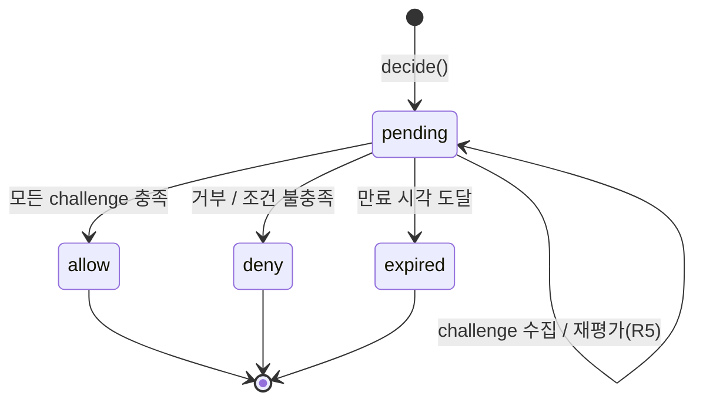
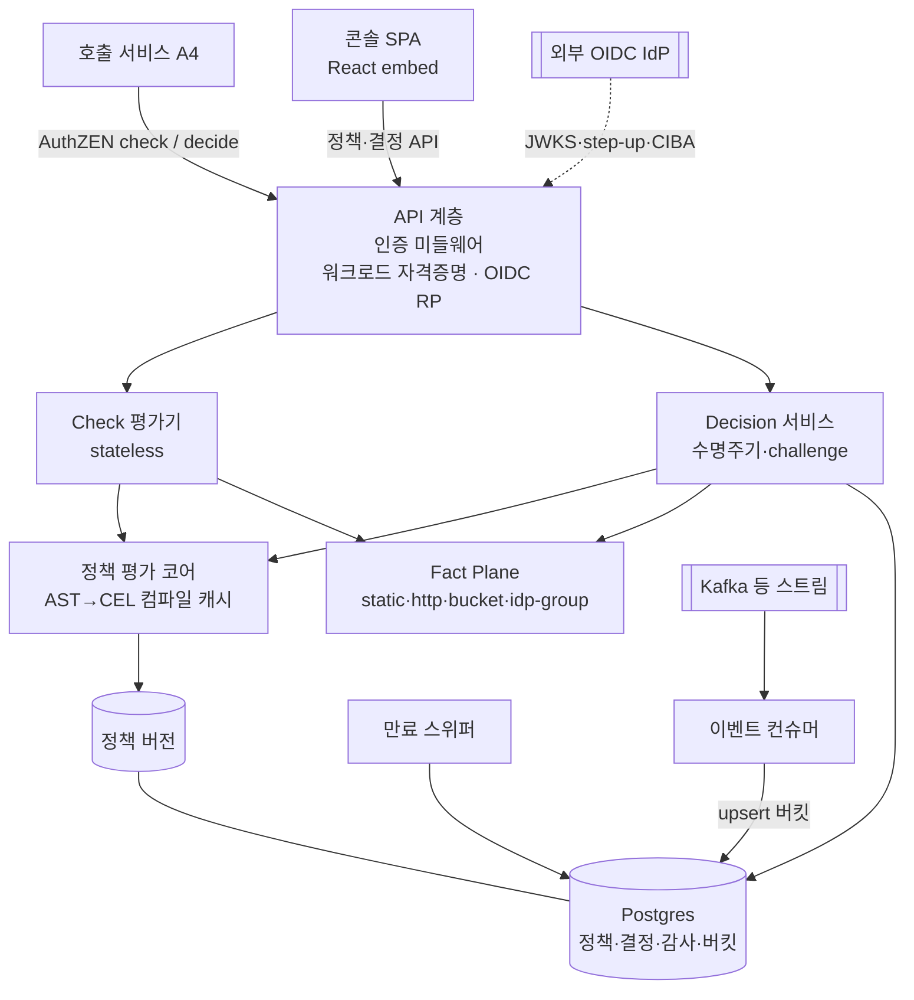
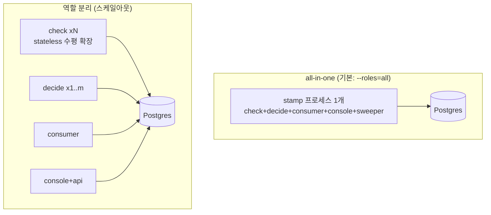
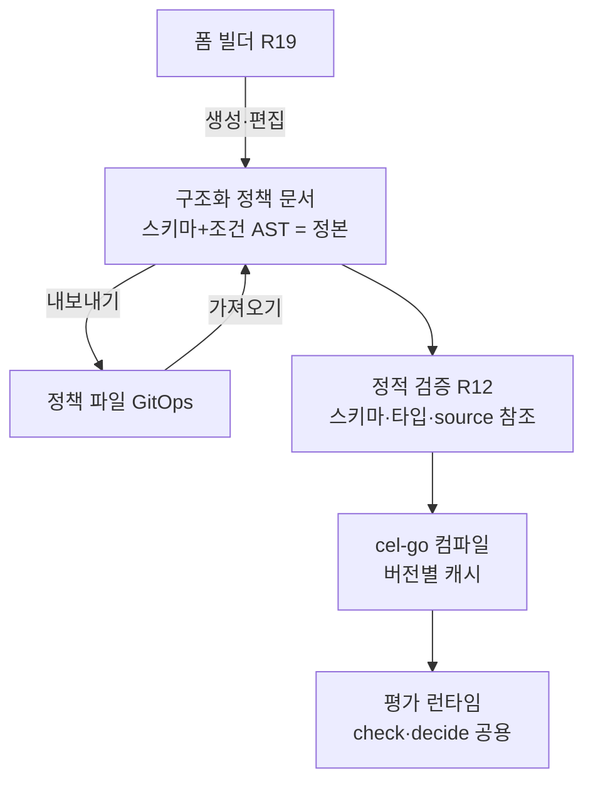
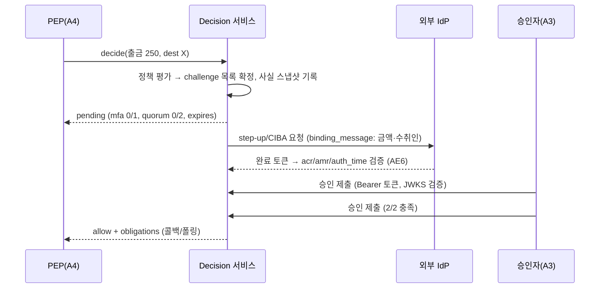

# STAMP Feature Map - Plan

## Goal Capsule

- **Objective:** STAMP(STateful Authorization for Multi-Party approvals) v1을 완결된 오픈소스 제품으로 구현한다 — Go 단일 이미지(역할 선택 실행), challenge 4종, 폼 기반 콘솔, Fact Plane 4종 source, 배포·릴리즈 체계까지.
- **Authority:** `STRATEGY.md`(제품 방향) → 이 문서의 Product Contract(무엇을) → Planning Contract(어떻게). 충돌 시 상위가 이긴다.
- **Execution profile:** M1 엔진 코어(반증 스파이크 포함) → M2·M3·M4 병행(모두 M1에만 의존) → M5 릴리즈. 릴리즈 게이트는 전 영역 완결(KD2).
- **Stop conditions:** Product Contract의 R-ID 의미를 바꾸는 발견, 보안 결함(인가 우회 경로), cel-go·AuthZEN 호환성의 계획 전제 붕괴 — 구현을 멈추고 계획을 개정한다.
- **Product Contract preservation:** changed — R3·AE6(mfa를 delegated/direct 두 모드 계약으로 개정, v1은 delegated; user-directed), Scope Boundaries에 direct 모드 이연 추가. 그 외 불변.
- **Open blockers:** 없음.

---

## Product Contract

### Summary

정책 평가를 두 경로 — stateless `check()`(고QPS 즉시 판정, AuthZEN 호환)와 stateful `decide()`(pending 결정 생성, challenge 수집 후 확정) — 로 제공하는 self-hosted 엔진과, 그 위의 폼 기반 정책 빌더·승인함·감사 콘솔, 데모 번들을 포함한 배포 체계를 v1 완결 릴리즈로 정의한다. challenge 4종(quorum·mfa·delay·external)과 source 4종(정적 리스트·동기 HTTP·비동기 윈도 집계·IdP 그룹)을 모두 갖추고 MIT로 공개한다.

### Problem Frame

기존 정책 엔진(OPA·Cedar·Cerbos)은 stateless 판정만 제품화한다. 거래 승인·어드민 액션처럼 정족수·MFA·만료가 개입하는 고위험 인가에서는, 판정에 필요한 사실 조달(PIP)과 승인 절차 조율(orchestrator)이 전부 사용자 몫으로 남는다. 실제 OPA 운영 경험에서 이 orchestrator가 엔진보다 커졌고, Rego는 고정 kernel이 JSON을 해석하는 메타순환 구조로 퇴화했다. 이 비용 구조가 STAMP가 존재하는 이유다.

### Key Decisions

- KD1. **결정을 boolean이 아니라 수명주기 객체로 만든다.** (session-settled: user-approved — chosen over stateless PDP + 외부 orchestrator: orchestrator 비대화는 구현 실수가 아니라 모델 미스매치라는 진단) Governs R2, R4.
- KD2. **v1은 완결된 오픈소스 릴리즈다.** (session-settled: user-directed — chosen over 수직 슬라이스 조기 공개: 동력 소진 리스크를 인지한 상태에서 완성된 첫인상을 선택) 릴리즈 게이트는 전 영역 완결이되, 빌드 순서는 엔진 → UI → 패키징을 권장. 공개 계약 3종의 semver 관리(R11)는 유지. Governs R3, R11, R27, R28, R29.
- KD3. **check()/decide() 경로 분리.** 상태가 필요한 결정은 QPS가 낮고, 고QPS 조회는 상태가 필요 없다 — 같은 정책 모델을 두 실행 경로로 제공한다. Governs R1, R2, R24.
- KD4. **표준 정렬은 AuthZEN, XACML 와이어 포맷은 비채택.** (session-settled: user-approved — chosen over XACML 3.0 준수: 표준화가 최대 외부 리스크이므로 check 표면을 AuthZEN 호환으로, 결정 수명주기는 상위집합 확장으로 포지셔닝) Governs R1.
- KD5. **정책 개정 시 작성자가 적용 방식을 선택하고, 기본값은 재평가.** (session-settled: user-approved — chosen over 일괄 grandfather 기본값: 컴플라이언스 도메인에서 정책 강화는 리스크 대응이므로 침묵 기본값이 옛 규칙 통과를 허용하면 안 됨) Governs R5.
- KD6. **정책 변경 자체가 STAMP 결정을 통과한다(self-referential 거버넌스), v1 필수.** (session-settled: user-approved — chosen over 정책 CRUD를 일반 API로 두는 것: 사용자의 1번 시나리오이자 dogfooding) Governs R6.
- KD7. **승인자 신원은 외부 IdP에 위임하고, 승인자 집합은 참조로 해석한다.** (session-settled: user-approved — chosen over 자체 역할 저장소: 인증 서버를 별도 설계하지 않고 OIDC/JWKS 표준 인터페이스로 닫으며, 그룹 해석이 Fact Plane source와 같은 모양이 됨) Governs R17, R18.
- KD8. **저작 UX는 스키마에서 렌더링되는 폼 빌더다.** (session-settled: user-directed — chosen over 룰 캔버스와 코드+프리뷰(시각 시안 비교 후 선택): 비개발자 저작을 얻는 대가로 v1 정책 표현력을 폼 렌더링 가능 범위로 제한) Governs R9, R19.
- KD9. **MIT 라이선스로 공개한다.** (session-settled: user-directed — chosen over Apache-2.0 권고와 AGPL-3.0) Governs R27.

### How This Work Fits Together

<!-- ce-section: work-relationships -->

이 플랜이 v1 전 영역을 소유한다. 아래는 마일스톤 간 빌드 순서 관계다.

- M1 엔진 코어 (반증 스파이크·스키마·평가기·저장·check/decide·quorum·거버넌스)
  - **Enables** M2–M5 전부 — 공개 계약 3종(R11)이 접점. 반증 스파이크(U0) 결과가 KTD3·KTD6·KTD8과 R28의 확정 또는 개정으로 이어진다.
- M2 challenge 완결 (mfa delegated·delay·external)
  - **Depends on** M1의 결정 수명주기. **Can proceed independently of** M3.
- M3 Fact Plane 확장 (이벤트 집계·IdP 그룹)
  - **Depends on** M1의 source 계약. **Can proceed independently of** M2, M4.
- M4 UI (콘솔 셸·폼 빌더·승인함·감사)
  - **Depends on** M1의 정책 스키마와 결정 API.
- M5 릴리즈 (벤치 CI·패키징·데모 번들)
  - **Depends on** 전 영역 완결 — v1 릴리즈 게이트(KD2). 패키징 골격은 M1 직후 병행 착수 가능.

### Actors

- A1. **정책 작성자** — 플랫폼 엔지니어 또는 컴플라이언스·운영 담당(KD8로 비개발자 저작 가능). 폼 빌더로 정책을 저작·개정하고, 개정 시 적용 방식(R5)을 선택한다.
- A2. **요청자(initiator)** — 결정을 발생시키는 서비스 또는 어드민. 정책 발동 조건의 입력이며 mfa challenge의 대상이 될 수 있다.
- A3. **승인자** — quorum challenge의 대상. 승인함에서 pending 결정을 승인/거부한다.
- A4. **호출 서비스(PEP)** — check/decide API를 호출하고 obligation을 집행하는 애플리케이션.
- A5. **감사자** — 컴플라이언스 담당. 감사 콘솔에서 결정 이력·정책 버전·사실 스냅샷을 조회한다.

### Requirements

**Decision Kernel**

- R1. `check()`는 stateless 단일 요청-응답 평가를 제공하며, 요청/응답 표면은 AuthZEN Access Evaluation(단건) API와 호환된다. 판정은 AuthZEN 정본 boolean으로 반환하고, STAMP 고유 정보는 응답 컨텍스트의 네임스페이스 키(`stamp.reason`, `stamp.obligations`, `stamp.policy_version`)에만 싣는다 — 표준 소비자가 컨텍스트를 무시해도 판정 해석이 동일해야 한다.
- R2. `decide()`는 결정 객체를 생성한다. 결정 객체는 상태(pending/allow/deny/expired), 요구 challenge 목록과 수집 현황, 만료 시각, obligation 목록을 노출한다.
- R3. challenge는 플러그인 계약으로 정의되며 계약에는 quorum(m-of-n, 대상 해석은 R18), mfa(두 모드: delegated — RFC 9470 step-up·CIBA `binding_message` 위임 후 acr/amr/auth_time 검증; direct — WebAuthn에 결정 컨텍스트 바인딩), delay(대기 시간, 지정 권한자의 취소 가능 — 권한자 집합은 R18과 동일한 해석 규칙을 따른다), external(외부 시스템 webhook 왕복)이 포함된다. v1 구현은 quorum·mfa(delegated)·delay·external이며 mfa direct 모드는 계약만 정의한다.
- R4. 결정 수명주기는 pending → allow / deny / expired 전이를 가지며, 만료 타이머와 승인 수집 API(승인/거부 제출)를 포함한다.
- R5. 정책 개정 시 작성자는 즉시 재평가와 grandfather 중 선택하며 기본값은 재평가다. 재평가는 기수집 승인 중 신규 정족수 집합에 유효한 것을 보존하고 부족분만 추가 수집한다.
- R6. 정책 생성·수정·삭제는 STAMP 자신의 decide() 결정을 통과한다. 최초 설치 시 단독 관리자 모드로 시작하고, 명시적 잠금 액션 이후에는 정책 개정이 정족수를 요구한다.
- R7. 모든 결정은 평가에 사용된 정책 버전, 사실 스냅샷, 반환된 obligation 목록을 고정해 append-only 감사 로그에 기록한다.
- R8. 결정 응답은 obligation 목록을 반환한다. 집행은 PEP(A4) 책임이며 v1은 반환까지만 담당한다.
- R30. challenge를 가진 정책은 check 경로에서 allow가 될 수 없다 — check는 `requires_decision` 사유의 deny를 반환한다. 이는 정책별 설정이 아니라 평가기 불변식이다.
- R31. 승인은 승인자가 검토한 자료의 해시에 바인딩된다. 해시 입력은 결정 컨텍스트, 사실 스냅샷, challenge 명세 중 정족수 임계값을 제외한 부분(대상 집합·challenge 종류·조건), obligation 목록이며, 정책 버전 식별자와 정족수 숫자는 입력에서 제외한다. R5의 재평가는 이 해시가 동일할 때만 기존 승인을 보존하고, 다르면 무효화 후 재수집한다.
- R32. 감사 로그는 변조 탐지가 가능해야 한다: writer별 세그먼트 해시 체인과, 각 시점 전 writer의 head 해시를 함께 묶는 주기적 체크포인트, 그리고 검증 절차를 제공한다. 체크포인트는 DB 쓰기 권한만으로 위조할 수 없도록 앱 전용 키로 서명해 DB 밖으로 내보낸다. decide·거버넌스 감사는 상태 전이와 같은 트랜잭션에 기록한다. check 경로의 감사 유실은 체인에 유실 구간 마커(시각 범위·건수)로 남겨 검증 시 공백이 드러나게 하며, 운영자는 버퍼 포화 시 check를 deny하는 fail-closed 모드를 선택할 수 있다.
- R33. 거버넌스 개정은 diff를 완화(weakening) 여부로 분류한다 — 정족수 감소, 승인자 집합 확대, source on_error 완화, challenge 제거. 완화 개정은 구·신 정책 중 엄격한 쪽의 요구를 충족해야 하며, 운영자가 설정한 하한(최소 승인자 수, 제안자≠승인자)을 위반할 수 없다.
- R34. 승인자 집합이 충족 불가능해지는 개정(대상 인원 < 정족수)은 거부한다. 잠금 이전의 거버넌스 액션(첫 정책 생성, 잠금 실행)은 최초 기동 시 1회 출력되는 부트스트랩 토큰을 요구하며, 토큰은 잠금 성공 시 소멸하고 미사용 상태로 남으면 주기적으로 최고 심각도 감사 경고를 남긴다. 잠금 이후의 복구 경로는 서비스 리스너가 기동하지 않은 상태에서만 실행 가능한 오프라인 break-glass 절차로만 제공하며, 최고 심각도 감사 이벤트를 남긴다.

**Policy Language & Contracts**

- R9. 정책은 타입 있는 스키마(entity·action·source 선언)와 구조화된 조건(필드·연산자·값)으로 구성되며, 표현력은 폼 빌더(R19)가 렌더링할 수 있는 범위로 한정한다.
- R10. 정책의 저장·교환 포맷은 파일이며 API로도 입출력된다 — UI 저작과 GitOps 저작이 같은 포맷으로 왕복 가능해야 한다.
- R11. 공개 계약 3종 — 정책 스키마, challenge 인터페이스, 결정 API(R1의 확장 키 집합 포함) — 는 첫 릴리즈부터 semver로 버전 관리하며, 각 계약의 스펙 문서를 버전 명시와 함께 `docs/`에 둔다.
- R12. 정책 로드 시 스키마·타입·source 참조를 정적 검증하고, 실패한 정책은 로드를 거부한다.
- R44. 미저장 정책과 샘플 입력으로 시험 평가(dry-run)를 수행해 매칭 여부·조건별 참/거짓·발동될 challenge를 반환한다 — 저장이나 개정 승인 없이 실행된다.

**Fact Plane**

- R13. 동기 source 2종(정적 리스트, HTTP 호출)을 제공하며 각 선언은 TTL, 타임아웃, on_error 동작(기본 deny)을 포함한다.
- R14. check 경로의 source 조회는 선언된 TTL 내 캐시로 제공되며, 판정의 신선도 한계는 source 선언이 명시한다.
- R15. 비동기 이벤트 source를 제공한다: 이벤트 스트림을 구독해 윈도 집계 상태(예: 24h 출금 합계)를 유지하고, 평가 시점에는 로컬 상태 조회로 응답한다.
- R16. IdP 그룹 조회 source를 제공한다 — quorum 대상 해석(R18)과 일반 조건 모두에서 사용 가능하다.
- R35. 원격 source의 호출 대상은 운영자 배포 설정의 egress 허용목록으로 제한한다 — 정책 내용만으로 임의 대상을 지정할 수 없다. 링크로컬·사설 대역 기본 차단, 리다이렉트 미추종, DNS 재바인딩 방지를 위한 해석 후 고정, 앰비언트 자격증명 미사용.
- R36. `on_error: allow`(fail-open)는 운영자 수준 플래그의 명시적 허용이 있을 때만 유효하다. TTL 만료 항목을 장애 시 대체 응답으로 제공하지 않는다.
- R37. 비동기 이벤트 source는 신선도 한계(`max_staleness`)를 선언하고, 컨슈머 지연이 이를 초과하면 deny한다. 음수·차감 델타는 source가 선언한 경우에만 허용한다.

**Approver Identity**

- R17. STAMP는 OIDC relying party로 동작한다: 승인 제출 등 사용자 액션의 토큰을 외부 IdP의 JWKS로 검증하며, 자격증명·역할·세션을 저장하지 않는다. 검증은 고정된 발급자 집합, 필수 audience, 비대칭 알고리즘 허용목록을 강제하고, JWKS 재조회는 속도 제한과 음성 캐시로 보호한다.
- R18. quorum 대상 집합은 명시 목록, 토큰 claim, IdP 그룹 source(R16) 중 하나로 해석한다.
- R38. delegated mfa challenge는 서버가 개시한 상관자(`auth_req_id`/state)를 저장하고, 충족 판정은 그 상관자의 정확한 일치와 1회 소비를 요구한다. `acr` 값은 운영자 허용목록으로 제한한다.
- R40. PEP 표면(check·decide·결정 조회)은 인증된 호출자만 접근할 수 있다 — 워크로드 자격증명(OIDC client_credentials 토큰 또는 mTLS)을 검증하고 호출자 식별자를 감사 행에 기록하며, 미인증 요청은 평가 이전에 거부한다. 결정 조회는 해당 결정을 생성한 호출자 또는 대상 승인자로 제한한다.

**UI Builder & Console**

- R19. 정책 빌더는 폼 기반이다: 스키마(R9)와 source 선언에서 폼이 렌더링되고, 발동 조건 → source 바인딩 → 규칙 → challenge 순의 가이드형 저작 흐름을 제공한다. entity·action·source 선언도 같은 빌더 안에서 저작하며, 선언이 하나도 없는 빈 상태에서 선언 생성으로 이어지는 경로를 제공한다. 전 저작 흐름은 키보드만으로 완주 가능하고, 폼 오류는 `aria-describedby`로 필드에 연결되며 상단 오류 요약을 함께 제공하고, 대비는 4.5:1 이상이어야 한다.
- R20. source 바인딩 UX는 유형별 설정을 안내한다 — 동기는 호출 대상·TTL·on_error, 비동기는 이벤트 스트림·윈도 정의. 호출 대상은 자유 입력이 아니라 운영자 egress 허용목록(R35)에서 고르는 선택형이며, 목록에 없는 대상은 제시하지 않고 운영자 요청 경로를 안내한다.
- R21. 승인함: 승인자(A3)가 자신에게 걸린 pending 결정을 조회하고 승인/거부하며, 수집 현황과 만료 시각을 확인한다. 목록은 만료 임박 순으로 정렬해 잔여 시간을 표시하고, 제출 실패 4종(만료됨·이미 충족됨·대상 아님·개정으로 무효화됨)은 각각의 화면 문구와 후속 동작을 갖는다.
- R22. 감사 콘솔: 감사자(A5)가 결정 이력을 조회하며, 각 결정에서 적용된 정책 버전과 사실 스냅샷(R7)을 열람한다. 감사자 자격은 운영자 설정의 토큰 claim/그룹으로 판별하고 서버 측에서 강제하며, 자격이 없는 사용자는 자신이 초기화했거나 대상인 결정만 조회할 수 있다.
- R23. 폼에서의 정책 개정은 변경 diff와 함께 완화 분류 결과(R33)·위반한 운영자 하한·영향받을 pending 결정 건수를 제출 전에 보여주고, R5의 적용 방식(기본 재평가)을 선택하게 한 뒤 R6의 개정 결정 플로로 이어진다. 운영자 하한을 위반하는 개정은 제출 자체를 막는다.
- R41. 최초 설치 인스턴스는 미잠금 상태를 상시 경고로 표시하고, 잠금 진행 화면에서 해석된 승인자 집합과 정족수를 먼저 보여준 뒤 명시적 재입력으로 확인받는다.

**Scale & Ops**

- R24. check 경로는 인스턴스 간 상태 비공유로 수평 확장 가능해야 한다. decide 경로는 공유 저장소를 사용한다. 정책 발효 후 최대 `policy_refresh_interval`(기본 5초) 내에 모든 check 인스턴스가 신 버전으로 판정하며, 갱신 실패가 그 2배를 넘긴 인스턴스는 fail-closed로 전환한다.
- R39. 역할별로 분리된 DB 권한을 제공한다 — check는 읽기 + 감사 삽입, consumer는 버킷 upsert만. 외부 콜백(webhook) 수신 표면은 PEP·콘솔 표면과 분리된 리스너로 노출한다.
- R42. 모든 비밀(OIDC client secret, 역할별 DB 자격증명, webhook 서명 키)은 파일 또는 Secret 참조로만 주입되며 차트 values·이미지·로그에 평문으로 존재하지 않는다. 서명 키는 식별자(kid)를 가져 무중단 회전이 가능하다. 데모 전용 자격증명으로의 기동은 비-데모 프로파일에서 거부한다.
- R43. decide 생성, challenge 발급(특히 delegated mfa의 IdP 요청), 외부 webhook 발신, 승인 제출은 호출자·주체별 속도 제한과 미결 결정 상한을 가지며, 한도 초과는 deny와 감사 이벤트로 처리한다.
- R25. 단일 컨테이너 + Postgres로 self-host 설치가 가능해야 한다.
- R26. check p99 지연과 최대 QPS를 CI에서 상시 벤치마크한다. 목표 수치는 KTD8이 정의한다.

**Release**

- R27. MIT 라이선스로 공개한다.
- R28. 데모 번들을 동봉한다: docker-compose + CIBA 또는 RFC 9470 step-up을 실제 지원하는 self-hostable IdP + 단일 노드 브로커 + 예제 정책으로, 퀵스타트 문서만 따라 하면 설치부터 첫 판정까지 도달하며 F4(mfa+quorum)와 F5(벨로시티)가 종단 시연 가능하다.
- R29. 컨테이너 이미지와 Helm 차트를 릴리즈 산출물로 제공하고, 릴리즈는 semver와 체인지로그를 따르며 산출물에 SBOM과 서명을 동반한다.

### Key Flows

- F1. 계좌 화이트리스트 검사 (check 경로)
  - **Trigger:** PEP가 transaction의 from/to 계좌로 check() 호출.
  - **Steps:** 정책 매칭 → source 조회(화이트리스트, 캐시 TTL 내) → 조건 평가 → 즉시 allow/deny 반환, 감사 기록.
  - **Covers:** R1, R7, R13, R14.
- F2. 정책 수정 정족수 승인 (decide 경로)
  - **Trigger:** A1이 폼에서 정책 개정을 제출(diff 확인 포함).
  - **Steps:** 개정 요청이 decide() 통과(R6) → quorum challenge 생성, pending 결정 반환 → A3들이 승인함에서 승인 → 정족수 충족 시 allow 전이, 개정 발효 → 발효 시점에 R5의 적용 방식 실행.
  - **Covers:** R2, R3, R4, R6, R7, R21, R23.
- F3. 개정 발효 시 pending 결정 처리
  - **Trigger:** F2의 개정이 발효되고, 구 정책에 걸린 pending 결정이 존재.
  - **Steps:** 작성자가 선택한 방식 적용 — 재평가(기본): 유효 승인 보존 후 부족분 재수집 / grandfather: 구 정책 버전으로 계속. 각 pending 결정에 적용된 방식을 감사 기록.
  - **Covers:** R5, R7.
- F4. 고액 출금 복합 승인 (mfa + quorum)
  - **Trigger:** 한도 초과 출금으로 decide() 호출.
  - **Steps:** mfa challenge 발급(delegated: 금액·수취인을 `binding_message`에 실어 IdP step-up/CIBA 요청) → initiator(A2)가 IdP에서 인증 완료 → STAMP가 acr/amr/auth_time 검증 → quorum challenge 병행 수집 → 모두 충족 시 allow.
  - **Covers:** R2, R3, R4.
- F5. 벨로시티 한도 검사 (비동기 source)
  - **Trigger:** 출금 요청으로 check() 또는 decide() 호출.
  - **Steps:** 이벤트 스트림에서 유지된 24h 집계 상태를 로컬 조회 → 한도 비교 → 판정.
  - **Covers:** R15.

결정 수명주기(R4)의 상태 전이:



### Acceptance Examples

- AE1. **Covers R1, R13.** Given 화이트리스트에 계좌 X가 있음, When from=X인 transaction으로 check() 호출, Then 즉시 allow. 계좌 Y(미등록)면 즉시 deny.
- AE2. **Covers R2, R3, R4.** Given 정족수 2-of-3(a, b, c) 정책, When decide() 호출 후 a만 승인, Then 결정은 pending(1/2)이며 만료 시각 도달 시 expired.
- AE3. **Covers R5, R31.** Given pending 결정에 a의 승인이 수집됨(정족수 2, 대상 a·b·c), When 정족수만 3으로 올리는 개정이 기본값(재평가)으로 발효, Then 임계값은 해시 입력이 아니므로 a의 승인 해시가 동일해 보존되고 결정은 pending(1/3)이 된다.
- AE4. **Covers R6.** Given 최초 설치 직후, When 단독 관리자가 첫 정책을 생성하고 잠금 액션을 실행, Then 이후의 모든 정책 개정은 정족수 결정을 통과해야만 발효된다.
- AE5. **Covers R13.** Given 화이트리스트 source가 타임아웃, When check() 호출, Then on_error 선언대로 deny(기본값)를 반환하고 장애 사유를 감사 기록.
- AE6. **Covers R3, R38.** Given 금액·수취인을 `binding_message`에 실어 발급된 delegated mfa challenge, When 완료 토큰의 acr/amr/auth_time이 정책 요구를 충족하지 않거나, 상관자가 다른 결정의 것이거나, 이미 소비된 토큰의 재제출인 경우, Then challenge는 미충족으로 남는다.
- AE7. **Covers R15.** Given 24h 출금 합계 집계가 한도 직전, When 한도를 넘기는 출금 요청, Then 판정은 deny이며 집계 상태 조회는 외부 왕복 없이 수행된다.
- AE8. **Covers R10, R19.** Given 폼 빌더로 저작한 정책, When 파일 포맷으로 내보내 다시 가져옴, Then 의미 손실 없이 동일한 정책으로 로드된다.
- AE9. **Covers R28.** Given 새 환경, When 퀵스타트 문서의 절차만 수행, Then 데모 번들이 기동되고 예제 정책으로 첫 판정(check 1건, decide 1건, 벨로시티 deny 1건)이 성공하며, 스크립트 시작부터 첫 판정까지 소요 시간이 CI 아티팩트로 기록된다(초기 목표 15분, KTD8과 같은 가정 지위).
- AE10. **Covers R30.** Given quorum challenge를 가진 정책, When 어떤 사실 조합으로든 check() 호출, Then 결과는 결코 allow가 아니며 `requires_decision` 사유의 deny다.
- AE11. **Covers R33.** Given 2-of-3 거버넌스 정책, When 제안자 a가 정족수를 1로 낮추는 개정을 제출하고 a와 b가 승인, Then 제안자 승인은 계수되지 않아 유효 승인은 b 1건뿐이고, 완화 개정에 적용되는 엄격한 쪽 요구(2)에 미달해 발효되지 않는다. 제안자가 아닌 b·c 2명이 승인하면 같은 개정이 발효된다.
- AE12. **Covers R35.** Given 정책이 링크로컬 주소 또는 내부 호스트로 302 리다이렉트하는 대상을 source로 선언, Then 로드 시점과 호출 시점 모두에서 거부된다.
- AE13. **Covers R31.** Given 정족수 집합이 동일한 개정이지만 obligation이 변경됨, When 개정이 발효, Then 기존 승인은 전부 무효화되고 재수집된다.

### Success Criteria

- v1 릴리즈 게이트: R1–R44 전부 충족된 상태로 최초 공개 (KD2).
- AE9의 퀵스타트 경로가 재현 가능하고 소요 시간이 기록됨 — `STRATEGY.md`의 time-to-first-decision 지표의 전제.
- check 벤치마크가 CI에 존재하고 히트·미스 두 수치가 추적됨 (목표치는 KTD8).
- 두 원 시나리오(F1, F2)가 데모 가능하고, F4·F5도 데모 번들에서 종단 시연 가능.
- 실제 운영 중인 승인·조율 코드 1건을 STAMP 정책으로 재현하고, 대체되지 않고 남은 로직을 `docs/`에 목록으로 기록 — `STRATEGY.md`의 orchestrator 대체율 지표의 첫 측정점.

### Scope Boundaries

**Deferred for later (v2 후보)**

- mfa direct 모드(WebAuthn 결정 컨텍스트 바인딩) 구현 — 계약은 R3에 정의됨
- challenge 플러그인 SDK의 서드파티 공개(외부 개발자용 문서·배포 채널) — v1은 내장 4종까지
- 정책 시뮬레이션 고급 기능(과거 데이터 백테스트, what-if 분석)
- AuthZEN batch evaluations와 Subject/Resource/Action Search API — v1은 Access Evaluation 단건 프로파일까지 (KTD3)
- AuthZEN 확장 스펙의 공식 제안 문서화 — v1은 호환 구현까지
- 다중 테넌시
- gRPC fact source — v1은 정적 리스트와 HTTP까지. 임의 대상 호출에 필요한 디스크립터 조달을 요구하는 유스케이스가 v1에 없다
- 승인 알림 채널(메일·슬랙 등) — 승인함 pull과 external challenge webhook으로 대체
- 브로커 중립 컨슈머 인터페이스 — 두 번째 브로커가 필요해지는 시점에 추출 (KTD7)

**Outside this product's identity**

- SaaS 호스팅 — self-hosted 우선, 추후 control plane SaaS로만 재고
- 범용 워크플로 엔진 — 인가에 필요한 상태까지만
- 인증(authn) 구현 — step-up은 IdP에 위임하고 토큰 검증만 수행, IdP가 되지 않음 (R17)
- XACML 와이어 포맷 호환 (KD4)

### Risks & Mitigations

| 리스크 | 완화 (소유 요구) | 소유 유닛 |
|---|---|---|
| check 경로가 challenge를 우회해 승인 없이 allow | 평가기 불변식으로 차단 (R30) | U3, U5 |
| 정족수가 스스로를 약화시키는 개정을 통과시킴 | diff 완화 분류 + 운영자 하한 (R33) | U9 |
| 정책이 지정한 source URL을 통한 SSRF | 운영자 egress 허용목록·사설 대역 차단 (R35) | U6, U18 |
| 잠금 미실행 방치 또는 잠금 후 승인자 소실로 영구 잠김 | 부트스트랩 토큰 게이팅과 미사용 경고, 충족 불가 개정 거부, 오프라인 break-glass CLI (R34) | U9, U18 |
| 감사 체인이 check 경로를 직렬화해 수평 확장을 막음 | writer별 세그먼트 체인 + 교차 연결 체크포인트, 배치 Merkle 루트 (R32, R24) | U4, U5 |
| 강화된 정책 발효 후에도 구 버전 인스턴스가 allow 반환 | 전파 상한과 초과 시 fail-closed 전환 (R24) | U5 |
| step-up 토큰이 다른 결정에 재사용됨 | 서버 개시 상관자 1회 소비 + acr 허용목록 (R38) | U10 |
| 발급자 혼동·audience 누락·JWKS 재조회 폭주 | 발급자·audience·알고리즘 고정, 재조회 속도 제한 (R17) | U8 |
| 개정 후 보존된 승인이 미검토 내용을 인가 | 승인의 내용 해시 바인딩 (R31) | U9 |
| 감사 기록 변조 또는 유실로 흔적 소멸 | 해시 체인·동일 트랜잭션 기록·유실 카운터 (R32) | U4, U5 |
| 이벤트 위조·지연으로 벨로시티 한도 무력화 | 수집 인증, 차감 델타 제한, `max_staleness` deny (R37) | U12 |
| 정책 작성자가 fail-open을 선언해 우회 | 운영자 플래그 필수, 만료 캐시 대체 금지 (R36) | U6 |
| check 파드 침해가 정책 쓰기로 확대 | 역할별 DB 권한·리스너 분리 (R39) | U4, U18 |
| 인가 엔진 자신의 표면이 무인증으로 노출 | 워크로드 자격증명 검증과 결정 조회 제한 (R40) | U5, U7 |
| 비밀이 차트 values·이미지에 평문으로 유입 | Secret 참조 주입과 키 회전 (R42) | U18 |
| decide·mfa 반복 호출로 자원 고갈·MFA fatigue 유발 | 호출자·주체별 속도 제한과 미결 상한 (R43) | U7, U10, U11 |
| 감사 폭주 유실로 자기 흔적 삭제 | 유실 구간 마커와 fail-closed 옵션 (R32) | U5 |
| 의존성 공급망(리포 이전에 편승한 타이포스쿼팅) | 의존성 고정 + `govulncheck` CI, SBOM·서명 아티팩트 (R29) | U1, U18 |
| 얇은 근거 위의 결정이 M5에서야 반증되어 대규모 재작업 | M1 내 반증 스파이크로 확인 시점을 앞당김 | U0 |

### Dependencies / Assumptions

- 1인 사이드 프로젝트이며, v1 완결 릴리즈(KD2)로 공개까지의 기간이 길어지는 리스크를 인지하고 선택했다. 성과에 따라 사용자 소속 회사 적용을 검토한다.
- 배포 환경에 OIDC IdP가 존재한다고 가정한다(R17). delegated mfa(R3)는 IdP의 step-up(RFC 9470) 또는 CIBA 지원을 요구하며, 이 능력을 실제로 갖춘 self-hostable IdP의 존재는 U0가 확인한다 — 미확인 시 KTD6과 R28을 개정한다.
- AuthZEN은 2026-01 Final 승인으로 안정 — check 표면(R1)은 스펙에 직접 구현한다.
- Postgres SQL/PGQ는 정식 릴리즈 전이므로 의존하지 않는다. 관계 조회 실험 옵션으로만 유지.

### Outstanding Questions

모두 비차단(Deferred to Planning) — 구현 착수를 막지 않으며, 해당 유닛 진입 시점에 결정한다.

- 감사 스냅샷의 보존 기간과 삭제 요구 대응 — 개인정보·금융정보를 append-only 체인에 영구 고정하는 구조라 사후 개조 비용이 크다. 스냅샷을 별도 테이블로 분리해 체인에는 해시만 남기는 구조를 v1에 넣을지 v2로 미룰지 (U4 진입 시).
- 콘솔 사용자의 역할(A1 저작·A3 승인·A5 감사) 판별 출처 — IdP claim인지, 거버넌스 정책의 대상 집합에서 유도하는지. R18은 quorum 대상 해석만 정의한다 (U14 진입 시).
- 승인자의 '거부' 제출이 결정을 즉시 deny로 전이시키는지, 정족수 충족 불가가 확정될 때까지 pending인지 (U7 진입 시).
- R33의 운영자 하한(최소 승인자 수·제안자≠승인자) 기본값과, 잠금 이후 이 하한 자체를 변경하는 경로 (U9 진입 시).
- 감사 콘솔의 조회 축(기간·정책·주체·상태)·정렬·페이지네이션과 대응 인덱스 (U16 설계 시, U4 마이그레이션에 반영).
- PEP 인증 방식을 mTLS로 고정할지 client_credentials로 통일할지(R40) — 데모 번들이 보여줄 기본값과 함께 정한다 (U5 진입 시).
- U17 벤치의 경고→실패 승격 시점 — 첫 수치가 나온 뒤 확정한다.

### Sources / Research

- `STRATEGY.md` — approach, 페르소나, 지표, not-working-on의 원천.
- [OpenID AuthZEN](https://openid.github.io/authzen/) — R1의 기준 스펙(2026-01 Final). [interop 하네스](https://github.com/openid/authzen)는 CI 적합성 게이트(KTD3).
- [RFC 9470 — OAuth 2.0 Step-up Authentication](https://www.rfc-editor.org/rfc/rfc9470), [OIDC CIBA](https://openid.net/specs/openid-client-initiated-backchannel-authentication-core-1_0.html) — delegated mfa(R3)의 표준 경로; CIBA `binding_message`가 거래 컨텍스트 전달 훅.
- [PSD2 SCA dynamic linking](https://mojoauth.com/blog/passkeys-psd2-sca-dynamic-linking-webauthn) — mfa direct 모드(v2)의 규제 근거.
- [Fireblocks TAP](https://www.fireblocks.com/platforms/governance-and-policies) — quorum 설정 모델의 선례.
- [Cerbos: YAML 구조 + CEL 조건](https://docs.cerbos.dev/cerbos/latest/policies/conditions.html) — KTD2와 같은 분리의 기존 증명.
- [cel-go](https://github.com/google/cel-go) — 평가기(2026-06-16부터 `cel-expr/cel-go`로 이전). `policy` 패키지는 pre-v1.0이라 core만 사용.
- [River](https://github.com/riverqueue/river) — KTD5의 업그레이드 경로(Postgres 트랜잭셔널 잡 큐).
- [Zanzibar 논문](https://research.google/pubs/pub48190/) — check 경로 일관성 모델 참조.

---

## Planning Contract

### Key Technical Decisions

- KTD1. **구현 언어 Go.** (session-settled: user-directed — chosen over Kotlin/JVM과 하이브리드: 주류 self-hosted authz 엔진 전부가 Go이고, cel-go·go-webauthn·River 등 핵심 라이브러리와 단일 정적 바이너리 배포 규범이 Go에 정합) Governs 전 유닛.
- KTD2. **조건식은 자체 구조화 AST가 정본이고, cel-go core로 컴파일해 평가한다.** KD8의 how-level 인스턴스화 (cites R9, R12). 폼 ↔ AST가 1:1이라 폼 렌더링 가능성이 구조적으로 보장되고, 평가기는 검증된 것을 쓴다. AST 타입 체계는 CEL 타입의 진부분집합으로 정의하고(암묵 수치 변환 없음, timestamp·duration은 CEL 타입 그대로), R12의 정적 검증 마지막 단계에 cel-go 컴파일을 포함시켜 "검증 통과 = 컴파일 성공"을 보장한다 — 그렇지 않으면 폼 프리플라이트를 통과한 정책이 저장에서 실패한다. cel-go의 `policy` 패키지는 pre-v1.0이라 비채택 — core 컴파일·평가 API만 사용하고, 컴파일 계층은 얇은 어댑터로 격리해 `cel-expr/cel-go` 리포 이전과 API 변경을 흡수한다.
- KTD3. **AuthZEN Final에 직접 구현하고 추상화 계층을 두지 않는다.** KD4의 인스턴스화 (cites R1). 스펙이 2026-01 Final로 개정 불가이므로 안전하다. **적합성 범위는 Access Evaluation(단건) 프로파일로 한정**하며, batch evaluations와 Subject/Resource/Action Search API는 Scope Boundaries의 이연 항목이다 — 하네스가 프로파일 전체를 요구하면 게이트가 영구 실패로 고정되므로 범위를 계약으로 못박는다. `openid/authzen` interop 하네스를 이 프로파일 기준으로 CI 게이트에 편입한다.
- KTD4. **배포는 단일 이미지 + 역할 선택 실행.** (session-settled: user-directed — chosen over 단일 바이너리 전용: 단일/멀티 바이너리 양쪽 지원 요구) 하나의 바이너리가 `--roles=all`(기본) 또는 `check,decide,consumer,console` 부분집합으로 기동한다. Loki·Temporal이 증명한 패턴. Helm 차트가 두 토폴로지를 모두 제공한다. Governs R24, R25.
- KTD5. **만료 타이머는 `next_deadline` 컬럼 + `FOR UPDATE SKIP LOCKED` 스위퍼.** (cites R4) 외부 의존 없이 단일 컨테이너 약속을 지킨다. 만료의 정본은 `next_deadline` 값이며 스위퍼는 지연된 정리 작업일 뿐이다 — 승인 제출·상태 조회·전이 함수가 모두 진입 즉시 마감 경과를 검사한다. 규모가 커지면 River로 승격하는 경로를 남긴다.
- KTD6. **mfa v1은 delegated 모드.** (session-settled: user-directed — chosen over direct WebAuthn 우선과 둘 다 구현: RFC 9470 step-up + CIBA `binding_message`로 외부 IdP에 위임하고 STAMP는 acr/amr/auth_time 검증만 수행 — 표준 기반이라 커스텀 코드·리스크 최소, TOTP도 IdP가 대신 처리) direct 모드는 challenge 계약에만 정의한다 (cites R3).
- KTD7. **벨로시티 집계는 Postgres 고정 폭 버킷.** (cites R15) `(subject, metric, bucket_start) → value` upsert, 조회는 트레일링 N버킷 합. 스트림 프로세서(Flink/Kafka Streams)는 단일 컨테이너 약속과 충돌해 비채택. v1은 Kafka 컨슈머를 직접 작성하고 브로커 중립 인터페이스를 두지 않는다 — 구현이 하나뿐인 추상화는 테스트 예산만 이중화하고, 오프셋 커밋 시맨틱이 이미 Kafka 종속이라 실제로 중립도 아니다. 두 번째 브로커가 필요해지는 시점에 집계 로직(`aggregate.go`)에서 인터페이스를 추출한다. 외부 선례가 얇은 자체 설계이므로 재생·중복(idempotency) 테스트에 예산을 명시적으로 배정한다.
- KTD8. **성능 목표(가정): 캐시 히트 경로 check p99 ≤ 10ms, 단일 check 인스턴스 ≥ 5k QPS, 그리고 선언된 TTL에서 유도되는 미스율(기준 5%)을 포함한 종단 p99를 별도 임계값으로 둔다.** 레퍼런스 하드웨어 4 vCPU/8GB (cites R26). 미스 경로 지연은 source 선언 타임아웃(R13)이 지배하므로 웜 캐시만 측정하면 p99가 운영 지연과 무관해진다 — 두 값을 함께 추적한다. 이 수치는 검증된 요구가 아니라 설계 가정이며 벤치 결과에 따라 조정한다.
- KTD9. **콘솔은 React + TypeScript(Vite)로 만들어 `go:embed`로 동봉한다.** (cites R19–R23, R25) 콘솔 전용 BFF를 두지 않고 엔진의 정책·결정 API를 그대로 소비한다 — API가 곧 공개 계약(R11)이라는 원칙 유지.
- KTD10. **운영 의존은 Postgres 하나로 통일한다(브로커 제외).** 정책·결정·감사·타이머·집계 버킷 전부 Postgres (cites R25). 브로커(Kafka)는 R15를 쓰는 배포에서만 필요한 선택 의존이다.
- KTD11. **보안 통제는 정책 데이터가 아니라 코드 경로와 운영자 설정이 강제한다.** challenge 우회 금지는 평가기 불변식으로(cites R30), 원격 호출 대상과 fail-open 허용은 배포 설정으로(cites R35, R36), 승인·MFA의 결속은 서버가 발급한 해시·상관자로(cites R31, R38) 강제한다. 정책 작성자는 신뢰 경계 안이 아니라 밖에 있다고 가정한다 — 정책 저작 권한이 곧 인프라 접근 권한이 되어서는 안 된다.

### High-Level Technical Design

컴포넌트 구성 (C1):



배포 토폴로지 (C2) — 같은 이미지, 역할 플래그만 다름 (KTD4):



정책 컴파일 파이프라인 (C3) — 폼과 파일이 같은 정본을 왕복 (KTD2, R10):



decide 경로 시퀀스 (C4) — F4(mfa delegated + quorum) 기준:



### Sequencing

M1(U0–U9) → M2(U10–U11) · M3(U12–U13) · M4(U14–U16) 병행 → M5(U17–U18). M2·M3·M4는 모두 M1에만 의존해 상호 독립이다. U0는 U1과 병행하며 그 결과가 M1의 종료 조건에 포함된다 — 부정적 결과는 KTD3·KTD6·KTD8과 R28의 개정으로 이어진다. U17은 M1 직후 화이트리스트 시나리오만으로 착수하고 벨로시티 시나리오는 U12 완료 후 추가한다. U18의 패키징 골격도 M1 직후 착수 가능하되 릴리즈 게이트는 전 유닛 완료.

M1 종료 시 엔진 코어만으로 F1·F2를 종단 시연해 통합 발견 시점을 앞당긴다.

---

## Implementation Units

| U-ID | 단위 | 마일스톤 | 핵심 경로 | 의존 |
|---|---|---|---|---|
| U0 | 반증 스파이크 | M1 | `spikes/` | — |
| U1 | 모노레포 스캐폴드 + CI | M1 | `cmd/stamp/`, `.github/workflows/` | — |
| U2 | 정책 스키마·AST·정적 검증 | M1 | `internal/policy/` | U1 |
| U3 | AST→CEL 컴파일·평가 코어 | M1 | `internal/engine/` | U2 |
| U4 | Postgres 저장 계층·감사 | M1 | `internal/store/` | U1 |
| U5 | check API + AuthZEN 적합성 | M1 | `internal/api/` | U3, U4, U6 |
| U6 | 동기 Fact source 2종 + 캐시 | M1 | `internal/fact/` | U2 |
| U7 | decide 수명주기 + 만료 스위퍼 | M1 | `internal/decision/` | U3, U4 |
| U8 | OIDC RP + quorum challenge | M1 | `internal/identity/`, `internal/challenge/` | U7 |
| U9 | self-referential 거버넌스 + 개정 시맨틱 | M1 | `internal/policy/`, `internal/decision/` | U7, U8 |
| U10 | mfa challenge (delegated) | M2 | `internal/challenge/mfa/` | U8 |
| U11 | delay + external challenge | M2 | `internal/challenge/` | U6, U7, U8 |
| U12 | 이벤트 컨슈머 + 버킷 집계 source | M3 | `internal/stream/` | U4, U6 |
| U13 | IdP 그룹 source | M3 | `internal/fact/idpgroup/` | U6, U8 |
| U14 | 콘솔 셸 + OIDC 로그인 + embed | M4 | `console/` | U5, U8 |
| U15 | 정책 폼 빌더 | M4 | `console/src/builder/` | U14, U9 |
| U16 | 승인함 + 감사 콘솔 | M4 | `console/src/inbox/`, `console/src/audit/` | U14 |
| U17 | 성능 벤치마크 CI | M5 | `bench/` | U5, U6, U12 |
| U18 | 패키징·데모 번들·퀵스타트 | M5 | `deploy/`, `docs/` | 전 유닛 |

### Output Structure

```text
cmd/stamp/              # 단일 엔트리포인트, --roles 플래그 (KTD4)
internal/policy/        # 스키마, 조건 AST, 정적 검증, 파일 포맷 왕복
internal/engine/        # AST→CEL 컴파일 캐시, 평가 코어
internal/decision/      # decide 수명주기, 재평가/grandfather, 스위퍼
internal/challenge/     # challenge 계약 + quorum/mfa/delay/external
internal/fact/          # source 계약 + static/http/bucket/idp-group, TTL 캐시, egress 게이트
internal/stream/        # Kafka 컨슈머 + 버킷 집계
internal/identity/      # OIDC RP, JWKS 검증, step-up/CIBA 클라이언트
internal/store/         # pgx, 마이그레이션, 감사 로그
internal/api/           # HTTP 표면: AuthZEN check, 결정 API, 정책 API
console/                # React+TS(Vite) SPA — go:embed로 동봉
bench/                  # 성능 벤치 시나리오와 임계값
deploy/helm/            # 두 토폴로지 지원 차트
deploy/demo/            # docker-compose + Dex + 예제 정책
docs/                   # 퀵스타트, 계약 3종 스펙 문서
```

트리는 범위 선언이다 — 구현 중 더 나은 배치가 보이면 조정 가능하며, 각 유닛의 Files가 정본이다.

### U0. 반증 스파이크

- **Goal:** 가장 얇은 근거 위에 선 세 결정을 M1 안에서 반증하거나 확정한다 — 반증 비용이 가장 작은 시점에.
- **Requirements:** KTD3, KTD6, KTD8의 전제 검증. 산출은 결정이지 코드가 아니다.
- **Dependencies:** 없음. U1과 병행.
- **Files:** `spikes/idp-capability/`, `spikes/audit-throughput/`, `spikes/authzen-harness/`, `docs/spike-results.md`.
- **Approach:** 세 항목을 각각 최소 실험으로 확인한다 — (a) self-hostable IdP 후보(Keycloak·Dex 등)가 CIBA `binding_message`와 acr 기반 step-up을 실제 지원하는지, (b) 세그먼트 감사 체인의 동시 삽입 처리량과 캐시 미스를 포함한 check 지연의 자릿수, (c) `openid/authzen` 하네스가 CI 재현 가능한 형태인지와 Access Evaluation 프로파일만 선택 가능한지.
- **Execution note:** 스파이크 코드는 폐기 대상이다 — 결과만 `docs/spike-results.md`에 남기고 본 구현에 끌어오지 않는다.
- **Test scenarios:** Test expectation: none — 스파이크의 산출물은 테스트가 아니라 확정된 결정이다.
- **Verification:** 세 항목의 결과가 문서화되고, 부정적 결과가 나온 항목은 대응 KTD(KTD3·KTD6·KTD8)와 R28이 개정되었다. 이것이 M1의 종료 조건 중 하나다.

### U1. 모노레포 스캐폴드 + CI

- **Goal:** 빌드·테스트·린트·컨테이너 빌드가 도는 뼈대와 역할 플래그 엔트리포인트.
- **Requirements:** R27(LICENSE), R29 기반. KTD1, KTD4.
- **Dependencies:** 없음.
- **Files:** `cmd/stamp/main.go`, `go.mod`, `.golangci.yml`, `.github/workflows/ci.yml`, `Dockerfile`, `LICENSE`(MIT), `README.md`.
- **Approach:** 역할 레지스트리(`--roles=all|check,decide,consumer,console`)에 각 서브시스템이 등록되는 구조를 처음부터 둔다(KTD4). CI는 lint → test → `govulncheck` → docker build 순. 의존성은 고정하고 `cel-go`의 `cel-expr` 리포 이전을 명시적 import 경로로 반영한다(공급망 리스크).
- **Test scenarios:**
  - `--roles=all`로 기동 시 모든 서브시스템이 등록되고 헬스 엔드포인트가 응답한다.
  - `--roles=check`로 기동 시 decide API가 미등록(404)이다.
  - 알 수 없는 역할 문자열은 기동 실패와 명확한 오류를 낸다.
- **Verification:** CI 파이프라인 그린, `docker run`으로 헬스 체크 통과.

### U2. 정책 스키마·AST·정적 검증

- **Goal:** entity·action·source 선언과 구조화 조건 AST의 타입, 파일 포맷(YAML) 직렬화 왕복, 정적 검증기.
- **Requirements:** R9, R10, R12. KTD2, KD8.
- **Dependencies:** U1.
- **Files:** `internal/policy/schema.go`, `internal/policy/ast.go`, `internal/policy/validate.go`, `internal/policy/codec.go`, 대응 `_test.go`.
- **Approach:**
  1. 스키마 선언(entity 타입·속성 타입·action·source 시그니처)을 정의.
  2. 조건 AST는 폼 렌더링 가능 노드만: 비교·집합 포함·논리 결합(and/or/not)·source 참조. 임의 함수 호출 노드는 두지 않는다(R9).
  3. 검증기는 타입 일치·미선언 source 참조·미선언 필드를 로드 시점에 거부하고, 마지막 단계로 cel-go 컴파일을 수행해 "검증 통과 = 컴파일 성공"을 보장한다(R12, KTD2). 오류는 AST 노드 경로(JSON Pointer)·오류 코드·사람이 읽는 메시지 3요소의 구조화 형식으로 반환해 폼이 필드에 매핑할 수 있게 한다.
- **Patterns to follow:** Cerbos의 "YAML 구조 + 제한 조건" 분리(Sources 참조).
- **Test scenarios:**
  - Covers AE8. 유효 정책의 YAML 내보내기→가져오기 왕복이 의미 동일(AST 등가)하다.
  - 미선언 source를 참조하는 정책은 로드 거부와, AST 노드 경로(JSON Pointer)·오류 코드·메시지 3요소를 담은 구조화 오류를 반환한다.
  - 정적 검증을 통과한 임의 AST가 항상 cel-go 컴파일에 성공한다(property 테스트).
  - 타입 불일치(문자열 필드에 수치 비교) 정책은 로드 거부된다.
  - 빈 조건·중첩 논리 결합의 경계 케이스가 정상 파싱된다.
- **Verification:** `go test ./internal/policy/...` 통과, 왕복 등가성 property 테스트 포함.

### U3. AST→CEL 컴파일·평가 코어

- **Goal:** 검증된 AST를 cel-go 프로그램으로 컴파일하고 정책 버전별로 캐시하는 평가 코어, 그리고 challenge 보유 정책의 check-allow 금지 불변식.
- **Requirements:** R9, R30. KTD2.
- **Dependencies:** U2.
- **Files:** `internal/engine/compile.go`, `internal/engine/eval.go`, `internal/engine/cache.go`, `internal/engine/invariant.go`, 대응 `_test.go`.
- **Approach:** AST 노드 → CEL 표현식 문자열이 아닌 CEL AST 직접 생성(문자열 조립 금지 — 주입·이스케이프 문제 차단). 컴파일 산출물은 정책 버전 키로 캐시(R7의 버전 고정과 일치). cel-go는 core API만 사용(KTD2). R30 불변식은 평가 모드(check/decide)를 타입으로 구분해 challenge 보유 정책의 check 결과가 allow가 될 수 없게 만든다 — 정책 데이터가 아니라 코드 경로가 보장한다.
- **Execution note:** R30 불변식은 test-first — 실패하는 테스트를 먼저 두고 구현한다.
- **Test scenarios:**
  - Covers AE10. challenge 보유 정책은 어떤 사실 조합에서도 check가 allow를 반환하지 않는다(사실 조합 property 테스트).
  - AST 각 노드 유형(비교·포함·논리)별 평가 결과가 기대와 일치한다.
  - 동일 정책 버전 재평가는 컴파일 캐시를 사용한다(컴파일 1회 검증).
  - 평가 입력에 선언되지 않은 필드가 와도 결정적 오류(테스트로 고정)를 낸다.
- **Verification:** `go test ./internal/engine/...` 통과, 마이크로벤치(`go test -bench`)로 캐시 유효성 확인.

### U4. Postgres 저장 계층·감사

- **Goal:** 정책(버전 포함)·결정·challenge 진행·승인·감사 로그·집계 버킷의 스키마와 저장 API, 해시 체인 감사와 역할별 권한.
- **Requirements:** R7, R32, R39, R24 기반. KTD5, KTD10.
- **Dependencies:** U1.
- **Files:** `internal/store/migrations/`, `internal/store/policies.go`, `internal/store/decisions.go`, `internal/store/audit.go`, `internal/store/buckets.go`, `internal/store/grants.sql`, 대응 `_test.go`.
- **Approach:** pgx + golang-migrate(방향 제시이며 교체 가능). 감사 체인은 `(writer_id, seq, prev_hash)` 세그먼트로 분할해 인스턴스 로컬 append로 만들고, 주기적 체크포인트 행이 그 시점 전 writer의 head 해시를 함께 서명해 세그먼트를 교차 연결한다 — 이것이 R24의 무상태 확장과 R32의 변조 탐지를 동시에 만족시키는 구조다. 체크포인트는 앱 전용 키로 서명해 DB 밖 싱크로 내보낸다. check 경로는 배치 Merkle 루트 1행으로 append 빈도를 요청 수와 분리한다. 결정 테이블에 `next_deadline` 인덱스(KTD5). 사실 스냅샷은 결정 행에 JSONB로 고정(R7). 역할별 DB 롤과 GRANT를 마이그레이션과 함께 배포(R39).
- **Test scenarios:**
  - 마이그레이션이 빈 DB에서 최신까지 그리고 1단계 롤백이 가능하다.
  - 감사 행을 우회 수정·삭제하면 체인 검증이 실패한다.
  - 다중 writer가 동시 삽입해도 체인 검증이 통과하고, 삽입 처리량이 KTD8의 QPS 목표를 상회한다.
  - 감사 로그 전체를 재체인해도 외부 체크포인트 대조에서 불일치가 검출된다.
  - 체크포인트 누락 구간이 검증에서 탐지된다.
  - check 역할 커넥션은 정책 테이블에 INSERT/UPDATE 할 수 없다.
  - consumer 역할은 버킷 외 테이블에 쓸 수 없다.
  - 결정 저장 시 정책 버전·사실 스냅샷·감사 행이 같은 트랜잭션에 기록된다.
- **Verification:** testcontainers 기반 `go test ./internal/store/...` 통과, 동시 writer 삽입 처리량이 측정되어 기록된다.

### U5. check API + AuthZEN 적합성

- **Goal:** stateless check 평가 경로와 AuthZEN 호환 HTTP 표면, 공식 interop 적합성 통과.
- **Requirements:** R1, R14, R24, R30, R32(check 경로 절반), R39(리스너 분리), R40(호출자 인증), R44(dry-run 엔드포인트). KTD3, KD3, KD4.
- **Dependencies:** U3, U4, U6.
- **Files:** `internal/api/authzen.go`, `internal/api/server.go`, `internal/engine/check.go`, `testdata/conformance/policies/`, `testdata/conformance/facts/`, `.github/workflows/conformance.yml`, 대응 `_test.go`.
- **Approach:** AuthZEN 평가 요청 → 정책 매칭 → Fact 조회(U6 캐시) → 평가 → 판정 + 감사 기록. 하네스 시나리오의 데이터 모델을 STAMP 스키마로 이식하는 작업(정책 픽스처와 주체·자원 디렉터리 static source)이 이 유닛 범위다. check 프로세스는 인스턴스 상태 비공유(R24) — 컴파일 캐시는 로컬, 무효화는 정책 버전 폴링. 감사는 비동기이되 내구성 버퍼를 거치고 유실 카운터·경보 임계를 노출한다(R32). PEP·콘솔·외부 콜백 표면은 별도 리스너로 분리(R39).
- **Execution note:** 착수 첫 작업으로 `openid/authzen` 하네스를 실제 실행해 CI 재현 가능성과 프로파일 선택 가능 여부를 확인하고 픽스처 규모를 확정한다 — 재현 불가하거나 부분 적합성을 허용하지 않으면 KTD3을 개정한다. 그다음 하네스를 실패 상태로 CI에 물리고 통과를 완료 증거로 삼는다.
- **Test scenarios:**
  - Covers AE1. 화이트리스트 히트/미스가 allow/deny로 즉시 반환된다.
  - Covers AE10. challenge 보유 정책의 check 응답이 `requires_decision` deny로 나온다(API 레벨 확인).
  - Access Evaluation 프로파일의 interop 케이스가 전부 통과한다.
  - 표준 소비자가 응답 컨텍스트를 무시해도 판정 해석이 동일하다.
  - 감사 버퍼 포화 시 유실 카운터가 증가하고 경보 임계를 넘긴다.
  - 버퍼 포화 후 감사 체인 검증이 유실 구간을 보고하고, fail-closed 모드에서는 check가 deny를 반환한다.
  - 정책 발효 후 `policy_refresh_interval` 내에 판정이 신 버전으로 바뀐다.
  - 정책 갱신 실패가 상한의 2배를 넘긴 인스턴스가 fail-closed로 전환한다.
  - PEP 리스너에서 콘솔·콜백 경로에 접근할 수 없다.
  - 워크로드 자격증명 없는 check/decide 요청이 평가 이전에 401로 거부되고 감사에 남는다.
  - 호출자 식별자가 감사 행에 기록된다.
- **Verification:** conformance CI 잡 그린, `go test ./internal/api/...` 통과.

### U6. 동기 Fact source 2종 + 캐시

- **Goal:** source 계약 인터페이스와 static list·HTTP 구현, TTL 캐시·타임아웃·on_error 시맨틱, egress 허용목록.
- **Requirements:** R13, R14, R35, R36. KD1의 사실 조달 책임.
- **Dependencies:** U2.
- **Files:** `internal/fact/source.go`(계약), `internal/fact/static.go`, `internal/fact/httpcall.go`, `internal/fact/cache.go`, `internal/fact/egress.go`, 대응 `_test.go`.
- **Approach:** 선언(TTL·timeout·on_error)이 곧 실행 파라미터. 캐시 키는 source id + 정규화 인자. on_error 기본 deny(fail-closed)이며 allow는 운영자 플래그가 있을 때만 로드 통과(R36). egress 게이트는 배포 설정의 허용목록으로 로드 시점·호출 시점 이중 검사, 링크로컬·사설 대역 기본 차단, 리다이렉트 미추종, 해석된 IP 고정 후 다이얼(R35). fact 호출에는 앰비언트 자격증명을 싣지 않는다.
- **Test scenarios:**
  - Covers AE5. HTTP source 타임아웃 시 on_error 기본값 deny와 감사 사유 기록.
  - Covers AE12. 링크로컬 대상과 내부 호스트로의 302 리다이렉트가 로드·호출 양쪽에서 거부된다.
  - DNS가 허용 대상에서 사설 IP로 응답해도 다이얼이 거부된다(재바인딩 방지).
  - 운영자 플래그가 꺼진 상태에서 `on_error: allow` 정책은 로드 거부된다.
  - TTL 만료 항목은 원격 장애 시에도 응답으로 재사용되지 않는다.
  - TTL 내 재조회는 원격 호출 없이 캐시로 응답하고, 경과 후에는 재페치한다.
  - IP 고정 다이얼에서도 원 호스트명으로 TLS 인증서가 검증된다.
- **Verification:** `go test ./internal/fact/...` 통과(httptest 사용).

### U7. decide 수명주기 + 만료 스위퍼

- **Goal:** 결정 객체 생성·전이(pending→allow/deny/expired), challenge 오케스트레이션 프레임, obligation 반환, 만료 스위퍼.
- **Requirements:** R2, R4, R8, R40(결정 조회 권한), R43(속도 제한·미결 상한). KD1, KTD5.
- **Dependencies:** U3, U4.
- **Files:** `internal/decision/lifecycle.go`, `internal/decision/service.go`, `internal/decision/sweeper.go`, `internal/challenge/contract.go`(플러그인 계약 — R11 공개 계약), 대응 `_test.go`.
- **Approach:** 상태 전이는 단일 함수 경유(불법 전이 컴파일·런타임 차단). challenge 계약은 `Issue/Submit/Status` 형태의 인터페이스로 확정하고 semver 관리 대상에 포함(R11). 스위퍼는 `next_deadline` + `FOR UPDATE SKIP LOCKED` 배치(KTD5), 다중 인스턴스 동시 실행 안전.
- **Execution note:** 상태 머신은 test-first — 전이 표를 테이블 주도 테스트로 먼저 고정한다.
- **Test scenarios:**
  - Covers AE2. 2-of-3 quorum에서 1명 승인 시 pending(1/2), 만료 도달 시 expired.
  - 모든 불법 전이(allow→pending 등)가 거부된다(전이 표 전수).
  - 스위퍼 2개 동시 실행 시 각 만료 결정이 정확히 1회 처리된다.
  - 마감 경과 후 스위퍼 실행 전에 도착한 승인이 정족수를 충족시키지 못하고 결정이 expired로 남는다.
  - obligation 목록이 결정 응답에 포함되어 반환된다(R8).
  - 결정을 생성하지 않았고 대상 승인자도 아닌 호출자의 결정 조회가 거부된다.
  - 동일 주체의 미결 결정이 상한에 도달하면 신규 decide가 거부되고 감사에 남는다.
  - 결정 응답의 obligation 목록이 감사 행에 동일하게 기록된다.
- **Verification:** `go test ./internal/decision/...` 통과, 동시성 테스트는 `-race`로 실행.

### U8. OIDC RP + quorum challenge

- **Goal:** JWKS 토큰 검증 미들웨어, 승인 제출 API, quorum 대상 해석(명시 목록·토큰 claim)과 충족 판정.
- **Requirements:** R3(quorum), R17, R18, R31(승인 해시 바인딩의 발급 절반). KD7.
- **Dependencies:** U7.
- **Files:** `internal/identity/oidc.go`, `internal/identity/middleware.go`, `internal/challenge/quorum.go`, `internal/api/approvals.go`, 대응 `_test.go`.
- **Approach:** `coreos/go-oidc/v3` 또는 `lestrrat-go/jwx`(방향 제시)로 JWKS 원격 키셋 검증 — 발급자 집합·audience·비대칭 알고리즘 허용목록을 설정에서 고정하고, 미지 `kid` 유입에 대비해 JWKS 재조회를 속도 제한 + 음성 캐시로 보호(R17). 승인자 식별은 `sub`. quorum 해석기는 R18의 세 모드 중 v1 두 개(명시 목록, claim)를 구현하고 IdP 그룹은 U13에서 source로 합류. 승인 저장 시 승인자가 본 내용의 해시를 함께 기록(R31 — 검증은 U9). 동일 승인자 중복 승인은 1회로 계수.
- **Test scenarios:**
  - 서명 유효/만료/발급자 불일치 토큰 각각의 수용·거부.
  - 설정에 없는 제2 발급자의 유효 토큰이 거부된다.
  - audience 누락 토큰과 대칭키(HS256)·`none` 알고리즘 토큰이 거부된다.
  - 미지 `kid` 요청 1천 건이 상한 이하의 JWKS 재조회만 유발한다.
  - 동일 승인자의 중복 승인이 정족수에 1회만 계수된다.
  - claim 기반 대상 해석: 요구 그룹 claim이 없는 토큰의 승인은 거부된다.
  - 대상 외 사용자의 승인 제출이 거부되고 감사에 남는다.
- **Verification:** `go test ./internal/identity/... ./internal/challenge/...` 통과(모의 JWKS 서버 사용).

### U9. self-referential 거버넌스 + 개정 시맨틱

- **Goal:** 정책 CRUD가 decide()를 통과하는 거버넌스, 부트스트랩 단독 관리자 → 잠금, 개정 발효 시 재평가/grandfather, 완화 개정 분류와 승인 해시 검증.
- **Requirements:** R5, R6, R31, R33, R34, R23(백엔드 절반). KD5, KD6.
- **Dependencies:** U7, U8.
- **Files:** `internal/policy/governance.go`, `internal/policy/weakening.go`, `internal/policy/bootstrap.go`, `internal/decision/revalidate.go`, `internal/api/policies.go`, `cmd/stamp/breakglass.go`, 대응 `_test.go`.
- **Approach:**
  1. 정책 변경 요청은 내부적으로 decide() 호출로 변환 — 거버넌스 정책 자체도 정책 저장소의 예약 정책.
  2. 부트스트랩: 설치 직후 단독 관리자 모드, `lock` 액션이 예약 거버넌스 정책을 정족수형으로 교체하며 불가역(R6). 잠금 전 거버넌스 액션은 최초 기동 시 1회 출력되는 부트스트랩 토큰으로 게이팅한다(R34) — 바인드 주소를 제약하지 않으므로 컨테이너·Helm 배포가 정상 동작한다. 복구는 리스너 미기동 상태에서만 실행되는 오프라인 break-glass CLI로만(R34).
  3. 완화 분류기: 개정 diff에서 정족수 감소·승인자 확대·on_error 완화·challenge 제거를 판정하고, 해당 시 구·신 중 엄격한 요구 + 운영자 하한(최소 승인자, 제안자≠승인자)을 적용(R33). 승인자 집합이 정족수를 충족할 수 없게 되는 개정은 거부(R34).
  4. 발효 훅: 작성자 선택(기본 재평가)에 따라 pending 결정을 처리하되, 승인 보존은 승인 해시가 동일할 때만(R31). 임계값·대상 집합 변경은 해시 입력이 아니므로 R33의 완화 분류기가 담당하고, 강화 방향(임계값 상향·집합 축소)만 기존 승인을 보존한다.
  5. break-glass: `stamp break-glass --reason=<...>`는 서비스 리스너가 기동하지 않은 상태에서만 실행되며, DB에 직접 접속해 거버넌스 정책을 단독 관리자 모드로 되돌리고 같은 트랜잭션에서 최고 심각도 감사 행을 체인에 append한다(R34).
- **Execution note:** 완화 분류기(R33)와 승인 해시 검증(R31)은 test-first — 우회 시나리오를 실패 테스트로 먼저 고정한다.
- **Test scenarios:**
  - Covers AE4. 잠금 후 정책 개정이 정족수 없이는 발효되지 않는다.
  - Covers AE11. 제안자 a가 제출하고 a·b가 승인하면 유효 승인 1건으로 요구(2)에 미달해 발효되지 않으며, 제안자 아닌 b·c 2명 승인 시 같은 개정이 발효된다.
  - Covers AE13. 정족수 집합이 같아도 obligation이 바뀐 개정은 해시가 달라져 기존 승인을 전부 무효화한다.
  - Covers AE3. 정족수만 2→3으로 올리는 개정에서 승인 해시가 변하지 않아 기존 승인이 보존되고 pending(1/3)로 전이한다.
  - 승인자 집합을 정족수 미만으로 축소하는 개정이 거부된다.
  - 잠금 전 부트스트랩 토큰 없는 거버넌스 요청이 거부되고, 토큰은 잠금 성공 시 소멸한다.
  - 미사용 부트스트랩 토큰이 남아 있으면 주기적 최고 심각도 감사 경고가 발생한다.
  - break-glass CLI는 리스너가 기동 중이면 실행을 거부하고, 실행 시 최고 심각도 감사 항목을 체인에 남긴다.
  - grandfather 선택 시 pending 결정이 구 버전으로 계속 진행되고 감사에 적용 방식이 남는다.
  - 재평가로 조건 자체가 불충족이 된 pending 결정은 deny로 전이한다.
  - 잠금 이전에는 단독 관리자의 정책 생성이 즉시 발효된다.
- **Verification:** `go test` 통합 시나리오(스토어 포함) 통과.

### U10. mfa challenge (delegated)

- **Goal:** RFC 9470 step-up과 CIBA(`binding_message`) 기반 delegated mfa challenge, acr/amr/auth_time 검증. direct 모드는 계약 정의만.
- **Requirements:** R3(mfa), R38, R43(발급 속도 제한). KTD6.
- **Dependencies:** U8.
- **Files:** `internal/challenge/mfa/delegated.go`, `internal/challenge/mfa/contract.go`(direct 모드 포함 계약), `internal/identity/stepup.go`, 대응 `_test.go`.
- **Approach:** challenge 발급 시 결정 컨텍스트(금액·수취인 등 정책이 지정한 필드)를 `binding_message`로 직렬화해 IdP에 전달하고, 서버가 개시한 상관자(`auth_req_id`/state)를 challenge에 저장한다. `binding_message`는 표시용일 뿐 암호학적 결속이 아니므로 결속은 상관자가 담당한다(R38). 완료 검증은 (a) 상관자 정확 일치와 1회 소비, (b) 발급자·client_id·audience 일치, (c) acr가 운영자 허용목록에 속하고 정책 요구 충족, (d) `auth_time`이 challenge 발급 이후, (e) 발급 시점 컨텍스트 해시와 현재 결정 컨텍스트 일치. IdP가 CIBA 미지원이면 step-up 리다이렉트 플로로 폴백.
- **Test scenarios:**
  - Covers AE6. 결정 A용으로 발급된 유효 토큰이 결정 B에서 거부된다.
  - Covers AE6. 동일 토큰 2회 제출이 최대 1회만 충족시킨다.
  - acr 미충족·허용목록 외 acr·발급 전 auth_time·컨텍스트 해시 불일치가 각각 미충족으로 남는다.
  - CIBA 지원 IdP(모의)에서 binding_message가 요청에 실려 나간다.
  - step-up 폴백 경로에서 acr_values 파라미터가 전달된다.
  - 같은 주체·같은 결정 컨텍스트의 mfa 재발급이 최소 간격 내에서는 새 IdP 요청을 만들지 않는다.
  - direct 모드 호출은 명시적 "미구현(v1.x)" 오류를 반환한다(계약은 존재).
- **Verification:** `go test ./internal/challenge/mfa/...` 통과(모의 OP), Dex 기반 통합 스모크는 U18 데모에서.

### U11. delay + external challenge

- **Goal:** 시간 지연 challenge(지정 권한자 취소 가능)와 외부 webhook 왕복 challenge.
- **Requirements:** R3(delay, external), R17·R18(취소 권한자 해석), R35(발신 대상 egress), R39(콜백 리스너 분리), R43(webhook 발신 속도 제한).
- **Dependencies:** U6, U7, U8.
- **Files:** `internal/challenge/delay.go`, `internal/challenge/external.go`, `internal/api/webhooks.go`, 대응 `_test.go`.
- **Approach:** delay는 스위퍼(U7) 재사용 — `next_deadline` 도달 시 자동 충족, 취소는 권한자 검증 후 deny 전이. external은 발신 webhook(서명 헤더 포함, 대상은 U6의 egress 게이트 경유) + 수신 콜백(서명 검증, 결정 id·논스 바인딩) 왕복. 콜백 수신 표면은 PEP·콘솔과 분리된 리스너(R39). 콜백 재전송에 멱등.
- **Test scenarios:**
  - delay 만료 도달 시 challenge 충족으로 전이하고, 취소 권한자의 취소가 deny로 전이한다.
  - 취소 권한자 해석이 R18의 세 모드(명시 목록·토큰 claim·IdP 그룹)에서 각각 동작한다.
  - 인증되지 않은 취소 요청이 거부되고 감사에 남는다.
  - external 콜백의 서명 위조·논스 재사용이 거부된다.
  - 동일 콜백 2회 수신이 상태를 1회만 전이시킨다.
- **Verification:** `go test ./internal/challenge/...` 통과.

### U12. 이벤트 컨슈머 + 버킷 집계 source

- **Goal:** 브로커 중립 컨슈머 계약 + Kafka 구현, Postgres 버킷 upsert, 트레일링 윈도 합 조회 source.
- **Requirements:** R15, R37. KTD7, KTD10.
- **Dependencies:** U4, U6.
- **Files:** `internal/stream/kafka.go`, `internal/stream/aggregate.go`, `internal/fact/bucket.go`, 대응 `_test.go`.
- **Approach:** 이벤트 → `(subject, metric, bucket_start)` upsert(가산). 조회는 트레일링 N버킷 합(윈도 정밀도 = 버킷 폭, 정책 선언). 오프셋 커밋은 upsert 트랜잭션 이후 — at-least-once + 멱등 키(이벤트 id)로 중복 가산 방지. 이벤트 스트림은 신뢰 경계이므로 브로커 ACL을 문서상 필수로 요구하고, 차감 델타는 source가 선언한 경우에만 허용하며, 컨슈머 지연이 선언된 `max_staleness`를 넘으면 조회가 deny를 반환한다(R37). Kafka 컨슈머는 직접 작성하고 브로커 추상화는 두지 않는다(KTD7) — 집계 로직은 `aggregate.go`에 브로커 무관하게 유지해 향후 인터페이스 추출 지점으로 남긴다. Kafka 클라이언트는 franz-go(방향 제시).
- **Execution note:** KTD7이 명시한 대로 재생·중복 시나리오에 테스트 예산을 우선 배정한다.
- **Test scenarios:**
  - Covers AE7. 한도 직전 집계 + 초과 요청 → deny, 조회는 로컬(외부 왕복 0회 검증).
  - 동일 이벤트 재전송이 버킷을 중복 가산하지 않는다.
  - 컨슈머 재시작 후 미커밋 구간 재생이 최종 합을 왜곡하지 않는다.
  - 컨슈머 지연이 `max_staleness`를 초과하면 해당 source 조회가 deny를 반환한다.
  - 개별로는 한도 미만인 동시 요청 N건이 합계로 한도를 넘기지 못한다.
  - 차감 델타를 선언하지 않은 source에서 음수 이벤트가 거부된다.
  - 버킷 경계(자정 등)에 걸친 윈도 합이 정확하다.
- **Verification:** testcontainers(Kafka·Postgres) 통합 테스트 통과.

### U13. IdP 그룹 source

- **Goal:** IdP 그룹 조회를 Fact source로 제공하고 quorum 대상 해석(R18)의 세 번째 모드로 연결.
- **Requirements:** R16, R18.
- **Dependencies:** U6, U8.
- **Files:** `internal/fact/idpgroup/source.go`, 대응 `_test.go`.
- **Approach:** 동기 HTTP source(U6)의 특수화 — IdP의 그룹 API(또는 SCIM 표면)를 호출, TTL 캐시 동일 적용. quorum 해석기(U8)가 이 source를 대상 집합 공급자로 소비.
- **Test scenarios:**
  - 그룹 멤버십 기반 quorum 대상 해석이 동작한다(모의 IdP).
  - IdP 장애 시 on_error 시맨틱(기본 deny)이 quorum 판정에 적용된다.
  - TTL 내 반복 해석이 IdP를 재호출하지 않는다.
- **Verification:** `go test ./internal/fact/idpgroup/...` 통과.

### U14. 콘솔 셸 + OIDC 로그인 + embed

- **Goal:** React+TS 콘솔 골격, OIDC 로그인(코드 플로), `go:embed` 서빙과 console 역할.
- **Requirements:** R19 기반, R17, R25. KTD9.
- **Dependencies:** U5, U8.
- **Files:** `console/package.json`, `console/src/app/`, `console/src/auth/`, `internal/api/console.go`(embed 서빙), 대응 테스트.
- **Approach:** Vite 빌드 산출물을 `go:embed`. 인증은 code flow + PKCE, 토큰은 메모리 보관. 콘솔은 엔진 공개 API만 소비(KTD9 — BFF 없음). 내비게이션은 토큰 claim에서 파생한 역할로 노출을 제어하고, 로그인 후 기본 랜딩은 저작 권한이 있으면 정책 목록, 없으면 승인함, 둘 다 없으면 감사로 정한다. 권한 없는 라우트는 사유와 접근 가능 화면 링크를 담은 전용 화면을 반환한다. embed 서빙은 인라인·외부 오리진 스크립트를 금지하는 CSP와 `X-Content-Type-Options`, `Referrer-Policy`, `frame-ancestors` 차단 헤더를 함께 반환한다.
- **Test scenarios:**
  - 미인증 접근이 로그인으로 리다이렉트되고, 콜백 후 원 화면 복귀.
  - 역할별로 내비게이션 노출과 기본 랜딩이 달라진다.
  - 권한 없는 라우트에 직접 접근하면 전용 화면이 표시된다(원시 403 노출 없음).
  - 응답 헤더에 CSP가 포함되고 인라인 스크립트가 차단된다.
  - 토큰 만료 시 API 401 처리와 재로그인 유도.
  - embed 빌드가 없는 개발 모드에서 명확한 안내를 반환한다.
- **Verification:** `npm test`(vitest) + `npm run build` 성공, embed 포함 `go build` 성공.

### U15. 정책 폼 빌더

- **Goal:** 스키마 렌더링 폼(발동 조건 → source 바인딩 → 규칙 → challenge), diff + 개정 제출.
- **Requirements:** R19, R20, R23, R41, R44(시험 평가). KD8, KTD2.
- **Dependencies:** U14, U9.
- **Files:** `console/src/builder/`, `console/src/declarations/`, `console/src/bootstrap/`, 대응 테스트.
- **Approach:** 폼 상태 = 조건 AST와 1:1(KTD2·C3). 선언 편집기가 빌더 안에 포함되어 entity·action·source 선언 저작을 담당하고, 호출 대상은 서버가 내려준 egress 허용목록에서 선택한다(R20). 저장 전 서버 정적 검증(R12)과 완화 분류(R33)를 같은 프리플라이트 왕복으로 호출해 제출 전에 결과를 보여준다. 저작 흐름에 "시험 평가" 스텝을 두어 미저장 AST와 샘플 입력으로 dry-run(R44)을 호출하고 매칭·조건별 결과·발동될 challenge를 보여준다. 제출은 diff + 적용 방식 선택 → decide 플로(R23). 폼 상태는 스텝 전환마다 `sessionStorage`에 스냅샷해 재로그인 후 복원한다. 잠금 진행 화면과 미잠금 경고 배너를 소유한다(R41).
- **Test scenarios:**
  - Covers AE8(UI 절반). 폼 저작 → 내보내기 → 재가져오기 왕복이 폼 상태를 보존한다.
  - 선언이 0건인 빈 상태에서 선언 생성으로 이어지는 경로가 동작한다.
  - 허용목록 밖 대상은 선택지에 없고 운영자 요청 안내가 표시된다.
  - 미선언 source 선택이 UI에서 불가능하다(스키마 유도 확인).
  - 검증 실패 응답이 해당 폼 필드에 매핑되어 표시된다.
  - 완화 분류 결과와 위반한 운영자 하한이 제출 전에 표시되고, 하한 위반 개정은 제출 버튼이 비활성화된다.
  - 적용 방식 선택(기본 재평가) 옆에 영향받을 pending 결정 건수가 표시된다.
  - 시험 평가가 미저장 정책에 대해 매칭 여부·조건별 참/거짓·발동될 challenge를 반환한다.
  - 토큰 만료 후 재로그인 복귀 시 작성 중이던 폼 상태가 복원된다.
  - 잠금 확인 화면이 해석된 승인자 집합과 정족수를 표시하고 명시적 재입력을 요구한다.
  - diff 뷰가 변경 필드만 표시하고 제출 시 pending 결정 id를 수신한다.
- **Verification:** vitest 컴포넌트 테스트 + Playwright 스모크(빌더 왕복) 통과.

### U16. 승인함 + 감사 콘솔

- **Goal:** 승인자용 pending 목록·승인/거부, 감사자용 결정 이력·정책 버전·사실 스냅샷 열람.
- **Requirements:** R21, R22, R31(승인 표시 범위).
- **Dependencies:** U14.
- **Files:** `console/src/inbox/`, `console/src/audit/`, 대응 테스트.
- **Approach:** 승인함은 "내가 대상인 pending" 필터가 서버 측(R21)이며, 결정 상세는 5초 폴링·목록은 창 포커스 복귀 시 재조회로 갱신한다. 승인 상세는 R31의 해시 입력 전부(결정 컨텍스트·사실 스냅샷·challenge 명세·obligation)를 접힘 없이 표시하고, 서버가 함께 내려준 해시를 제출에 그대로 실어 보낸다 — 표시 범위와 해시 범위를 일치시킨다. 감사 뷰는 결정 상세에서 정책 버전·스냅샷(R7)을 문자열로만 렌더링하며 HTML 해석 경로를 쓰지 않는다.
- **Test scenarios:**
  - 승인 제출 후 수집 현황(1/2 등)이 갱신된다.
  - 대상이 아닌 결정이 승인함에 나타나지 않는다.
  - 표시된 승인 자료 집합이 해시 입력 집합과 일치한다.
  - 제출 실패 4종(만료됨·이미 충족됨·대상 아님·개정으로 무효화됨)이 각각 전용 문구와 후속 동작으로 표시된다.
  - 목록이 만료 임박 순으로 정렬되고 잔여 시간이 표시된다.
  - HTML·스크립트 페이로드가 포함된 사실 스냅샷이 이스케이프되어 표시된다.
  - 감사자 자격이 없는 토큰의 감사 목록 조회가 거부되고 감사에 남는다.
  - 감사 상세에서 평가 시점 정책 버전과 스냅샷이 표시된다.
- **Verification:** vitest + Playwright 스모크(승인 왕복) 통과.

### U17. 성능 벤치마크 CI

- **Goal:** check 경로 p99·QPS 상시 벤치와 임계값 게이트.
- **Requirements:** R26. KTD8.
- **Dependencies:** U5, U6, U12(벨로시티 시나리오).
- **Files:** `bench/check_bench.go` 또는 `bench/k6/`(방향 제시), `.github/workflows/bench.yml`.
- **Approach:** 웜 캐시 시나리오와 미스율 강제 시나리오를 분리해 KTD8의 두 임계값을 각각 평가한다. 미스 경로의 지연 상한이 source 선언 타임아웃(R13)에 의해 결정된다는 사실을 벤치 아티팩트에 함께 기록한다. 대표 시나리오는 AE1 화이트리스트로 착수하고 벨로시티 조건은 U12 완료 후 추가한다. 회귀 감지(직전 대비 악화율)도 기록.
- **Test scenarios:** Test expectation: none — 벤치 자체가 검증 절차이며 기능 동작은 U5·U6 테스트가 소유.
- **Verification:** bench CI 잡이 수치를 아티팩트로 남기고 KTD8 임계값을 평가한다(미달 시 실패가 아닌 경고로 시작, 릴리즈 게이트에서 확정).

### U18. 패키징·데모 번들·퀵스타트

- **Goal:** 컨테이너·Helm(두 토폴로지)·docker-compose 데모(Dex + 예제 정책)·퀵스타트 문서·semver 릴리즈 파이프라인.
- **Requirements:** R11(계약 스펙 문서·버전 게이트), R25, R27, R28, R29, R35(egress 설정 표면), R39(권한·리스너 배포), R42(비밀 주입), R34(부트스트랩 토큰·break-glass 문서).
- **Dependencies:** 전 유닛.
- **Files:** `deploy/helm/stamp/`, `deploy/demo/docker-compose.yml`, `deploy/demo/policies/`, `docs/quickstart.md`, `docs/security.md`, `docs/break-glass.md`, `.github/workflows/release.yml`, `CHANGELOG.md`. 퀵스타트와 Helm NOTES는 부트스트랩 토큰 획득(`docker logs` / `kubectl logs`)과 잠금 절차를 단계로 포함한다(R34).
- **Approach:** Helm values로 all-in-one/역할 분리 선택(KTD4·C2)과 egress 허용목록·역할별 DB 자격·리스너 분리를 노출하되, 비밀은 Secret 참조로만 주입(R42). 데모는 compose 한 번으로 STAMP+Postgres+IdP(U0가 확정)+단일 노드 브로커+예제 정책 로드 — F4·F5까지 시연 가능한 구성이다. 릴리즈 워크플로는 태그 → 이미지·차트 발행 + SBOM + 서명 + 체인지로그. 운영 문서는 잠금 절차, break-glass, 저하 모드 런북(fail-closed source 장애 시 대응)을 포함한다.
- **Execution note:** 퀵스타트는 스크립트화해 스모크로 상시 실행 — 문서와 실제 절차의 표류를 막는다.
- **Test scenarios:**
  - Covers AE9. 깨끗한 환경에서 퀵스타트 스크립트만으로 check 1건·decide 1건(승인 포함)·벨로시티 deny 1건이 성공하고, 소요 시간이 아티팩트로 기록된다.
  - F4가 데모 번들에서 종단 성공한다(binding_message 표시 → 인증 → acr 검증 → quorum 충족 → allow).
  - Helm 렌더링이 두 토폴로지 모두 유효 매니페스트를 생성한다(`helm template` 스냅샷).
  - 역할 분리 렌더링이 역할별 DB 자격과 분리된 리스너를 생성한다.
  - `helm template` 산출물에 평문 비밀이 없다(Secret 참조만).
  - 데모 전용 자격증명을 사용한 기동이 비-데모 프로파일에서 거부된다.
  - egress 허용목록 미설정 시 원격 source를 쓰는 예제 정책이 로드되지 않는다.
  - 공개 계약 3종 스펙 문서가 `docs/`에 semver 버전 명시와 함께 존재하며, 버전 표기가 없으면 릴리즈 워크플로가 실패한다.
  - 퀵스타트가 부트스트랩 토큰 획득과 잠금 절차를 단계로 포함한다.
  - 데모의 Dex 로그인으로 콘솔 접속과 승인 제출이 동작한다.
- **Verification:** compose 스모크 CI 잡 그린, `helm lint` 통과, 태그 릴리즈 드라이런이 서명·SBOM 산출물과 함께 성공.

---

## Verification Contract

| 게이트 | 명령/절차 | 적용 대상 |
|---|---|---|
| Go 단위·통합 테스트 | `go test -race ./...` (testcontainers: Postgres, Kafka) | U1–U13 |
| 린트 | `golangci-lint run` | 전 Go 유닛 |
| AuthZEN 적합성 | `openid/authzen` interop 하네스 → check 엔드포인트 | U5 |
| 콘솔 테스트·빌드 | `npm ci && npm test && npm run build` (console/) | U14–U16 |
| E2E 스모크 | Playwright: 빌더 왕복·승인 왕복 + axe 접근성 검사 | U15, U16 |
| 성능 벤치 | bench CI 잡, KTD8 임계값 | U17 |
| 데모 스모크 | 퀵스타트 스크립트 (compose 기동→check·decide 성공) | U18, AE9 |
| 컨테이너·차트 | `docker build`, `helm lint`, `helm template` 스냅샷 | U1, U18 |
| 공개 계약 문서·버전 | 릴리즈 워크플로의 계약 스펙 버전 검사 | U18 |
| 취약점 스캔 | `govulncheck ./...` | 전 Go 유닛 |
| 감사 체인 검증 | 감사 검증 명령 → 체인 무결성 확인 | U4 |

---

## Definition of Done

- R1–R44가 구현되고 각 R을 소유한 유닛의 테스트가 그린이다.
- AE1–AE13이 자동화 테스트(단위·통합·E2E·데모 스모크)로 커버되고 통과한다.
- U0의 세 반증 항목이 확인되어 대응 KTD가 확정 또는 개정되었다.
- Risks & Mitigations 표의 각 행이 소유 유닛의 테스트로 검증된다.
- Verification Contract의 전 게이트가 CI에서 그린이다. 벤치는 KTD8 목표 충족 또는 명시적 편차 기록.
- 퀵스타트가 깨끗한 환경에서 재현된다(AE9 스모크가 그 증거).
- 공개 계약 3종(정책 스키마·challenge 인터페이스·결정 API)이 `docs/`에 버전 명시로 문서화되어 있다.
- `LICENSE`(MIT)·`CHANGELOG.md`·릴리즈 워크플로가 존재하고 v1 태그 드라이런이 성공한다.
- 폐기된 실험·막다른 코드가 diff에 남아 있지 않다.
