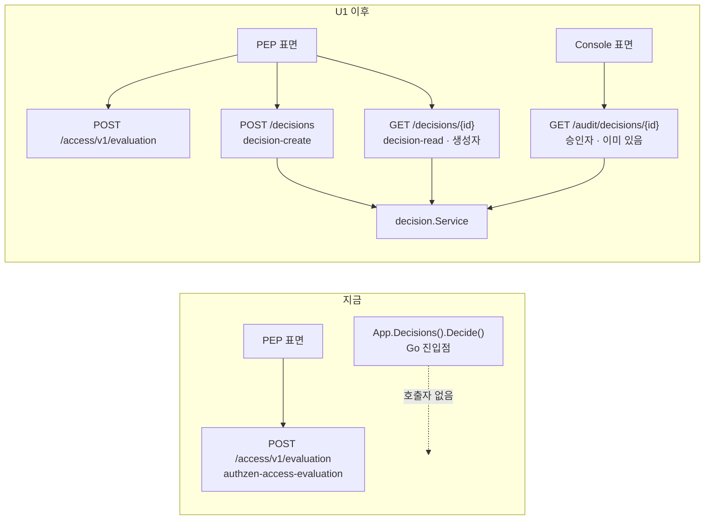
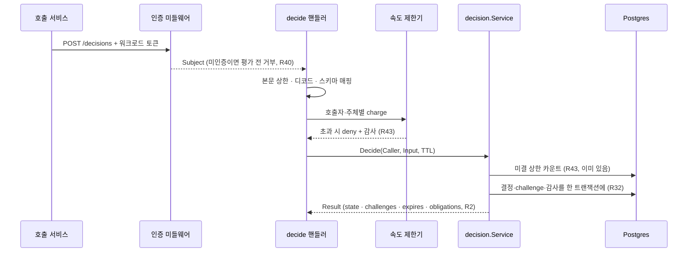

# feat: STAMP 완결 — decide 표면, egress 재사용, 배포·데모 번들

> **정본 관계.** 제품 요구(R-ID)와 결정(D-ID)의 정본은 `docs/plans/2026-08-07-001-feat-stamp-feature-map-plan.md`와 `docs/decisions/stamp-decision-log.md`다. 이 문서는 **새 제품 요구를 만들지 않는다** — 그 요구들 중 구현이 도달하지 않은 지점을 지목하고 닫는 실행 계획이다. R-ID는 전부 원 계획서의 것을 인용한다.

---

## Goal Capsule

원래 계획한 20개 구현 유닛이 전부 `main`에 있다. 그런데 유닛들을 실제로 돌려보니 **요구와 구현 사이에 다섯 개의 구멍**이 남았고, 그중 하나는 제품의 논지 자체에 걸린다.

이 계획이 닫는 것은 하나다: **`docker compose up` 한 번과 스크립트 하나로, 깨끗한 환경에서 STAMP가 자기가 주장하는 일을 하는 것을 볼 수 있게 만든다.** check 한 건, 승인을 거쳐 발효되는 decide 한 건, 벨로시티 deny 한 건.

그 문장이 지금 성립하지 않는 이유가 이 계획의 문제 프레임이다.

---

## Problem Frame

### 결정을 만드는 방법이 없다

PEP 표면에 마운트되는 라우트는 `authzen-access-evaluation` **하나뿐**이다. `Routes()`를 제공하는 타입 열한 개 중 결정을 생성하는 것이 없고, `internal/api` 어디에서도 `Decide(`가 호출되지 않는다. Go 진입점(`internal/runtime/decide.go`의 `decidePlane.Decide`, `App.Decisions()`)은 있는데 HTTP가 그것에 닿지 않는다.

승인 제출·취소·콜백·조회는 전부 있다. **그것들이 대상으로 삼는 결정을 만드는 방법만 없다.**

증거가 하나 더 있다. `decision.Result`는 이미 JSON 태그를 전부 달고 있고(`internal/decision/service.go:239-251`), `authzen.go`의 `ContextKeyObligations` 주석은 "obligation은 결정과 함께 온다"며 decide를 명시적으로 전방 참조한다. **HTTP 표면을 전제하고 설계됐는데 그 표면만 지어지지 않았다.**

어떤 유닛의 `Files`도 `internal/api/decisions.go`를 지목하지 않았다. U7이 `internal/decision`에 수명주기를 세우고 U5가 check API를 세웠는데, 그 사이가 비었다 — 계획의 공백이지 구현의 태만이 아니다.

### 나머지 넷

- **egress가 연결을 재사용하지 않는다.** `MaxIdleConns: 32`는 있지만 `MaxIdleConnsPerHost`가 없어 Go 기본값 2다. fact source는 보통 소수의 호스트이므로 전체 상한 32는 도움이 되지 않는다. U17 벤치에서 loopback 포트가 고갈됐다.
- **R43의 속도 제한 절반이 없다.** 미결 상한은 구현·감사·배선까지 끝나 있다(`decision.DefaultMaxOutstanding`, `refuse()`가 `decision.refused`를 남기고 deny를 돌려준다). 그런데 **호출자·주체별 속도 제한은 `internal/api` 어디에도 없다.**
- **`AlertThreshold`가 배선되지 않았다.** `AuditConfig`는 받지만 합성 루트가 넘기지 않아 항상 1이다. 이벤트 한 건만 잃어도 알람이 뜨고 운영자가 민감도를 못 바꾼다.
- **배포와 데모가 없다.** Helm과 릴리즈는 브랜치에 있고 PR 전이며, compose 데모·예제 정책·퀵스타트는 아예 없다.

### 반복되는 모양 하나

`AlertThreshold`는 세 번째 사례다. `STAMP_BOOTSTRAP_WARN_INTERVAL`(M4 통합이 발견), 체크포인트 서브시스템 전체(U18a가 발견), 그리고 이것 — **읽히거나 정의되지만 아무 데도 전달되지 않는 설정.** 이 계획은 U5에서 그 부류를 기계적으로 잡는 검사를 세운다. 개별 사례를 고치는 것으로는 네 번째가 나오는 것을 막지 못한다.

---

## Requirements

원 계획서의 R-ID를 인용한다. 새 요구는 없다.

| R-ID | 요구 | 지금 상태 | 닫는 유닛 |
|---|---|---|---|
| **R2** | `decide()`가 결정 객체를 생성하고, 그 객체가 상태·요구 challenge와 수집 현황·만료 시각·obligation을 노출한다 | HTTP 표면 없음 | U1 |
| **R40** | PEP 표면(check·decide·결정 조회)은 인증된 호출자만 접근. **결정 조회는 생성 호출자 또는 대상 승인자로 제한** | 생성·조회 표면 없음. 판정 로직(`decision.Service.Get` → `mayAccess`)은 완성돼 있음 | U1 |
| **R43** | decide 생성 등이 호출자·주체별 **속도 제한**과 **미결 상한**을 갖고, 초과는 deny와 감사 이벤트 | 미결 상한 완료. 속도 제한 부재 | U2 |
| **R26** | check 미스 경로 종단 지연·QPS 추적 | 측정이 연결 재사용 부재에 막힘 | U3 |
| **R32** | 감사 유실 구간 마커와 운영자 경보 | 마커·경보 있음. 경보 **민감도**가 배선 안 됨 | U5 |
| **R11, R25, R27, R29, R35, R39, R42, R49, R51** | 컨테이너·차트·역할별 자격·비밀 참조·저작 모드·릴리즈 | 브랜치에 있고 미착지 | U4 |
| **R28, R34** | 데모의 위임 MFA(step-up, D26), 부트스트랩·잠금 절차 | 없음 | U6 |

---

## Key Technical Decisions

### KTD1. decide는 PEP 표면에 새 라우트로 서고, AuthZEN 계약을 흉내 내지 않는다

`check`의 요청 본문은 AuthZEN Access Evaluation 스펙이 정한 모양이고 `EvaluationPath`도 스펙 고정이다. **decide는 그 스펙에 없는 호출이다.** 응답이 결정 객체이므로 AuthZEN의 boolean 판정 계약에 담기지 않는다.

요청 **본문**은 AuthZEN 모양을 그대로 재사용한다(`EvaluationRequest`는 이미 패키지 수준 타입이고 `CheckAPI`와 독립이다) — 같은 것을 두 번 다르게 표현할 이유가 없고, PEP가 check와 decide를 같은 입력으로 부를 수 있어야 한다. 여기에 `ttl`만 더한다.

**기각:** decide를 AuthZEN 응답 컨텍스트의 확장으로 표현하는 안. `stamp.*` 네임스페이스에 결정 객체를 통째로 싣는 것은 표준 소비자가 컨텍스트를 무시해도 판정 해석이 같아야 한다는 R1의 규약을 깬다 — pending은 boolean으로 정직하게 표현할 수 없다.

### KTD2. 결정 조회는 PEP에 생성자용, 콘솔에 승인자용으로 이미 갈라져 있다

마운트 테이블이 `PEP → {workload}`, `Console → {user, static}`으로 고정돼 있다(`internal/api/server.go:111-115`). 생성 호출자는 워크로드 자격이고 대상 승인자는 사용자 토큰이므로 **하나의 라우트가 둘을 서빙할 수 없다.**

승인자 쪽은 이미 있다 — `GET /audit/decisions/{id}`(U16)가 `decision.Service.Get`을 통과시킨다. 그래서 U1은 **PEP에 생성자용 조회만** 추가한다. 판정은 새로 쓰지 않고 `decision.Service.Get`을 부른다 — R40의 규칙을 두 번 구현하면 두 규칙이 갈라진다.

### KTD3. 속도 제한은 in-process 토큰 버킷으로 시작하고, 그 한계를 문서에 적는다

리포에 선례가 둘이다. `internal/stream`의 토큰 버킷(in-memory, 요청당 O(1))과 `revision`의 DB 후행 창 카운트(클러스터 정확, 요청당 쿼리 1회).

decide는 check 다음으로 뜨거운 경로이므로 **요청마다 DB를 치는 제한기를 둘 수 없다.** 토큰 버킷을 고르되 그 대가를 명시한다: **한도가 인스턴스별이므로 N개 레플리카는 실효 한도 N배다.** 미결 상한이 DB 기반이라 절대 상한은 여전히 클러스터 전역으로 걸리고, 속도 제한은 그 위의 완충이다 — 그 조합이 이 선택을 감당 가능하게 만든다.

**기각:** DB 후행 창. 정확하지만 decide 경로에 쿼리를 하나 더 얹는다. **기각:** 외부 저장소(Redis 등). D20(Postgres 단일 저장소)을 깬다.

### KTD4. egress 연결 재사용은 핀이 재사용 연결에도 성립하는지 확정한 뒤에 켠다

`Gate.DialContext`가 핀의 유일한 지점이다 — 호스트를 resolve하고 `checkAll`로 모든 주소를 검사한 뒤에야 연결한다. **연결이 재사용되면 그 검사는 최초 다이얼 때 한 번만 돈다.**

그게 안전한지는 자명하지 않다. Go의 연결 풀은 `(scheme, host:port)` 키로 재사용하므로 **다른 호스트로 가는 요청이 남의 연결을 물려받지는 않는다.** 위험은 다른 쪽이다: 허용된 호스트의 DNS가 사설 대역으로 바뀌어도(DNS rebinding) 이미 열린 연결은 계속 쓰인다.

U3은 이것을 **먼저 테스트로 확정하고** 그 결과에 따라 재사용 범위를 정한다. 값을 올리는 것이 결론이 아닐 수 있고, 그 판단이 이 유닛의 산출물이다.

### KTD5. "정의됐지만 전달되지 않는 설정"은 개별로 고치지 않고 검사로 잡는다

같은 결손이 세 번 나왔다. 네 번째를 막는 것은 네 번째를 고치는 것이 아니라 **그 부류가 CI에서 빨개지게 만드는 것**이다.

---

## High-Level Technical Design

### 지금의 PEP 표면과 U1 이후

`decision.Service`가 셋의 단일 판정 지점이라는 것이 KTD2의 요점이다.

### decide 요청의 게이트 순서

속도 제한이 **평가 앞**에 있는 것이 요점이다 — 한도 초과가 평가 비용을 치른 뒤에 거부되면 그 한도는 자원을 지키지 못한다.

---

## Implementation Units

### U1. decide HTTP 표면

- **Goal:** 결정을 생성하는 PEP 엔드포인트와 생성자용 결정 조회. R2와 R40을 닫는다.
- **Requirements:** R2, R40. (R43의 속도 제한은 U2.)
- **Dependencies:** 없음.
- **Files:** `internal/api/decisions.go`, `internal/api/decisions_test.go`, `internal/runtime/decide.go`, `internal/runtime/wiring.go`, `internal/runtime/wiring_test.go`, `docs/contracts/decision-api.md`(U4가 만드는 파일 — 충돌 시 U4 이후로).
- **Approach:**
  1. `package api`에 `Decisions` provider를 세운다. `CheckAPI`의 구성 규약을 그대로 따른다 — `Config`의 필수 의존은 `New`에서 오류, 상한과 시계는 주입, `Routes()`가 `Provider`를 만족.
  2. 라우트 둘 다 `SurfacePEP` + `AuthWorkload`. 마운트 테이블이 PEP에 워크로드만 허용하므로 다른 선택지가 없고, 그 제약이 KTD2의 근거다.
  3. 요청 본문은 `EvaluationRequest`(패키지 수준, `CheckAPI`와 독립)를 재사용하고 `ttl`을 더한다. `engine.Input` 조립은 **`entityInput`/`attributeValue`를 직접 부른다** — 리포에 이미 입력 변환기가 셋(`inputFor`, `dryrun.sampleInput`, `revalidate.restoreInput`) 있고 네 번째를 만들면 그 갈라짐이 고착된다.
  4. **막힌 지점 하나:** `entityInput`은 `*policy.Schema`를 요구하는데 decide 쪽에 스키마 출처가 없다. `decidePlane.refresh`가 스냅샷을 읽고 evaluator를 만든 뒤 버린다. `decidePlane`에 `Schema()`를 더한다(`snap`을 이미 들고 있다). **`RoleCheck`를 함께 요구하는 안은 기각** — 역할 분리를 깬다.
  5. 조회는 `decision.Service.Get(ctx, caller, id)`를 그대로 부른다. `mayAccess`가 R40이고 감사 거부까지 이미 남긴다. `runtime.DecisionPath`에 `Get`을 더한다.
  6. 핸들러는 `plane`을 거친다(`plane.Service()`가 아니라) — 후자는 부팅 시점 서비스를 캡처해서 개정 시 교체를 따라가지 못한다. 감사 콘솔이 그 형태로 배선돼 있는 것은 별개 사안이며 **발견하면 보고하라**.
  7. 오류 매핑은 `approvals.go`의 `approvalError` 선례를 따른다 — **404와 403을 구분 불가능하게** 유지한다. 결정의 존재 여부가 권한 없는 호출자에게 새면 안 된다.
- **Execution note:** 표면이 존재하지 않는다는 것을 먼저 red로 고정하라 — `wiring_test.go`의 `TestRolesDecideWhichRoutesTheProcessHas`가 지금 PEP 404를 단언하고 있으므로, 그 테스트가 새 라우트를 요구하도록 뒤집는 것이 자연스러운 시작점이다.
- **Test scenarios:**
  - 워크로드 토큰으로 `POST /decisions`가 pending 결정을 만들고, 응답이 상태·challenge 목록과 수집 현황·만료 시각·obligation을 전부 싣는다(R2).
  - 아무 challenge도 요구하지 않는 요청이 allow로 즉시 해소되고, 그 결정도 조회 가능한 객체로 남는다.
  - deny는 결정 행을 만들지 않고 감사에만 남는다 — 응답이 그것을 정직하게 표현한다.
  - 미인증 요청이 **평가 이전에** 거부된다(R40).
  - 사용자 토큰(엔드유저)이 PEP 표면에서 거부된다.
  - 생성 호출자가 자기 결정을 `GET /decisions/{id}`로 읽는다.
  - **다른 워크로드 호출자의 조회가 거부되고, 그 거부가 존재하지 않는 결정의 조회와 구분되지 않는다.**
  - 거부된 조회가 `decision.access.refused` 감사 행을 남긴다.
  - `--roles=check`로 기동 시 decide 라우트가 404다(원 계획 U1의 시나리오가 이제 실재한다).
  - `--roles=decide`로 기동 시 decide 라우트가 서고 check 라우트가 404다.
  - 본문 상한 초과가 디코드 이전에 거부된다.
  - 선언되지 않은 속성이 무시되고 선언된 것만 타입이 붙는다(check와 동일한 매핑을 쓴다는 증거).
  - 스키마가 아직 없는 상태의 요청이 500이 아니라 명시적 거부로 답한다.
- **Verification:** `go test -race ./internal/api/ ./internal/runtime/` 통과. F-테스트가 **실제 HTTP로** 결정을 만드는 경로가 하나 이상 생긴다(지금은 전부 in-process `Decisions().Decide()`를 부른다).

### U2. decide 속도 제한 (R43의 나머지 절반)

- **Goal:** 호출자·주체별 속도 제한을 decide 생성 경로에 건다. 초과는 deny와 감사 이벤트.
- **Requirements:** R43.
- **Dependencies:** U1.
- **Files:** `internal/api/ratelimit.go`, `internal/api/ratelimit_test.go`, `internal/api/decisions.go`, `internal/api/decisions_test.go`, `internal/runtime/config.go`, `internal/runtime/wiring.go`.
- **Approach:**
  1. `internal/stream`의 토큰 버킷이 형태의 선례다 — 호출자 키와 주체 키를 각각 charge하고, **환불하지 않으며**, 표가 무한히 자라지 않게 sweep-or-refuse한다. 그 패키지에서 꺼내 공유할지 `internal/api`에 별도로 둘지는 구현자 판단이고, **꺼낼 경우 `stream`의 동작이 바뀌지 않는다는 것을 테스트로 보여야 한다.**
  2. 제한기는 **평가 앞**에 선다(HTD 시퀀스 참조).
  3. 초과는 R43의 문면대로 **deny와 감사**다 — 429가 아니라 deny 결과다. 다만 그것이 정책 판정에 의한 deny와 구분 가능해야 한다: `decision.Service.refuse()`가 미결 상한 초과에 쓰는 `ReasonOutstandingCap`의 선례를 따라 전용 reason을 쓴다.
  4. 감사는 서비스에 도달하지 않는 거부이므로 HTTP 계층이 남겨야 한다. `AuditBuffer`의 `Event`는 종류가 고정(`EventCheck`/`EventAuth`)이므로, 감사 콘솔이 쓰는 `AuditAppender` 이음새를 쓸지 `Event` 종류를 늘릴지 정하고 **근거를 PR에 쓴다.**
  5. 설정은 `revision.Rate`(`Window`/`Burst`)나 `stream.RateLimit`(`PerSecond`/`Burst`) 중 **기존 이름 하나를 고르고** 새 어휘를 만들지 않는다.
- **Execution note:** 한도 초과를 먼저 red로 고정하라 — 제한기 없는 상태에서 연속 호출이 전부 통과하는 것이 그 red다.
- **Test scenarios:**
  - 한 호출자가 burst를 넘겨 호출하면 초과분이 deny로 답하고, 그 deny가 정책 deny와 구분되는 reason을 갖는다.
  - 같은 호출자라도 **다른 주체**에 대한 요청은 주체별 한도를 따로 소비한다.
  - 한 주체에 대해 여러 호출자가 호출하면 주체별 한도가 합산되어 걸린다.
  - 한도 초과가 감사 행을 남기고, 그 행이 호출자·주체·한도를 싣는다.
  - 창이 지나면 예산이 회복된다.
  - **한도 초과가 평가를 수행하지 않는다** — 정책 평가나 fact 조회가 일어나지 않았음을 단언한다(이것이 이 유닛의 요점이다).
  - 제한기 표가 무한히 자라지 않는다(고유 키를 대량 투입하고 상한을 확인).
  - 설정 미지정 시 기본값이 적용되고, 잘못된 값은 기동 실패다.
- **Verification:** `go test -race ./internal/api/ ./internal/runtime/` 통과. 한도가 인스턴스별이라는 사실이 설정 문서와 PR에 명시된다.

### U3. egress 연결 재사용과 핀의 관계 확정

- **Goal:** 이슈 #30을 닫되, 연결 재사용이 egress 핀을 우회하지 않는다는 것을 먼저 확정한다.
- **Requirements:** R26(미스 경로 측정 가능성), 그리고 원 계획의 egress 경계 요구.
- **Dependencies:** 없음.
- **Files:** `internal/fact/egress.go`, `internal/fact/egress_test.go`.
- **Approach:**
  1. **먼저 확정한다:** 재사용되는 연결이 `Gate.DialContext`를 거치지 않는다는 것을 테스트로 보인다. Go의 풀이 `(scheme, host:port)` 키로만 재사용하므로 **다른 호스트가 남의 연결을 물려받지는 않는다** — 그것도 테스트로 고정한다(그 전제가 깨지면 재사용은 곧 핀 우회다).
  2. 남는 위험은 **허용된 호스트의 DNS가 나중에 바뀌는 경우**다. 이미 열린 연결은 계속 쓰인다. 이것이 수용 가능한지 판단하고 근거를 쓴다 — `IdleConnTimeout`이 30초이므로 노출 창이 그 정도로 제한된다는 것이 판단의 재료다.
  3. 그 다음에야 `MaxIdleConnsPerHost`를 설정한다. 값은 `MaxIdleConns: 32`와의 관계에서 정한다.
  4. **판단이 "재사용을 켜면 안 된다"로 나올 수 있다.** 그 경우 이슈 #30은 "고칠 수 없다"가 아니라 "미스 경로 최대 QPS는 한 호스트에서 측정 불가"로 닫히고, U17의 페이싱이 영구 조건이 된다. **그 결론도 정당한 산출물이다.**
- **Execution note:** 재사용이 핀을 우회하는지가 이 유닛의 진짜 질문이다. 성능 변경은 그 답이 나온 뒤의 따름정리다.
- **Test scenarios:**
  - 차단된 호스트로의 요청이 재사용 설정과 무관하게 거부된다.
  - 허용된 호스트로 연속 요청 시 두 번째가 새 연결을 열지 않는다(재사용이 실제로 일어난다).
  - **서로 다른 호스트로의 요청이 연결을 공유하지 않는다.**
  - 사설 대역으로 resolve되는 호스트가 최초 다이얼에서 거부된다(기존 보장 유지).
  - `Proxy`가 nil이고 `InsecureSkipVerify`가 없다는 기존 단언이 그대로 통과한다.
- **Verification:** `go test -race ./internal/fact/` 통과. 이슈 #30에 결론과 근거를 코멘트로 남긴다.

### U4. U18b 착지 — Helm·릴리즈·계약 버전

- **Goal:** 브랜치 `u18b-packaging`을 `main`에 착지시키고, 그 유닛이 남긴 미해결 셋을 처리한다.
- **Requirements:** R11, R25, R27, R29, R32(싱크 설정), R35, R39, R42, R49, R51.
- **Dependencies:** 없음. (U18a의 체크포인트 설정은 이미 `main`에 있다.)
- **Files:** `deploy/helm/stamp/**`, `.github/workflows/release.yml`, `scripts/release-artifacts.sh`, `scripts/check-contract-versions.sh`, `docs/contracts/*.md`, `CHANGELOG.md`, `internal/release/**`.
- **Approach:**
  1. 브랜치를 현재 `main`으로 rebase하고 전 게이트를 다시 통과시킨다.
  2. **체크포인트 values를 잇는다.** U18b가 뺀 이유는 그때 `config.go`에 체크포인트 env가 하나도 없었기 때문이고, U18a가 `STAMP_AUDIT_CHECKPOINT_*` 6종을 만들었으므로 이제 실재하는 설정이다. 서명 키는 **Secret 참조로만**(R42) — U18a가 로더를 PEM 파일 경로로 고정했으므로 차트도 그 형태여야 한다.
  3. **U18a가 남긴 배포 요구 하나를 차트가 받는다:** 체크포인트는 `RoleAPI`만 찍으므로, **api 티어가 없는 역할 분리 렌더링은 아무도 체크포인트를 찍지 않는다.** 차트가 그것을 렌더링 시점에 드러내야 한다 — 조용히 통과시키면 감사 검증이 불가능한 배포가 유효한 매니페스트로 나온다.
  4. U18b가 보고한 나머지 둘 — R42의 데모 자격증명 거부에 런타임 개념이 없다, 문서 라우트가 모든 티어에 마운트된다 — 는 **차트에서 해결할 수 없다.** 전자는 U6이 데모 프로파일 개념을 만들 때 함께 보고, 후자는 런타임 변경이므로 이 계획의 범위 밖으로 두고 이슈로 남긴다.
- **Test scenarios:**
  - (U18b가 이미 갖고 있는 것 전부 유지) 두 토폴로지 렌더링 스냅샷, 역할 분리가 역할별 DB 자격과 분리된 리스너를 만든다, 렌더링에 평문 비밀이 없다, 계약 버전 표기 누락이 릴리즈를 실패시킨다.
  - **추가:** 체크포인트 values가 설정되면 서명 키가 Secret 참조로 마운트되고 매니페스트에 키 바이트가 없다.
  - **추가:** api 티어를 뺀 역할 분리 렌더링이 체크포인트 부재를 드러낸다.
- **Verification:** `helm lint` 두 values, `helm template` 스냅샷 일치, CI 전 잡 그린. **릴리즈 워크플로는 `workflow_dispatch` 리허설을 머지 후·태그 전에 한 번 돌린다** — U18b가 "GitHub에서 한 번도 실행된 적 없다"고 정직하게 보고했다.

### U5. 전달되지 않는 설정을 잡는 검사

- **Goal:** `AlertThreshold`를 잇고, 같은 부류를 CI가 잡게 한다.
- **Requirements:** R32(경보 민감도).
- **Dependencies:** 없음.
- **Files:** `internal/runtime/config.go`, `internal/runtime/wiring.go`, `internal/runtime/config_test.go`.
- **Approach:**
  1. `AlertThreshold`를 배선하고 env를 더한다.
  2. **본체는 검사다.** `Config`의 필드가 하나도 빠짐없이 합성 루트에서 소비되는지 확인하는 테스트를 세운다. 같은 결손이 세 번 나왔고(`STAMP_BOOTSTRAP_WARN_INTERVAL`, 체크포인트 전체, `AlertThreshold`) 네 번째를 막는 방법은 개별 수정이 아니다.
  3. 검사 형태는 구현자 판단이다 — reflect로 필드를 훑고 소비 지점을 대조하는 것, 각 필드에 대해 "기본값과 다른 값을 넣으면 관측 가능한 차이가 난다"를 요구하는 것 등. **후자가 더 강한 주장이고 더 비싸다.** 고르고 근거를 쓴다.
  4. 검사가 통과할 수 없는 필드가 있으면 그것이 곧 네 번째 사례다 — 고치거나, 왜 예외인지 검사에 명시적으로 적는다. **조용히 제외 목록에 넣지 마라.**
- **Execution note:** 검사를 먼저 세워 현재 `main`에서 빨개지는 것을 확인하라. 그것이 이 유닛이 실재하는 문제를 다룬다는 증거다.
- **Test scenarios:**
  - `STAMP_AUDIT_ALERT_THRESHOLD`가 경보 발화 시점을 바꾼다 — 설정한 건수 미만에서는 경보가 없고 이상에서 발화한다.
  - 잘못된 값(0 이하, 파싱 불가)이 기동 실패다.
  - 설정 소비 검사가 `Config`의 모든 필드를 덮고, 덮지 못하는 필드는 명시적 예외로 이유와 함께 기록된다.
  - 검사가 실제로 실패하는 것을 확인한다 — 임의의 필드 배선을 지우면 빨개진다.
- **Verification:** `go test -race ./internal/runtime/` 통과. 이슈 #31을 닫는다.

### U6. 데모 번들과 스크립트화된 퀵스타트

- **Goal:** compose 한 번과 스크립트 하나로 STAMP가 하는 일을 볼 수 있게 만든다. 이 계획의 종착점.
- **Requirements:** R28, R34, R42(데모 자격증명), R49, 그리고 원 계획 U18의 데모 시나리오 전부.
- **Dependencies:** U1(decide 표면 없이는 시나리오가 성립하지 않는다), U4(이미지·차트).
- **Files:** `deploy/demo/docker-compose.yml`, `deploy/demo/docker-compose.kafka.yml`, `deploy/demo/policies/**`, `deploy/demo/README.md`, `scripts/quickstart.sh`, `docs/quickstart.md`, `docs/security.md`, `docs/break-glass.md`, `.github/workflows/ci.yml`.
- **Approach:**
  1. **기본 프로파일은 브로커가 없다** — HTTP 인제스트로 벨로시티를 시연한다. Kafka는 선택 오버레이이고, 둘 다 돌아야 어댑터 2종이 검증된다(D11).
  2. **예제 정책은 파일 저작 포맷 그대로**이고 퀵스타트가 `stamp policy apply`로 적재한다 — 그래야 파일 경로가 문서화된 실제 절차가 된다(D10).
  3. 위임 MFA는 **step-up 리다이렉트**다. CIBA가 아니다 — D26이 U0의 스파이크로 확정했고, Keycloak CIBA는 동봉되지 않는 외부 인증 장치 서버를 요구한다.
  4. 퀵스타트는 **부트스트랩 토큰 획득과 잠금 절차를 단계로 포함한다.** 그 둘을 문서 밖에 두면 설치자가 단독 관리자 상태로 남는다.
  5. **`stamp audit verify`를 단계로 포함한다** — U18a가 만든 명령이고, 퀵스타트가 부르지 않으면 그 명령도 "구현됐지만 아무도 부르지 않는" 부류가 된다.
  6. **스크립트가 문서의 정본이다.** 문서가 스크립트를 설명하되 절차를 따로 적지 않는다 — 두 벌이면 표류한다.
  7. R42의 데모 자격증명 거부: 데모 전용 자격이 비-데모 프로파일에서 기동을 실패시켜야 하는데 런타임에 프로파일 개념이 없다(U18b 보고). **개념을 만들지, 아니면 요구를 이연하고 이슈로 남길지 판단하고 근거를 써라.**
  8. compose 전체 기동 시간을 한 번 재라 — U0의 S1이 "U18 착수 시점에 재고 예산을 초과하면 다시 연다"고 적어 뒀다.
- **Execution note:** 퀵스타트는 스모크로 상시 실행한다 — 문서와 실제 절차의 표류를 막는 유일한 장치다. 스크립트가 CI에서 돌지 않으면 이 유닛의 가치 대부분이 사라진다.
- **Test scenarios:**
  - 깨끗한 환경에서 스크립트만으로 **check 1건, 승인 포함 decide 1건, 벨로시티 deny 1건**이 성공하고 소요 시간이 아티팩트로 기록된다.
  - 위임 MFA 플로가 데모에서 종단 성공한다(step-up).
  - 파일 저작 집합 개정이 데모에서 종단 성공한다.
  - 기본 프로파일과 Kafka 오버레이에서 벨로시티 deny가 **동일하게** 성공한다.
  - 부트스트랩 토큰 획득과 잠금이 스크립트 단계로 성공하고, 잠금 후 개정이 정족수를 요구한다.
  - `stamp audit verify`가 데모 체인에 대해 종료 코드 0을 낸다.
  - egress 허용목록 미설정 시 원격 source를 쓰는 예제 정책이 로드되지 않는다.
  - 데모 IdP 로그인으로 콘솔 접속과 승인 제출이 동작한다.
  - 렌더링·로그에 평문 비밀이 없다.
- **Verification:** compose 스모크 CI 잡이 **두 프로파일 모두** 그린. `docs/quickstart.md`의 절차가 스크립트와 갈라지지 않는다(문서가 스크립트를 인용한다).

---

## Verification Contract

원 계획서의 게이트를 그대로 물려받고, 이 계획이 더하는 것만 적는다.

| 게이트 | 명령 또는 절차 | 적용 대상 |
|---|---|---|
| Go 단위·통합 테스트 | `go test -race ./...` (testcontainers) | 전 유닛 |
| 린트 | `golangci-lint run` (도커 형태 — 샌드박스가 `~/go/bin` 쓰기를 버린다) | 전 유닛 |
| 취약점 스캔 | `govulncheck ./...` | 전 유닛 |
| 컨테이너 | `docker build` | U4, U6 |
| 콘솔 | `npm ci && npm test && npm run build`, 계약 경계 검사 | 계약이 바뀌면 |
| E2E | Playwright 스모크 + axe(대비 포함) | U6이 콘솔을 건드리면 |
| AuthZEN 적합성 | interop 하네스 | U1(check 라우트를 건드리지 않음을 확인) |
| 벤치 | bench CI 잡 | U2, U3 |
| Helm | `helm lint`, `helm template` 스냅샷 | U4 |
| 릴리즈 | `workflow_dispatch` 리허설 1회 | U4 |
| **데모 스모크** | 퀵스타트 스크립트, 두 프로파일 | U6 |
| **설정 소비 검사** | `go test ./internal/runtime/` | U5 |

---

## Definition of Done

1. `POST /decisions`로 결정이 만들어지고, 응답이 R2가 요구하는 네 가지를 전부 싣는다.
2. 결정 조회가 생성 호출자에게 열리고 다른 호출자에게 닫히며, 그 거부가 부재와 구분되지 않는다.
3. decide 생성에 호출자·주체별 속도 제한이 걸리고 초과가 deny와 감사로 처리된다.
4. 이슈 #30·#31·#33이 결론과 함께 닫힌다 — 세 번째는 구현으로, 앞의 둘은 구현 또는 근거 있는 "이렇게 닫는다"로.
5. Helm 두 토폴로지가 `main`에 있고 릴리즈 워크플로가 최소 한 번 실제로 돌았다.
6. `Config`의 모든 필드가 소비된다는 것이 CI에서 검사된다.
7. **M4(저작 경로)가 종단으로 동작하는 것이 데모에서 보인다** — 데모 IdP로 콘솔에 로그인해 폼으로 정책을 저작하고, 그 개정이 승인함에서 승인을 거쳐 발효되며, 같은 집합을 파일 경로로 내보내고 되적재해도 변화가 없다. U14·U15·U16·U19가 각각의 테스트로 증명한 것을 **하나의 흐름으로 이어서** 보이는 것이 이 항목이다.
8. **깨끗한 환경에서 `scripts/quickstart.sh`만으로 check 1건·승인 포함 decide 1건·벨로시티 deny 1건이 성공하고, 그 스크립트가 CI에서 두 프로파일로 상시 돈다.**

7번과 8번이 이 계획의 실질적 완료 조건이다. 나머지 여섯은 그것이 성립하기 위한 조건이거나, 성립한 뒤에도 남아 있어야 하는 보장이다.

---

## Landing 전략

원 계획서의 **D25를 그대로 따른다. 이 계획은 착지 규약을 새로 만들지 않는다.**

- **구현 유닛 하나 = PR 하나이고 squash 병합이다.** 여섯 유닛을 한 PR로 묶지 않는다 — 각 유닛의 근거와 반증이 그 PR 본문에 남아야 하고, 뭉치면 그 기록이 사라진다.
- U1→U2, U4→U6, U1→U6의 의존이 있으므로 그 순서로 착지시킨다. U3와 U5는 어디에도 의존하지 않으므로 병행 가능하다.
- PR 본문은 네 항목을 갖는다 — **배경 / 해결법 / 근거 / 집중해서 봐야할 것**. 마지막 항목에는 최소 하나의 "여기가 틀렸으면 무엇이 무너지는가"가 있어야 하고, green-first인 부분은 정직하게 밝힌다.
- **그린 판정은 실제로 병합될 트리 위에서 나온다.** rebase 후에는 새 SHA 기준으로 CI를 다시 받는다.
- **부모를 병합할 때 브랜치를 함께 지우면 자식 PR이 닫힌다** — 자식을 먼저 rebase하고 base를 옮긴 뒤에야 부모 브랜치를 지운다.

---

## Scope Boundaries

### 이 계획이 하지 않는 것

- **새 제품 요구를 만들지 않는다.** R-ID는 전부 원 계획서의 것이다.
- **콘솔 화면을 늘리지 않는다.** U16이 승인함·감사를, U15가 빌더를 세웠고 이 계획은 그 위에 아무것도 더하지 않는다.
- **AuthZEN 프로파일을 확장하지 않는다.** decide는 AuthZEN 호출이 아니다(KTD1).

### 이연 — 후속 작업

- **문서 라우트가 모든 티어에 마운트되는 것**(U18b 보고). 합성 루트가 역할 적용 전에 레지스트리를 전부 만들기 때문이며, 좁히는 것은 런타임 변경이다. 이슈로 남긴다.
- **속도 제한의 클러스터 전역화.** KTD3이 인스턴스별을 고른 대가이고, 미결 상한이 DB 기반이라 절대 상한은 유지된다. 실제 배포에서 문제가 되면 그때 연다.
- **`approvals`·`revisions` 제출 경로의 속도 제한.** R43이 그것들도 지목하지만 이 계획은 decide만 닫는다 — 콘솔 표면이고 뜨거운 경로가 아니다. 남은 부분을 이슈로 명시한다.
- **감사 트랜잭션의 멱등 키.** 관측하지 못한 커밋의 비감사 부분이 남는 문제(이슈 #17 해소 시 보고됨)로, U4 스키마 결정이다.

---

## Open Questions

의도적으로 실행 시점에 남긴다.

1. **U2의 감사 이음새.** `AuditBuffer.Event`에 종류를 더할지, 감사 콘솔이 쓰는 `AuditAppender`를 쓸지. 전자는 버퍼의 손실 특성을 물려받고(속도 제한 거부가 유실될 수 있다), 후자는 동기 체인 쓰기라 뜨거운 경로에 트랜잭션을 얹는다. **한도 초과 기록이 유실되어도 되는가**가 이 선택의 실질이다.
2. **U3의 결론.** 연결 재사용이 허용 가능한지는 테스트가 답한다. "켜면 안 된다"가 정당한 결론이다.
3. **U5의 검사 형태.** 필드 소비 대조 대 관측 가능한 차이 요구. 후자가 강하고 비싸다.
4. **U6의 데모 프로파일.** R42의 데모 자격증명 거부에 런타임 개념을 만들지, 요구를 이연할지.

---

## Sources & Research

- `docs/plans/2026-08-07-001-feat-stamp-feature-map-plan.md` — 제품 요구(R-ID)와 원 유닛 정의의 정본.
- `docs/decisions/stamp-decision-log.md` — D1–D27. 특히 D10(파일 저작), D11(IO 경계 포트), D14(역할), D19(콘솔 동봉), D20(Postgres 단일 저장소), D26(step-up), D27(델타 before 면).
- `docs/spike-results.md` — U0의 실측. S1이 U18 착수 시 compose 기동 시간을 다시 재라고 남겼다.
- 이슈 #30(egress 재사용), #31(감사 경보 — **본문 정정됨**), #33(decide 표면).
- 코드 정찰: PEP 표면 라우트가 `internal/api/authzen.go:157-165` 하나뿐이라는 것, `decision.Service.Get`/`mayAccess`가 R40을 이미 구현한다는 것(`internal/decision/service.go:433-455, 747-776`), 미결 상한이 완성돼 있다는 것(`:296-307, 779-806, 825-840`), `decidePlane`에 `Schema()`와 `Get`이 없다는 것(`internal/runtime/decide.go:30-34, 71-102`), `internal/api`에 속도 제한이 전무하다는 것.
