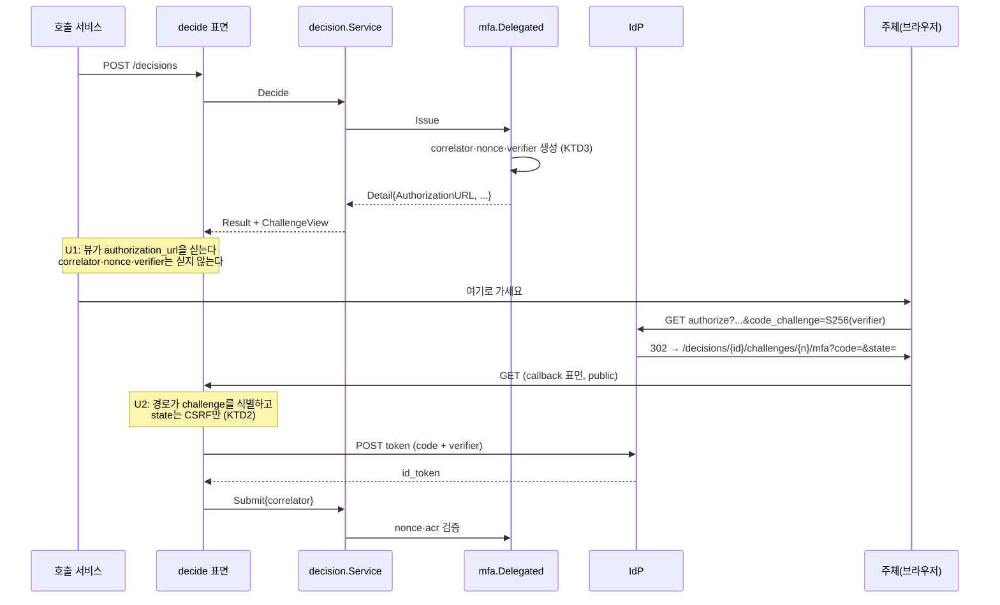
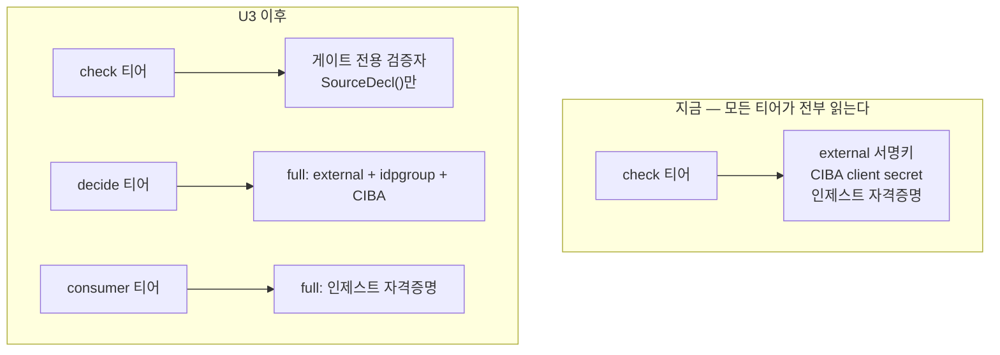

# fix: 열린 이슈 여덟 — 위임 MFA 완결, 티어별 자격증명, 선언-실제 대조

> **정본 관계.** 제품 요구(R-ID)의 정본은 `docs/plans/2026-08-07-001-feat-stamp-feature-map-plan.md`, 결정(D-ID)의 정본은 `docs/decisions/stamp-decision-log.md`(D27까지). 이 문서는 새 요구를 만들지 않는다 — 열린 이슈 여덟이 지목한 결손을 닫는 실행 계획이다.

---

## Goal Capsule

여덟 이슈는 세 부류다.

1. **도달할 수 없는 것** — 위임 MFA(#41). D26이 step-up을 데모의 **기본** 경로로 승격했는데 그 경로를 걸을 수 없다. 이것이 "구현됐지만 도달할 수 없다"의 다섯 번째 사례다.
2. **선언과 실제가 어긋난 것** — 계약 문서 대 라우트(#44), 역할 대 표면(#46), 주석 대 코드(#38), 그리고 `Config` 소비 검사의 사각지대(#47c). 전부 **대조하는 검사가 없어서** 어긋난 채로 초록이었다.
3. **경계가 덜 그어진 것** — 자격증명이 안 쓰는 티어에 있고(#34), 속도 제한이 한 경로에만 있고(#40), decide 응답이 소비자에게 재시도 가능성을 말하지 않고(#45), 타임아웃이 이름 없는 고아를 남긴다(#47a·b).

닫는 것 하나: **`gh issue list --state open`이 비고, 그 상태가 검사로 유지된다.**

---

## Problem Frame

### 위임 MFA는 세 군데가 끊겨 있다 (#41)

정찰이 이슈 본문보다 하나를 더 찾았다.

1. **주체를 어디로 보낼지 아무도 모른다.** `mfa.Detail.AuthorizationURL`은 `challenge_progress` 행에 저장되지만, 호출자가 보는 `decision.ChallengeView`는 `ordinal/kind/state/have/need/deadline` 여섯 필드가 전부다. 핸들러→뷰 경로에 `Status.Detail`이 존재하는데 **터미널 전이 시 저장용으로만 쓰이고 뷰로 가지 않는다.**
2. **콜백이 IdP가 보내는 모양을 받지 않는다.** `POST … /mfa`가 `{correlator, id_token}` JSON을 기대하는데 IdP는 `GET ?code=…&state=…`로 온다. 그리고 **리포에 authorization_code 교환 코드가 Go에 하나도 없다** — `StepUpConfig`에 `TokenEndpoint`도 `ClientSecret`도 없다.
3. **PKCE가 빠져 있다 — 이건 이슈에 없던 것이다.** `identity.StepUp.AuthorizationURL`이 `code_challenge`를 보내지 않는데, 데모의 `stamp-stepup` 클라이언트는 `pkce.code.challenge.method: S256`으로 등록돼 있다. Keycloak에서 그 속성은 PKCE를 **강제**하므로 현재 URL은 거절될 가능성이 높다. **데모가 브라우저 왕복을 실행하지 않아 드러나지 않았다** — 도달할 수 없는 경로는 자기 결함도 숨긴다.

### 자격증명이 안 쓰는 티어에 있다 (#34)

합성 루트가 역할과 무관하게 레지스트리 다섯을 만든다. 자격증명을 담는 셋의 실제 소비자는 좁다:

| 문서 | 자격증명 | 실제로 쓰는 역할 |
|---|---|---|
| `STAMP_INGEST_CREDENTIALS` | 발급자별 서명 비밀 | **consumer 전용** |
| `STAMP_EXTERNAL_TARGETS` | webhook HMAC 공유키 | **decide 전용** |
| `STAMP_IDP_GROUP_SOURCES` | 디렉터리 bearer | check + decide (진짜로 둘 다) |
| `STAMP_MFA_CIBA_CLIENT_SECRET` | IdP client secret | decide 전용 |

check 티어가 지금 external 서명키·CIBA client secret·인제스트 자격증명을 **파일로 쥐고 있다.** DB 쪽에서 얻은 최소 권한이 파일 쪽에서 되돌려진다.

**그런데 그냥 빼면 부팅이 안 된다.** 스키마 게이트(`snapshotSource.gates`)가 선언된 kind마다 검증자를 요구하고, 없으면 `unconfiguredKind`가 그 스키마를 거부한다 — 그 설계는 의도적이다("플레인이 목록에서 빠지면 더 약한 검사가 아니라 그 kind에 대해 검사가 **전혀 없는 것**").

**해소의 열쇠**: `VerifySchema` 구현 셋이 전부 `Declaration.SourceDecl()`만 본다 — **자격증명에 손도 대지 않는다.** 그리고 선언/자격증명 분리는 **이미 존재한다**(`SourceDecl()`이 그 함수다).

### 대조하는 검사가 없다 (#44, #46, #47c, #38)

- **#44**: 계약 버전 게이트가 `want_exact`를 비워 major만 비교하고, 그 major는 `EvaluationPath`에서 오므로 라우트가 늘어도 안 움직인다. 1.1.0으로 올려도, 1.99.0이어도 통과한다.
- **#46**: 역할의 라우트가 그 티어가 바인드하는 표면에 있는지 묻는 것이 없다. split 토폴로지가 decide를 서빙 못 하던 P0이 그래서 새어나갔다.
- **#47c**: `consumption_test.go`가 아무도 부르지 않는 함수의 읽기를 소비로 센다. 적대적 리뷰어가 디스크에서 재현했다.
- **#38**: `approvalError`와 `auditReadError`의 주석이 "존재하지 않는 결정과 의도적으로 같은 답"이라 말하는데 **코드는 403/404로 다른 코드·다른 메시지를 준다.**

넷의 공통점: **선언(문서·주석·표)과 실제(라우트·바인딩·코드)를 기계가 대조하지 않는다.**

### decide가 소비자에게 말하지 않는 것 (#45, #47a, #47b)

- 속도 제한 거부가 정책 deny와 **전송 수준에서 구분 불가**다. 중간의 재시도 미들웨어·게이트웨이·대시보드가 눈이 먼다.
- `policy_set_stale`이 `error` 어휘를 침범한다 — 같은 상태를 `GET /policies`는 `not_installed`로 답한다.
- 클라이언트 타임아웃이 **이름 없는 pending**을 남기고, 멱등 키가 없어 재시도가 고아를 늘린다. **결정적 제약: challenge 발급(IdP 호출, webhook 발신)이 DB 삽입보다 먼저 일어난다** — 멱등 키가 그 뒤에 놓이면 부작용은 이미 나갔다.
- 호출자·주체 예산이 8192항목 표 하나를 공유한다.

---

## Requirements

전부 원 계획서의 R-ID를 인용한다. 새 요구는 없다.

| R-ID | 요구 | 닫는 유닛 |
|---|---|---|
| **R28** | 위임 MFA는 IdP에 위임하고 응답의 `acr`를 검증한다 (D26: step-up이 기본 경로) | U1, U2 |
| **R39** | 콜백 수신 표면을 PEP·콘솔과 분리해 노출한다 | U2 |
| **R42** | 모든 비밀은 파일 또는 Secret 참조로만 주입되며 필요 없는 곳에 존재하지 않는다 | U3 |
| **R43** | decide 생성·**challenge 발급**·webhook 발신·승인 제출이 속도 제한과 미결 상한을 갖고, 초과는 deny와 감사 | U4, U7, U8 |
| **R11** | 공개 계약 3종이 semver로 관리되고 릴리즈가 검사한다 | U5 |
| **R40** | 결정 조회는 생성 호출자 또는 대상 승인자로 제한한다 | U6 |
| **R2** | 결정 객체가 상태·challenge 수집 현황·만료·obligation을 노출한다 | U1, U6 |
| **R32** | 감사 유실 구간 마커와 운영자 경보 | U8 |

---

## Key Technical Decisions

### KTD1. challenge kind별 정보는 선택적 핸들러 인터페이스로 노출한다

`decision` 레이어가 특정 challenge kind를 import하면 안 된다 — `deploy/demo/README.md`가 이 제약을 이미 적어 뒀다. 선례가 있다: `challenge.Targeter`가 "네 번째 동사를 만들지 않으려고" 분리된 선택적 인터페이스다.

**기각**: `Status.Detail`을 그대로 뷰로 흘리는 안. 그것은 저장용 detail이고 **비밀(correlator, nonce)을 담는다** — 뷰로 흘리면 승인 대상이 아닌 호출자에게 새어 나간다.

### KTD2. `state`는 correlator가 아니다

리다이렉트 URI가 이미 per-challenge(`/decisions/{id}/challenges/{n}/…`)이므로 **경로가 challenge를 식별한다.** `state`는 CSRF 방어만 하면 되고, correlator를 거기 넣으면 32바이트 비밀이 URL·리퍼러·브라우저 히스토리에 남는다.

**기각**: `state = correlator`. 편하지만 비밀을 브라우저 주소창에 놓는다.

### KTD3. PKCE verifier는 challenge Detail에 산다

`code_verifier`는 발급 시점에 만들어 콜백까지 살아야 한다. `challenge_progress` 행의 `Detail`이 이미 correlator·nonce를 그렇게 보관한다 — 새 저장소를 만들 이유가 없다.

### KTD4. 자격증명 없는 "게이트 전용" 레지스트리로 스키마 검증을 만족시킨다

`VerifySchema`가 `SourceDecl()`만 보므로, **선언만 가진 검증자**가 스키마 게이트를 통과시킨다. 그 kind의 source를 실제로 **호출**하는 역할만 자격증명을 읽는다.

**기각**: 레지스트리를 역할별로 아예 안 만드는 안 — `unconfiguredKind`가 스키마를 거부해 티어가 부팅하지 못한다. **기각**: 게이트를 느슨하게 하는 안 — `snapshot.go`가 그것을 명시적으로 방어한다("검사가 전혀 없는 것").

### KTD5. 멱등 키는 challenge 발급보다 앞에 선다

`decision.Service.Decide`가 결정 ID를 만들고 **challenge를 발급한 뒤** 행을 삽입한다. 즉 IdP 호출과 webhook 발신이 DB보다 먼저다. 멱등 키를 삽입 시점의 유니크 인덱스로만 두면 **재시도마다 사람에게 푸시가 한 번 더 간다.**

그래서 **조회를 평가 앞에** 두고, 유니크 인덱스는 경합에 대한 백스톱으로만 쓴다. 선례: `approvals_unique_approver` + `isUniqueViolation → ErrConflict`.

### KTD6. `minReissue`는 MFA fatigue를 막지 않는다 — 주체별 발급 한도가 따로 필요하다

`minReissue`의 키가 `subjectID + contextHash`이고 **contextHash는 decision ID를 포함한다.** 공격자가 `POST /decisions`를 N번 부르면 매번 다른 키 → **N번 푸시.** 주석 자신이 목적을 밝힌다 — correlator 회전이 진행 중인 step-up을 고아로 만드는 것을 막는 정합성 보호이지 남용 방지가 아니다.

간접 완화(주체 5/s, burst 10)가 있지만 **burst 10 = 즉시 프롬프트 10개**다.

### KTD7. 어휘가 갈라진 곳은 코드를 주석에 맞춘다 — 다만 `mfaError`는 예외다

`approvalError`·`auditReadError`의 주석이 불구분을 선언하는데 코드가 구분한다. **코드를 주석에 맞춘다** — U1이 PEP 표면에서 이미 응답 바이트까지 동일하게 만들었고, 표면마다 다른 답을 주면 R40의 의도가 표면 수에 따라 달라진다.

**`mfaError`는 건드리지 않는다.** 403을 일곱으로 나누는 것이 의도적이고 주석이 이유를 적었다 — 운영자가 IdP 오설정과 정책 요구를 구분해야 한다. 대상이 공격자가 아니라 운영자다.

`policy_set_stale`도 같은 부류다: `error`와 `reason`은 다른 어휘이고, 같은 서버 상태가 표면마다 다른 `error` 코드를 받으면 안 된다. **decide를 `not_installed`로 맞춘다.**

---

## High-Level Technical Design

### 위임 MFA가 완결되는 경로 (U1 + U2)

### 자격증명이 티어를 따라간다 (U3)

`VerifySchema`가 `SourceDecl()`만 보므로 왼쪽의 게이트가 오른쪽의 full 레지스트리와 **같은 검증을 한다**.

---

## Implementation Units

### U1. challenge kind별 뷰 정보

- **Goal:** step-up이 발급된 결정의 응답이 주체를 보낼 곳을 싣는다. R2·R28.
- **Requirements:** R2, R28.
- **Dependencies:** 없음.
- **Files:** `internal/challenge/contract.go`, `internal/challenge/mfa/delegated.go`, `internal/decision/service.go`, `internal/decision/service_test.go`, `internal/api/decisions_test.go`, `docs/contracts/decision-api.md`.
- **Approach:**
  1. `challenge.Targeter`를 선례로 **선택적 인터페이스**를 더한다(예: 진행 중 challenge의 공개 가능한 부분을 답하는 것). 이름과 시그니처는 구현자 판단이고, `Targeter`의 주석이 세운 규율("네 번째 동사를 만들지 않는다")을 따른다.
  2. `mfa.Delegated`가 그것을 구현해 **`AuthorizationURL`만** 답한다.
  3. `decision.Service.view`가 타입 어서션으로 그 인터페이스를 묻고 `ChallengeView`에 실는다. `decision`은 `mfa` 패키지를 import하지 않는다.
  4. **`correlator`·`nonce`·`code_verifier`는 절대 뷰로 가지 않는다** — 저장용 Detail과 공개용을 분리하는 것이 이 유닛의 요점이다.
- **Execution note:** 뷰가 지금 비어 있다는 것을 red로 먼저 고정하라 — 그 red가 이 유닛이 닫는 결손이다.
- **Test scenarios:**
  - step-up challenge가 발급된 결정의 `ChallengeView`가 `authorization_url`을 싣는다.
  - **그 뷰가 `correlator`·`nonce`·`code_verifier` 중 무엇도 싣지 않는다.** 직렬화된 JSON 바이트를 검사한다.
  - quorum·delay·external challenge의 뷰는 새 필드 없이 이전과 동일하게 직렬화된다(기존 소비자 불변).
  - 인터페이스를 구현하지 않는 핸들러가 있어도 뷰 조립이 실패하지 않는다.
  - `decision` 패키지가 `challenge/mfa`를 import하지 않는다(import 그래프 단언).
- **Verification:** `go test -race ./internal/decision/ ./internal/challenge/... ./internal/api/` 통과. `docs/contracts/decision-api.md`의 decide 절이 새 필드를 기술한다.

### U2. step-up 완결 — GET 콜백, 코드 교환, PKCE

- **Goal:** IdP의 리다이렉트를 받아 코드를 교환하고 challenge를 완결한다. #41의 본체.
- **Requirements:** R28, R39.
- **Dependencies:** U1.
- **Files:** `internal/identity/stepup.go`, `internal/identity/stepup_test.go`, `internal/challenge/mfa/delegated.go`, `internal/challenge/mfa/stepup.go`, `internal/api/mfa.go`, `internal/api/mfa_test.go`, `internal/runtime/config.go`, `internal/runtime/wiring.go`, `deploy/demo/docker-compose.yml`, `scripts/quickstart.sh`, `docs/contracts/decision-api.md`.
- **Approach:**
  1. **PKCE를 먼저 닫는다.** `AuthorizationURL`이 `code_challenge`(S256)를 싣고, verifier가 challenge Detail에 저장된다(KTD3). **이것이 없으면 데모 IdP가 인가 요청 자체를 거절한다** — 정찰이 찾은, 이슈에 없던 결함이다.
  2. **코드 교환을 새로 만든다.** 리포에 authorization_code 교환이 없다. `mfa.CIBA.Poll`이 form-POST + Basic auth + 오류 문서 분류의 유일한 Go 선례이므로 그 모양을 따른다. `StepUpConfig`에 토큰 엔드포인트와 클라이언트 자격이 필요하다 — **자격은 R42대로 파일/참조로만.**
  3. **GET 콜백을 `SurfaceCallback`에 더한다.** 경로가 challenge를 식별하므로(`{id}/{ordinal}`) `state`는 CSRF만 한다(KTD2). 기존 `POST … /mfa`는 유지한다 — CIBA 경로와 모의 OP 검증이 그것을 쓴다.
  4. **응답이 사람에게 간다.** external 콜백의 균일 403 정책을 그대로 쓰면 사용자가 무엇이 잘못됐는지 모른다. 성공·실패 각각 주체가 읽을 수 있는 최소한의 응답을 낸다 — HTML을 새로 만들지, 콘솔로 리다이렉트할지는 구현자 판단이고 **CSP와 콘솔 계약 경계를 깨지 않아야 한다.**
  5. 데모 realm은 이미 `/decisions/*` 와일드카드를 갖고 있어 **수정이 필요 없다.** 확인만 하라.
  6. `scripts/quickstart.sh`의 "KNOWN GAP" 세 줄을 **실제 왕복으로 교체**한다.
- **Execution note:** 인가 URL이 데모 IdP에 실제로 받아들여지는지를 가장 먼저 확인하라 — PKCE 가설이 틀렸다면 이 유닛의 순서가 바뀐다.
- **Test scenarios:**
  - 인가 URL이 `code_challenge`와 `code_challenge_method=S256`을 싣고, verifier가 응답 어디에도 없다.
  - IdP의 `GET ?code=&state=`가 challenge를 완결시키고 결정이 `allow`로 해소된다.
  - **`state`가 틀리면 거부된다**(CSRF).
  - `state`가 맞아도 **경로의 challenge와 다른 결정의 코드**면 거부된다.
  - 코드 교환이 실패하면(잘못된 코드, 만료) challenge가 완결되지 않고 주체가 읽을 수 있는 실패 응답을 받는다.
  - 교환된 `id_token`의 `acr`가 요구를 충족하지 않으면 거부된다 — **침묵 강등이 통과하지 않는다**(U0 스파이크가 확인한 유일한 방어선).
  - `nonce`가 맞지 않으면 거부된다.
  - 이미 완결된 challenge에 대한 재요청이 안전하게 거절된다.
  - `--roles=decide`가 아닌 프로세스에서 이 콜백이 404다.
  - 데모 퀵스타트가 위임 MFA를 **종단으로 완주**한다(두 프로파일).
- **Verification:** `go test -race ./...` 통과. **`demo smoke` 두 프로파일이 MFA 왕복을 포함해 그린.** `docs/contracts/decision-api.md`에 콜백이 기술된다.

### U3. 자격증명은 그것을 쓰는 티어만 읽는다

- **Goal:** check 티어가 external 서명키·CIBA client secret·인제스트 자격증명을 쥐지 않는다. #34.
- **Requirements:** R42, R39.
- **Dependencies:** 없음.
- **Files:** `internal/runtime/wiring.go`, `internal/runtime/snapshot.go`, `internal/runtime/wiring_test.go`, `internal/fact/idpgroup/source.go`, `internal/challenge/external.go`, `deploy/helm/stamp/templates/_helpers.tpl`, `deploy/helm/stamp/values.yaml`, `deploy/helm/snapshots/`, `internal/release/chart_test.go`.
- **Approach:**
  1. **게이트 전용 검증자를 만든다**(KTD4). `VerifySchema`가 `SourceDecl()`만 보므로, 선언 목록만 가진 검증자가 full 레지스트리와 같은 검증을 한다.
  2. 합성 루트가 역할에 따라 **full 레지스트리 또는 게이트 전용**을 고른다. 실제 소비자는 정찰이 확정했다 — 인제스트는 consumer, external·CIBA는 decide, idpgroup은 check+decide(조건식 source로도 쓰인다).
  3. **게이트 목록은 절대 줄이지 않는다.** `snapshot.go`가 그것을 명시적으로 방어한다 — 빠진 kind는 약한 검사가 아니라 검사 없음이다.
  4. 차트가 자격증명 문서를 **소비하는 티어에만** 마운트한다. U18a의 체크포인트 키가 이미 그 형태다.
- **Execution note:** 먼저 게이트 전용 경로가 full과 **같은 스키마를 받아들이고 같은 것을 거부하는지** 고정하라. 그것이 이 유닛의 안전성 전부다.
- **Test scenarios:**
  - 게이트 전용 검증자가 full 레지스트리와 **동일한 스키마 집합**을 받아들이고 동일한 것을 거부한다.
  - `--roles=check`가 external 대상·CIBA 자격·인제스트 자격 없이 부팅하고, 그 kind를 선언한 스키마를 정상 로드한다.
  - `--roles=check`가 `idp_group` source를 **호출**하는 정책을 로드할 때 필요한 것을 갖는다.
  - `--roles=decide`가 external 대상을 갖고 webhook을 발신할 수 있다.
  - `--roles=consumer`가 인제스트 자격을 갖고, 다른 티어는 갖지 않는다.
  - 역할 분리 렌더링에서 check 파드의 매니페스트에 세 자격증명 문서가 **없다**(`internal/release` 검사).
  - 선언되지 않은 kind를 쓰는 스키마가 모든 역할에서 거부된다(게이트 축소 없음).
- **Verification:** `go test -race ./...`, `helm template` 스냅샷, `internal/release` 매니페스트 검사 통과.

### U4. challenge 발급 속도 제한 (MFA fatigue)

- **Goal:** 주체별 challenge 발급 한도. R43의 남은 축 중 가장 급한 것.
- **Requirements:** R43.
- **Dependencies:** 없음. (U8과 `internal/api/ratelimit.go`에서 충돌하므로 순서를 둔다.)
- **Files:** `internal/challenge/mfa/delegated.go`, `internal/challenge/mfa/delegated_test.go`, `internal/api/approvals.go`, `internal/challenge/external.go`, `internal/runtime/config.go`, `internal/runtime/wiring.go`.
- **Approach:**
  1. **`minReissue`는 그대로 둔다.** 목적이 다르다(KTD6) — correlator 회전 방지이지 남용 방지가 아니다. 그 위에 **주체별 발급 한도**를 더한다.
  2. `stream.Limiter`를 재사용한다 — 타입 주석이 "stream-specific한 것은 아무것도 없다"고 명시한다. 키 접두사 관례(`\x1f`)를 따른다.
  3. 초과는 **deny와 감사**다(R43의 문면). `ReasonOutstandingCap`·`ReasonRateLimited`의 선례를 따라 전용 reason을 쓴다.
  4. 승인 제출과 webhook 발신에도 한도를 건다. **거부의 모양이 경로마다 다르다** — 승인 제출은 4xx가 자연스럽고, webhook 발신은 HTTP 응답이 없어 challenge 상태로 표현된다. `refuseRate`는 일반화 대상이 아니다.
  5. **한도가 인스턴스별이라는 대가를 문서에 적는다.** U2가 decide에 대해 같은 것을 했다.
- **Execution note:** 한도 없는 상태에서 같은 주체에 대해 N번 발급이 전부 통과하는 것을 red로 고정하라.
- **Test scenarios:**
  - 한 주체에 대해 **서로 다른 결정** N개를 만들어도 발급이 한도에서 멈춘다 — `minReissue`가 못 막는 그 경로다.
  - 초과가 deny와 감사 행을 남기고, 그 reason이 정책 deny·미결 상한·decide 속도 제한과 구분된다.
  - 창이 지나면 예산이 회복된다.
  - `minReissue`의 기존 동작(같은 결정 재평가 시 재발급 억제)이 바뀌지 않는다.
  - 승인 제출 한도 초과가 거부되고 감사에 남는다.
  - webhook 발신 한도 초과가 challenge를 실패시키고 그 이유가 기록된다.
  - 설정 미지정 시 기본값, 잘못된 값은 기동 실패.
- **Verification:** `go test -race ./...` 통과. 이슈 #40을 닫는다.

### U5. 선언과 실제를 대조하는 검사

- **Goal:** 계약 문서와 라우트, 역할과 표면이 어긋나면 CI가 빨개진다. #44 + #46.
- **Requirements:** R11, R39.
- **Dependencies:** 없음.
- **Files:** `internal/release/contract_versions_test.go`, `internal/release/routes_test.go`, `internal/release/chart_test.go`, `internal/release/testdata/`, `scripts/check-contract-versions.sh`, `internal/runtime/wiring_test.go`.
- **Approach:**
  1. **문서의 엔드포인트 표를 실제 마운트된 라우트와 대조한다.** 마운트됐는데 표에 없거나, 표에 있는데 마운트되지 않으면 실패. 버전 문자열 비교로는 구조적으로 불가능하다.
  2. **역할→표면 매핑을 유도한다.** 지금 `chart_test.go`의 기대 map이 손으로 쓰여 차트와 **함께** 틀렸다. 역할의 컴포넌트가 쓰는 표면 집합을 조립된 레지스트리에서 얻고, 차트가 그 티어에 바인드하는 표면과 대조한다. 레지스트리가 `App.build` 안에 있어 DB가 필요하므로 `wiring_test.go`의 `freshDB` 선례를 쓴다.
  3. **두 검사 모두 자기 검사를 갖는다.** 이 세션의 지배적 결함이 "가드가 자기가 가드임을 증명하지 않는 것"이었다 — 심어둔 드리프트로 각 검사가 실제로 실패하는 것을 고정한다.
- **Execution note:** 검사를 먼저 세워 현재 `main`에서 무엇이 잡히는지 확인하라. 아무것도 안 잡히면 그 검사는 이번 라운드의 P0을 잡지 못했을 것이다.
- **Test scenarios:**
  - 문서 표에 없는 라우트를 마운트하면 실패한다(픽스처로 심는다).
  - 문서 표에 있는데 마운트되지 않은 라우트가 있으면 실패한다.
  - 역할의 라우트가 그 티어가 바인드하지 않는 표면에 있으면 실패한다 — **직전 P0의 정확한 재현**.
  - 차트의 역할→표면이 코드에서 유도되고 손으로 쓴 map이 남지 않는다.
  - 각 검사의 자기 검사가 심어둔 드리프트에서 실제로 실패한다.
  - 현행 `main`에서 두 검사가 통과한다.
- **Verification:** `go test ./internal/release/ ./internal/runtime/` 통과. `make land`가 두 검사를 포함한다.

### U6. decide 소비자 계약과 어휘

- **Goal:** 속도 제한 거부가 전송 수준에서 재시도 가능함을 말하고, 같은 상태가 표면마다 다른 코드를 받지 않는다. #45 + #38.
- **Requirements:** R2, R40, R43.
- **Dependencies:** U1(계약 문서를 함께 고친다).
- **Files:** `internal/api/ratelimit.go`, `internal/api/decisions.go`, `internal/api/approvals.go`, `internal/api/auditconsole.go`, 대응 `_test.go`, `docs/contracts/decision-api.md`.
- **Approach:**
  1. 속도 제한 거부에 `Retry-After`를 세운다. 재충전 간격은 `RateLimit.PerSecond`에서 계산된다.
  2. `policy_set_stale` → `not_installed`(KTD7). `error`와 `reason`은 다른 어휘다.
  3. `approvalError`·`auditReadError`가 **주석이 선언한 불구분을 실제로 지킨다** — 코드와 메시지 양쪽. U1이 PEP에서 이미 응답 바이트까지 동일하게 만들었다.
  4. **`mfaError`는 건드리지 않는다**(KTD7) — 대상이 공격자가 아니라 운영자이고 주석이 그 이유를 적었다.
  5. 계약 문서가 `error` 코드 어휘를 기술한다.
- **Test scenarios:**
  - 속도 제한 거부가 `Retry-After`를 싣고 그 값이 재충전 간격과 일치한다.
  - 정책 deny에는 `Retry-After`가 없다.
  - 정책 집합 부재가 decide와 `GET /policies` 양쪽에서 **같은 `error` 코드**를 받는다.
  - 승인 제출에서 권한 없는 결정과 존재하지 않는 결정이 **응답 바이트까지 동일**하다.
  - 감사 조회에서도 같다.
  - `mfaError`의 일곱 갈래가 그대로 유지된다.
- **Verification:** `go test -race ./internal/api/` 통과. 이슈 #45·#38을 닫는다.

### U7. decide 멱등성

- **Goal:** 클라이언트 타임아웃이 이름 없는 고아를 남기지 않는다. #47(a).
- **Requirements:** R43, R2.
- **Dependencies:** U6(같은 파일을 만진다).
- **Files:** `internal/api/decisions.go`, `internal/api/decisions_test.go`, `internal/decision/service.go`, `internal/store/decisions.go`, `internal/store/migrations/000008_*.sql`, `internal/store/store_test.go`, `docs/contracts/decision-api.md`.
- **Approach:**
  1. 선택적 멱등 키를 받는다. 헤더인지 본문 필드인지는 구현자 판단이되 **계약 문서에 기술된다.**
  2. **조회가 평가와 challenge 발급보다 앞에 선다**(KTD5). 그러지 않으면 재시도마다 IdP 푸시가 한 번 더 간다 — 이 유닛이 막으려는 바로 그것이다.
  3. 유니크 인덱스는 **경합 백스톱**이다. 마이그레이션 8. `approvals_unique_approver` + `isUniqueViolation → ErrConflict`가 선례다.
  4. 키 없는 요청은 지금과 동일하게 동작한다.
- **Execution note:** "재시도가 두 번째 IdP 호출을 만든다"를 red로 먼저 고정하라 — 그것이 이 유닛의 요점이고, 유니크 인덱스만으로는 빨간 채로 남는다.
- **Test scenarios:**
  - 같은 `(caller, key)`의 반복이 **같은 결정**을 돌려주고 새 행을 만들지 않는다.
  - **반복이 두 번째 challenge 발급을 일으키지 않는다** — 발급 카운터 불변으로 단언한다.
  - 다른 호출자의 같은 키가 다른 결정을 만든다.
  - 키 없는 요청 둘이 서로 다른 결정을 만든다(기존 동작 불변).
  - 동시 요청 둘이 하나의 결정으로 수렴하고 유니크 위반이 `ErrConflict`로 매핑된다.
  - 마이그레이션 8이 롤백되고 `store_test.go`의 개수 단언이 갱신된다.
- **Verification:** `go test -race ./...` 통과. 이슈 #47(a)를 닫는다.

### U8. 제한기 표 분리와 소비 검사의 한계 고정

- **Goal:** 주체 압력이 호출자 용량을 먹지 않고, 소비 검사의 사각지대가 문서가 아니라 테스트로 고정된다. #47(b)+(c).
- **Requirements:** R43, R32.
- **Dependencies:** U4, U6(둘 다 `ratelimit.go`를 만진다).
- **Files:** `internal/api/ratelimit.go`, `internal/api/ratelimit_test.go`, `internal/runtime/consumption_test.go`.
- **Approach:**
  1. 네임스페이스마다 표를 따로 준다. 그러면 `\x1f` 접두사가 더 이상 하중을 받지 않으므로 **주석이 예산 분리가 아니라 키 분리를 주장하도록** 고친다.
  2. 메모리 대가를 판단한다 — 8192을 둘로 늘릴지 기존 예산을 쪼갤지.
  3. `consumption_test.go`의 "덮지 않는 것"에 **도달 불가 읽기**를 명시하고, mutation 표에 죽은 읽기를 심어도 소비됨으로 보고된다는 케이스를 더한다. **AST 스캔을 도달 가능성 인식으로 만들지 않는다** — 호출 그래프 분석은 비용에 비해 틀린 도구다.
- **Test scenarios:**
  - 주체 키로 표를 채워도 새 호출자 키가 여전히 허용된다.
  - 각 표가 자기 상한에서 sweep-or-refuse한다.
  - 기존 호출자·주체 예산 동작이 바뀌지 않는다.
  - 죽은 읽기를 심으면 소비 검사가 그 필드를 소비됨으로 보고한다(문서화된 한계가 테스트된 한계가 된다).
  - 소비 검사의 기존 세 mutation이 여전히 잡힌다.
- **Verification:** `go test -race ./internal/api/ ./internal/runtime/` 통과. 이슈 #47을 닫는다.

---

## Verification Contract

원 계획서의 게이트를 물려받고 이 계획이 더하는 것만 적는다.

| 게이트 | 적용 |
|---|---|
| `go test -race ./...` (testcontainers) · golangci-lint(도커) · `make vet` · `fmt-check` | 전 유닛 |
| govulncheck · docker build | 전 유닛 |
| **demo smoke 두 프로파일 — MFA 왕복 포함** | U2 |
| `helm lint` + 스냅샷 + `internal/release` 매니페스트 검사 | U3, U5 |
| **계약 문서 ↔ 라우트 대조**, **역할 ↔ 표면 대조** | U5 |
| 콘솔 `npm test`·`build`·계약 경계 | 계약이 바뀌면 |
| AuthZEN 적합성 | check 경로를 건드리지 않음을 확인 |
| 벤치 | U4, U8 |
| `make land`가 새 검사를 포함 | U5 |

---

## Definition of Done

1. **`gh issue list --state open`이 비어 있다.**
2. **데모 퀵스타트가 위임 MFA를 종단으로 완주하고**, 그것이 CI에서 두 프로파일로 돈다.
3. 역할 분리 렌더링에서 check 파드가 external 서명키·CIBA client secret·인제스트 자격증명을 갖지 않고, 그것이 매니페스트 검사로 고정된다.
4. 같은 주체에 대한 반복 decide가 무한한 MFA 프롬프트를 만들지 않는다.
5. 계약 문서와 라우트, 역할과 표면의 드리프트가 CI에서 빨개지고, **두 검사 모두 자기 검사를 갖는다.**
6. 속도 제한 거부가 `Retry-After`를 싣고, 같은 서버 상태가 표면마다 같은 `error` 코드를 받는다.
7. 멱등 키를 실은 재시도가 두 번째 IdP 푸시를 만들지 않는다.
8. `main`의 CI·conformance·bench가 전량 그린이다.

2번과 5번이 실질적 완료 조건이다. 나머지는 그것이 성립하기 위한 조건이거나, 성립한 뒤에도 남아야 하는 보장이다.

---

## Landing 전략

D25를 그대로 따른다. **구현 유닛 하나 = PR 하나, squash.**

의존: U1→U2, U6→U7, U4·U6→U8. U3와 U5는 어디에도 의존하지 않는다.

병렬 안전한 층: **① U1 · U3 · U5** → **② U2 · U4 · U6** → **③ U7** → **④ U8**.

PR 본문은 배경/해결법/근거/집중해서 봐야할 것. 그린 판정은 실제로 병합될 트리 위에서 나온다.

---

## Scope Boundaries

### 하지 않는 것

- **새 제품 요구를 만들지 않는다.** R-ID는 전부 원 계획서의 것이다.
- **CIBA 경로를 손보지 않는다.** D26이 데모 기본을 step-up으로 정했고 CIBA는 계약과 클라이언트 구현으로 남아 모의 OP로 검증된다.
- **`mfaError`의 403 세분을 통합하지 않는다**(KTD7).
- **소비 검사를 도달 가능성 인식으로 만들지 않는다** — 호출 그래프 분석은 비용에 비해 틀린 도구다.

### 이연 — 후속 작업

- **`render.sh`의 helm 버전 이중 핀.** CI의 `azure/setup-helm`과 `HELM_IMAGE`가 우연히 일치하고, 그것을 검사하는 것이 없다.
- **감사 트랜잭션의 멱등 키.** 관측하지 못한 커밋의 비감사 부분이 남는 문제(#17 해소 시 보고)로, U4 스키마 결정이다.
- **`quickstart.sh`의 자기 검사.** 알려진 자격증명을 로그에 주입하거나 감사 행을 변조해 스크립트가 죽기를 요구하는 CI 변종. 이번 라운드 silent-pass 셋을 전부 잡았을 것이다.

---

## Open Questions

실행 시점에 답한다.

1. **U2의 사용자 대면 응답 형태.** HTML을 새로 만들지, 콘솔로 리다이렉트할지. CSP와 콘솔 계약 경계가 제약이다.
2. **U2의 PKCE 가설.** 데모 IdP가 현재 인가 URL을 실제로 거절하는지는 실행이 확정한다. 거절하지 않는다면 PKCE는 여전히 옳지만 순서가 바뀐다.
3. **U7의 멱등 키 위치.** 헤더 대 본문 필드. 헤더가 관례에 가깝고 본문이 계약 타입에 담긴다.
4. **U8의 메모리 대가.** 표를 둘로 늘릴지 기존 예산을 쪼갤지.

---

## Sources & Research

- 이슈 #34 #38 #40 #41 #44 #45 #46 #47 — 각 본문에 재현·근거·제안된 수정이 있다.
- `docs/plans/2026-08-07-001-feat-stamp-feature-map-plan.md` — R-ID 정본. 위협 표(`:282`)가 "MFA fatigue"를 명시한다.
- `docs/decisions/stamp-decision-log.md` — D26(step-up이 데모 기본), D27(델타 before 면).
- `docs/spike-results.md` — S1이 확인한 것: 충족되지 않은 `acr` 요청은 오류가 아니라 **침묵 강등**으로 돌아온다. 응답의 `acr` 검증이 유일한 방어선이다.
- `docs/residual-review-findings/2026-08-11-completion-plan.md` — 집계 리뷰의 커버리지 공백과 가드 자기검사 패턴.
- `deploy/demo/README.md` — #41의 제약("decision 레이어가 특정 challenge kind를 import하면 안 된다")을 이미 문서화해 뒀다.
- 코드 정찰(이 계획을 위해 수행): `VerifySchema` 셋이 `SourceDecl()`만 본다는 것, challenge 발급이 DB 삽입보다 앞선다는 것, `minReissue`의 키가 decision ID를 포함한다는 것, `AuthorizationURL`이 `code_challenge`를 안 싣는데 데모 클라이언트가 S256을 강제한다는 것, 리포에 authorization_code 교환 Go 코드가 0건이라는 것.
