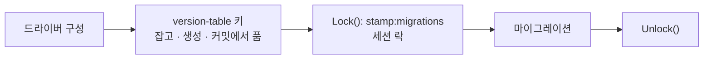

# fix: 동시성과 포화 — 증명 대신 운이 들어가 있는 자리

---

## Goal Capsule

CI가 지금 빨갛다. `TestMigrateSurvivesConcurrentBoot`가 실패했다 — **직전 라운드가 부팅 경합을 고쳤다고 증명한 바로 그 테스트다.**

```
--- FAIL: TestMigrateSurvivesConcurrentBoot (0.31s)
    store_test.go:812: boot 2: migrate: store: create schema_migrations:
        ERROR: type "schema_migrations" already exists (SQLSTATE 42710)
```

**로컬에서 재현됨: 미수정 동작 145회에 2회 실패(약 1.4%).** 그때도 초록이었다. 그 초록은 증명이 아니라 **약 98.6%의 확률로 경합이 일어나지 않은 결과**였다.

이 라운드가 닫는 것 하나: **부팅 경합이 견뎌지는 대신 없어지고, 그것을 지키는 검사가 운에 기대지 않는다. 그리고 포화 경계 셋이 관측된 값을 갖는다.**

---

## Problem Frame

### 같은 실수의 세 번째

`ensureVersionTable()`은 `CREATE TABLE IF NOT EXISTS schema_migrations`를 돌리고 중복 오류면 한 번 재시도한다. **재시도 로직 자체는 옳다** — 재시도가 커밋된 테이블을 발견하고 무해하게 끝난다. 틀린 것은 진입 조건이다. `isDuplicateObject()`가 `42P07`과 `23505`만 알고 **`42710`을 모른다.**

세 번 다 같은 모양이었다: **만난 사건만 처리했다.**

### 왜 사건 열거가 끝나지 않는가 (외부 조사로 확인)

PostgreSQL 소스에서 확인된 기제다. `CREATE TABLE`은 사전 확인을 **두 번** 한다:

| 단계 | 확인 대상 | 지면 나오는 코드 |
|---|---|---|
| `heap_create_with_catalog()` → `get_relname_relid()` | `pg_class` | **42P07** `duplicate_table` |
| 이어서 `GetSysCacheOid2(TYPENAMENSP)`, 그리고 `TypeCreate()` 내부 | `pg_type` (테이블의 암묵적 row type) | **42710** `duplicate_object` |
| 두 사전 확인을 **둘 다 통과**한 뒤 물리적 catalog insert | `pg_type_typname_nsp_index` 유니크 인덱스 | **23505** `unique_violation` |

어느 코드가 나오는지는 **순전히 스케줄링 운이다.** 경쟁자가 이미 커밋했으면 사전 확인이 잡아서 42P07이나 42710, 둘 다 아직 커밋 전이면 인덱스가 잡아서 23505.

Tom Lane(PostgreSQL 코어)이 이 정확한 버그에 대해 남긴 말:

> IF NOT EXISTS doesn't attempt to be bulletproof: it just checks at the start of the command to see if the object name is already there. So it's not sufficient to guard concurrent creations.

**이 표가 이 라운드의 답이다.** 세 코드는 **닫힌 집합**이다 — 이 문장에는 사전 확인 두 개와 유니크 인덱스 하나뿐이므로 넷째가 없다. 지난 두 번은 이 표를 만들지 않고 만난 코드를 적었다. **열거를 그만두는 것이 답이 아니라, 사건이 아니라 기제를 열거하는 것이 답이다.**

### 락은 이미 있다. 생성문만 그 밖에 있다

`internal/store/migrate.go`:

- 277행: `grantsLockKey = advisoryKey("stamp:grants")` — 트랜잭션 스코프 락의 기존 선례(343–355행)
- 384행: `d := &pgxMigrationDriver{..., lockKey: advisoryKey("stamp:migrations")}`
- 385행: `d.ensureVersionTable()` ← **어떤 락도 없다**
- 476행: `func (d *pgxMigrationDriver) Lock()` → `pg_try_advisory_lock($1)`

golang-migrate 자체 postgres 드라이버가 `pg_advisory_lock`을 쓰고, Atlas는 기본으로 advisory lock을 잡는다. **성숙한 도구가 수렴한 곳이 락이다.**

### 가드가 확률적으로만 실패한다

이것이 이 라운드의 진짜 문제다. `TestMigrateSurvivesConcurrentBoot`는 경합이 **실제로 일어났는지 확인하지 않는다.** 순차로 실행돼도 통과한다. 측정된 실패율이 **약 1.4%**(145회 중 2회)이므로, 이 테스트의 초록은 **약 98.6%의 경우 아무것도 증명하지 않는다.** 그리고 라운드 하나가 그 초록 위에 결론을 세웠다.

이 리포는 이미 답을 갖고 있다. `docs/operations/failure-modes.md:250–255`:

> Each of those tests releases its goroutines through a barrier and then asserts how many were inside the limiter at the same time, so that a run which happened to serialize fails instead of passing quietly.

**`internal/stream`과 `internal/api`의 동시성 테스트는 이미 이 관용구를 쓴다. `internal/store`만 안 쓴다.**

### 포화는 한 번도 측정된 적이 없다

`docs/HANDOFF.md` §4가 이름 붙인 셋:

| 경계 | 값 | 지금 아는 것 |
|---|---|---|
| 제한기 표 sweep-or-refuse | `DefaultMaxRateEntries = 8192` | `ingest_test.go:432–452`이 `MaxRateEntries: 2`로 동작을 고정. **실제 값에서는 관측된 적 없음** |
| 감사 버퍼 드롭 | `DefaultAuditCapacity = 4096` | 어느 부하에서 드롭이 시작되는지 모름 |
| 속도 예산이 인스턴스별 | — | `failure-modes.md:258`이 "N 레플리카가 N배"라고 주장. 측정된 적 없음 |

---

## Requirements

| R-ID | 요구 | 닫는 유닛 |
|---|---|---|
| **R43** | 속도 제한과 미결 상한, 초과는 deny와 **감사** | U3 |
| **R32** | 감사 유실 구간 마커와 **운영자 경보** | U3, U4 |

새 요구는 없다. **이미 선언된 것이 부하에서도 참인지 본다.** U1·U2는 요구가 아니라 **부팅이 살아남는다**는 전제를 지킨다.

---

## Key Technical Decisions

### KTD1. 경합을 견디는 대신 **없앤다** — 생성을 트랜잭션 스코프 advisory lock으로 감싼다

**생성은 지금 자리(드라이버 구성, 385행)에 그대로 두고, 그 문장만 `pg_advisory_xact_lock`을 잡은 트랜잭션 안에서 돌린다.** 키는 `advisoryKey("stamp:migrations:version-table")` — 마이그레이션 락과 **분리한다.**

**기각(그리고 이것이 이 계획이 검토에서 뒤집힌 자리)**: `ensureVersionTable`을 `Lock()` 안으로 옮기기. 초안이 이것을 골랐고 **틀렸다.** golang-migrate v4.19.1 `migrate.go:383–384`:

```go
func (m *Migrate) Version() (version uint, dirty bool, err error) {
	v, d, err := m.databaseDrv.Version()   // m.lock() 없음
```

`Version()`과 `Close()`가 `m.lock()`을 우회하는 **유일한** 두 드라이버 호출이고, 이 리포가 `Store.SchemaVersion`으로 쓰는 경로가 정확히 그것이다. 생성을 `Lock()` 안에 넣으면 **마이그레이션 전 데이터베이스에서 `SchemaVersion`이 `42P01`로 죽는다** — `store_test.go:201`이 그 경우 `ok=false, err=nil`을 단언한다.

**트랜잭션 스코프인 이유.** 같은 파일 343–355행의 `ApplyGrants`가 이미 이 모양이다: `pg_advisory_xact_lock`은 커밋이나 롤백에서 **부기 없이** 풀린다. 세션 스코프를 쓰면 해제 경로를 새로 만들어야 하고, 생성이 실패했을 때 락을 풀지 못하면 **그 연결이 풀에 돌아가면서 뒤따르는 모든 부팅을 90초씩 막는다.** 트랜잭션 스코프에는 그 실패 양식이 없다.

**락 순서.** version-table 키는 잡히고 **`stamp:migrations`가 잡히기 전에** 풀린다. 두 락을 동시에 쥐는 순간이 없으므로 순서 위험이 없다.

**기각**: `stamp:migrations`를 xact 락으로 재사용 — 부팅마다 peer의 **마이그레이션 전체**를 기다린 뒤 no-op 생성을 돌리고, 그다음 `Lock()`에서 또 기다린다.
**기각**: 42710만 추가 — 이번만 고치고 다음을 남긴다.
**기각**: `pg_catalog` 사전 조회 후 생성 — Tom Lane이 서술한 TOCTOU 간격이 그대로 남는다.
**기각**: 지정된 마이그레이터 하나만 두기(init container) — 배포 형태를 바꾸는 결정이고 `STAMP_DB_MIGRATE` 기본값의 의미를 바꾼다. 최소 목표 밖이다.

### KTD1b. `Lock()`의 폴링 이유는 여기에 전이되지 않는다 — 이유를 적어 둬라

`Lock()`이 블로킹 `pg_advisory_lock` 대신 폴링을 쓰는 이유는 **golang-migrate 고유**다(454–475행 주석): 라이브러리가 `LockTimeout`에 `Driver.Lock` 고루틴을 버리는데 호출자는 풀 연결을 반납하므로, 블로킹 락은 반납된 연결을 붙들게 된다. `migrationLockTimeout = migrationLockWait + 30s`의 순서가 그래서 load-bearing이다.

**새 락에는 그 위험이 없다.** 생성은 드라이버 구성 중 **우리 코드가 동기로** 부르고, 버리는 주체가 없고, 연결이 밑에서 빠지지 않는다. 그래서 여기서는 블로킹 `pg_advisory_xact_lock`이 옳다.

**그 사실이 주석에 있어야 한다.** 없으면 다음 사람이 "왜 여기는 폴링을 안 하지"라고 묻고, 답을 못 찾으면 폴링을 복사해 넣는다.

### KTD2. 벨트는 남긴다 — **사건이 아니라 기제**를 열거한다

**벨트가 필요한 이유는 하나이고 그것이 진짜다: 이 수정을 배포하는 롤링 업그레이드 그 자체.** 새 파드가 락 안에서 생성하는 동안 **구 파드는 여전히 락 밖에서 생성한다.** 그 한 번의 배포 동안 경합은 살아 있다. 락만 넣고 벨트를 빼면 **이 수정을 내보내는 배포에서 정확히 이 버그를 맞는다.**

(초안은 "다른 호출자가 있다"를 근거로 들었다. **거짓이다** — `isDuplicateObject`의 호출자는 421행 하나뿐이다.)

**`42P07`, `42710`, `23505` 셋.** Problem Frame의 기제 표가 이 문장에서 그 셋이 닫힌 집합임을 보인다.

**클래스 42를 통째로 잡는 것은 위험하다.** 클래스 42는 `syntax_error_or_access_rule_violation`이고 그 안에 **`42501 insufficient_privilege`**, `42601 syntax_error`, `42P01 undefined_table`이 있다. `isDuplicateObject`가 그것들을 참으로 답하면 **최소 권한 배포에서 권한 거부가 "이미 있다"로 읽히고 부팅이 성공한다.** 같은 패키지의 `grants.sql`이 정확히 반대를 약속한다 — 권한 실패는 삼켜지지 않고 부팅을 시끄럽게 죽인다.

**기각**: 클래스 42 통째 — 권한 거부와 문법 오류를 삼킨다.
**기각**: 클래스 23 통째 — FK·CHECK 위반이 조용히 재시도된다.
**기각**: 문서화된 `duplicate_*` 족보 전체(`42P06` 등) — 이 문장이 낼 수 없는 코드다. 기제가 근거일 때만 열거가 정당하고, 기제 없는 열거는 추측이다.

### KTD3. 동시성 검사를 **결정적인 부분과 확률적인 부분으로 나눈다**

- **결정적**: `isDuplicateObject`에 각 SQLSTATE를 **직접 넣어** 확인한다. 실물 함수에 실물 `*pgconn.PgError`를 준다. 운이 없다.
- **확률적**: 실제 동시 부팅 테스트는 남기되, **경합이 실제로 일어났음을 배리어로 관측**한다 — `failure-modes.md:250–255`가 이미 문서화한 이 리포의 관용구.

**기각**: `-count=50`으로 덮기 — 확률을 낮출 뿐, 통과가 무엇을 뜻하는지는 그대로 불분명하다.

### KTD4. 포화는 **관측이 먼저, 단언이 나중**

포화 유닛의 가치는 우리가 믿는 것이 아니라 **실제로 일어나는 것**을 적는 데 있다. 기대를 먼저 쓰면 발견을 기대에 맞추게 된다.

**인스턴스별 예산은 측정하고 문서화하되 고치지 않는다.** 고치려면 분산 예산이 필요하고 그것은 아키텍처 결정이다.

**기각**: 새 부하 도구(k6, vegeta) — 기존 `bench/`와 testcontainers 하니스로 충분한지 먼저 본다.

### KTD5. **PR 둘로 착지한다** — 빨간 CI를 열린 결말 뒤에 두지 않는다

라운드 1–4는 각각 PR 하나였다. **이 라운드는 다르다: 절반이 지금 빨간 CI를 고치고, 절반은 마감이 없는 측정이다.** KTD4가 포화 관측에서 나쁜 것이 나올 수 있다고 명시하는데, 그렇게 되면 **이미 증명된 부팅 수정이 열린 조사에 인질로 잡힌다.**

- **PR 1 = U1 + U2** — 부팅 경합. 즉시.
- **PR 2 = U3 + U4** — 포화 관측.

**기각**: 라운드 = PR 하나(선행 관행) — 선례는 전부 마감 없는 라운드였다. 이 라운드에는 급한 절반이 있다.

---

## High-Level Technical Design

```mermaid
sequenceDiagram
    participant A as 파드 A
    participant B as 파드 B
    participant PG as PostgreSQL

    Note over A,PG: 지금 — 생성에 어떤 락도 없다
    A->>PG: CREATE TABLE IF NOT EXISTS
    B->>PG: CREATE TABLE IF NOT EXISTS
    Note over PG: 사전 확인 · catalog insert 경합
    PG-->>B: 42P07 / 42710 / 23505 (어느 쪽인지는 운)
    Note over B: isDuplicateObject가 모르는 코드면 부팅이 죽는다

    Note over A,PG: 고친 뒤 — 생성이 자기 xact 락 안에 있다
    A->>PG: BEGIN; pg_advisory_xact_lock('…:version-table')
    B->>PG: BEGIN; pg_advisory_xact_lock(같은 키) — 블록
    A->>PG: CREATE TABLE IF NOT EXISTS; COMMIT
    Note over PG: 커밋이 락을 푼다 — 해제 경로 없음
    B->>PG: CREATE TABLE IF NOT EXISTS — 이미 있다, no-op; COMMIT
    Note over B: 중복 오류가 나올 자리가 없다
```

락 순서 — 두 락을 동시에 쥐는 순간이 없다:



---

## Implementation Units

> **PR 1 = U1 + U2** (KTD5). CI가 빨갛다.

### U1. 부팅 경합을 견디는 대신 없앤다

- **Goal:** 동시 부팅에서 중복 오류가 **나올 자리가 없어진다.** CI가 초록으로 돌아온다.
- **Requirements:** 없음 — 부팅이 살아남는다는 전제를 지킨다.
- **Dependencies:** 없음.
- **Files:** `internal/store/migrate.go`, `internal/store/store_test.go`.
- **Approach:**
  1. **먼저 `internal/store/migrate.go`를 읽어라** — 특히 `ApplyGrants`(293–355행, **따라 쓸 선례**), `ensureVersionTable`(392–426행), `Lock()`(454–504행), `advisoryKey()`(597행 근처).
  2. `ensureVersionTable`이 생성을 **트랜잭션 안에서, `pg_advisory_xact_lock(advisoryKey("stamp:migrations:version-table"))`을 먼저 잡고** 실행하게 한다(KTD1). `ApplyGrants`의 343–355행을 그대로 따르라 — 커밋이 락을 풀고, **해제 경로를 새로 만들지 않는다.**
  3. **호출 지점(385행)을 옮기지 마라.** 초안이 `Lock()` 안으로 옮기려 했고 그건 틀렸다 — KTD1이 왜인지 적어 뒀다. 생성은 드라이버 구성에 남는다.
  4. `isDuplicateObject`에 `42710`을 더한다 — **셋에서 멈춘다**(KTD2). 클래스 매칭을 하지 마라. 주석에 Problem Frame의 기제 표(사전 확인 둘 + 유니크 인덱스 하나 = 닫힌 셋)를 남겨서 **다음 사람이 왜 셋인지 알게 하라.**
  5. **주석 셋을 실물에 맞게 고쳐라** — 이 리포에서 주석은 load-bearing이다:
     - 392–410행: "재시도가 이것을 안전하게 만든다" → 이제 안전을 만드는 것은 락이고, 재시도는 롤링 업그레이드용 벨트다(KTD2).
     - 454–475행 인접: 새 락이 왜 블로킹이어도 되는지(KTD1b).
     - **178–185행**(`AppliedSchemaVersion`의 doc): "building a migrator runs `CREATE TABLE IF NOT EXISTS` before it reads anything"이 이 유닛으로 미묘하게 달라진다(이제 락 안에서 돈다). 이 주석은 `AppliedSchemaVersion`이 별도로 존재하는 근거이므로 정확해야 한다.
- **Execution note:** **먼저 현재 코드에서 실패를 재현하라.** `go test -run TestMigrateSurvivesConcurrentBoot -count=100 ./internal/store/`로 재현된다(측정된 실패율 약 1.4%이므로 `-count=15`로는 대개 재현되지 않는다). 재현을 보지 않고 고치면 무엇을 고쳤는지 모른다.
- **Test scenarios:**
  - `isDuplicateObject`가 `42P07`을 참으로 답한다.
  - `isDuplicateObject`가 `42710`을 참으로 답한다 — **지금 실패하는 케이스.**
  - `isDuplicateObject`가 `23505`를 참으로 답한다.
  - `isDuplicateObject`가 **`42501`(권한 없음)을 거짓**으로 답한다 — 클래스 42로 넓히지 않았음을 고정. **이것이 없으면 최소 권한 배포에서 권한 거부가 성공으로 읽히는 회귀를 막을 수 없다.**
  - `isDuplicateObject`가 **`23503`(FK 위반)을 거짓**으로 답한다.
  - `isDuplicateObject`가 `pgconn.PgError`가 아닌 오류를 거짓으로 답한다.
  - `TestMigrateSurvivesConcurrentBoot`가 통과한다.
  - **마이그레이션되지 않은 데이터베이스에서 `SchemaVersion`이 여전히 `ok=false, err=nil`을 답한다** — `store_test.go:201`이 이미 단언한다. 이것이 초안을 뒤집은 경로이므로 깨지지 않았음을 확인하라.
  - 동시 부팅 뒤 모든 부트가 최신 스키마 버전에 도달했다고 동의한다(기존 단언 유지).
- **Verification:** `go test -race -count=20 -run 'TestMigrate|TestSchemaVersion|TestDuplicate' ./internal/store/` 통과. `make land` 그린. 고치기 **전**에 재현을 봤을 것.

### U2. 동시성 검사가 운에 기대지 않는다

- **Goal:** 동시 부팅 테스트가 **경합이 실제로 일어났는지** 말한다. 순차 실행으로 통과하는 상태가 끝난다.
- **Requirements:** 없음 — 검사의 신뢰도를 지킨다.
- **Dependencies:** U1.
- **Files:** `internal/store/store_test.go`, `docs/testing/mutation-matrix.md`.
- **Approach:**
  1. **이 리포의 기존 관용구를 따르라.** `failure-modes.md:250–255`가 문서화하고 `internal/stream`·`internal/api`가 쓰는 것: 배리어로 고루틴을 풀고 **동시에 안에 있던 수를 단언한다.** `internal/store`만 이걸 안 쓴다. 새 관용구를 만들지 마라.
  2. 동시에 생성 트랜잭션 안에 있던(또는 version-table 락을 기다린) 부트 수가 **1을 넘었음**을 단언한다. 넘지 않은 실행은 **직렬화된 것이므로 조용히 통과하면 안 된다.**
  3. **뮤테이션은 U1의 두 변경을 함께 되돌려야 한다.** 락만 되돌리면 넓어진 `isDuplicateObject`가 `42710`을 처리해서 **초록으로 남는다** — 뮤테이션이 아무것도 증명하지 못한다. 락을 빼고 **동시에** `isDuplicateObject`를 `42P07`/`23505`로 좁혀야 원래 실패가 재현된다. 픽스처가 아니라 `migrate.go` 실물에 심어라.
  4. 뮤테이션은 확률적이므로(약 1.4%) **몇 회 돌려 확인했는지 기록하라.** 한 번 초록인 것은 뮤테이션 실패가 아니라 그 실행에서 경합이 없었다는 뜻이다 — 그 구분이 이 유닛의 요지다.
  5. 결과를 `docs/testing/mutation-matrix.md`에 이어 쓴다. `internal/store` 행이 아직 없으므로 다른 패키지 행의 형식을 따르라.
- **Execution note:** 이 유닛의 red는 **짝지은 뮤테이션에서 테스트가 빨개지는 것**이다. 그것을 보지 못했으면 이 유닛은 끝나지 않았다. 확인 뒤 되돌리고, 되돌아왔는지 `git diff`로 확인하라.
- **Test scenarios:**
  - 동시에 안에 있던 부트 수가 1을 넘었음이 단언된다.
  - 직렬화된 실행이 조용히 통과하지 않는다.
  - 짝지은 뮤테이션(락 제거 + 코드 좁힘)에서 테스트가 실패한다 — 뮤테이션 감사에 회수와 함께 기록.
- **Verification:** `go test -race -count=20 -run TestMigrate ./internal/store/` 통과. 뮤테이션 결과가 `mutation-matrix.md`에 있다.

> **PR 2 = U3 + U4** (KTD5).

### U3. 포화 경계 셋을 관측한다

- **Goal:** 세 경계에서 실제로 무슨 일이 나는지 **관측된 값**을 갖는다.
- **Requirements:** R43, R32.
- **Dependencies:** 없음(U1·U2와 독립).
- **Files:** `internal/stream/ingest_test.go`, `internal/api/auditwindow_test.go`, `internal/runtime/` 아래 기존 하니스를 쓰는 테스트.
- **Approach:**
  1. **기대를 먼저 쓰지 말고 관측부터 하라**(KTD4).
  2. **제한기 표 경계.** `ingest_test.go:432–452`가 이미 `MaxRateEntries: 2`로 동작(표가 차고 sweep이 회수 못하면 `ErrRateLimited`, 회수 가능하면 다시 허용)을 고정한다. **한계 가치는 동작이 아니라 규모다** — `DefaultMaxRateEntries = 8192`에서 같은 동작이 성립하는지, 8192개를 채우는 비용이 얼마인지. `sweepLocked`는 가득 찬 버킷만 회수하므로 고정된 순간에 `AllowAt`으로 부분 소진시킨 버킷은 회수되지 않는다.
  3. **감사 버퍼 드롭.** **`cfg.Now`로 flush 시점을 제어할 수 없다** — `AuditBuffer.Run`이 `time.NewTicker(b.interval)`로 flush하고(`audit.go:463–474`), `cfg.Now`는 이벤트 시각과 gap 창 경계만 찍는다. **`auditwindow_test.go:49`가 이미 쓰는 모양을 따르라: `FlushInterval`을 테스트보다 길게 두고 `Flush`를 직접 부른다.** 드롭은 `len(queue) >= capacity`로만 정해지므로(`audit.go:322–327`), 임계는 벽시계 유입률이 아니라 **flush 간격당 이벤트 수**로 기록하라.
  4. **R43의 감사 절반을 빠뜨리지 마라.** R43은 "초과는 deny **와 감사**"다. 표 포화로 거부된 호출자에게 **감사 기록이 남는지** 확인하고, 그 기록이 무엇이라고 말하는지 관측하라 — `internal/api/ratelimit.go`의 `refuseRate`는 `Scope`와 설정된 `Limit`을 찍으므로, **자기 예산을 쓰지도 않은 호출자가 예산 초과로 기록될 수 있다.** 그렇다면 그것이 이 유닛의 발견이다.
  5. **R32의 경보 절반도 마찬가지.** gap 마커만이 아니라 **운영자 경보가 실제로 울리는지.** `DefaultAuditAlertThreshold = 1`에서 `onAlert`가 한 번 울고 `alerting`이 래치된다 — 그 래치가 언제 풀리는지도 관측하라.
  6. **인스턴스별 예산.** 두 인스턴스를 **서로 다른 `writerID`(및 `InstanceID`)로** 같은 `dsn`에 세워라 — `newHarness`의 기본 `writerID`가 공유되면 둘째가 `store.ErrWriterTaken`으로 `Assemble`에 실패한다(`audit.go:194–203`, 의도된 동작). `wiring_test.go:1528`이 그 모양을 쓴다. **고치지 마라** — 측정하고 문서화한다(KTD4).
  7. **새 부하 도구를 들이지 마라.** 기존 하니스로 부족한 것이 있으면 보고하라.
- **Execution note:** 관측을 먼저, 단언을 나중에. **실시간을 기다리게 만들지 마라** — 제한기는 `AllowAt`으로, 감사 버퍼는 긴 `FlushInterval` + 직접 `Flush`로.
- **Test scenarios:**
  - 제한기 표가 `DefaultMaxRateEntries`를 넘고 sweep이 회수하지 못할 때 새 키가 **거부**된다.
  - sweep이 회수할 수 있으면 경계를 넘어도 허용된다 — 거부가 무조건이 아님을 고정.
  - **표 포화로 거부된 요청에 감사 기록이 정확히 하나 남는다**(R43), 그리고 그 기록이 무엇을 원인으로 말하는지가 관측된 값으로 기록된다.
  - 감사 버퍼가 용량을 넘으면 드롭하고 **gap 마커가 체인에 남는다**(R32).
  - **경보가 임계에서 정확히 한 번 울고, 언제 풀리는지가 관측된다**(R32).
  - 드롭 임계가 **flush 간격당 이벤트 수**로 기록된다.
  - 두 인스턴스가 같은 호출자에게 각자의 예산을 준다 — 배수가 관측된 값으로 기록된다.
- **Verification:** `go test -race ./internal/stream/ ./internal/api/ ./internal/runtime/` 통과. 관측 표가 커밋돼 있다.

### U4. 관측된 것이 운영자가 읽는 곳에 간다

- **Goal:** U3이 관측한 값이 문서가 되고, 각 주장이 자기를 지키는 테스트를 인용한다.
- **Requirements:** R32, R43.
- **Dependencies:** U3.
- **Files:** `docs/operations/failure-modes.md`, `docs/HANDOFF.md`.
- **Approach:**
  1. U3의 표를 `failure-modes.md`의 기존 형식으로 옮긴다 — **각 행이 그것을 지키는 테스트를 인용한다**(245–252행이 그 형식이다).
  2. `failure-modes.md:258`의 "N 레플리카가 N배" 주장에 **측정된 값**을 붙인다.
  3. `docs/HANDOFF.md` 갱신: §2 표에 이 라운드를 더하고, §4(남은 라운드)를 완료로, U3이 고치지 않기로 한 것을 §5로 근거와 함께 옮긴다.
  4. §3(반복된 결함 부류)에 이 라운드의 교훈을 넣어라: **"열거를 그만두는 것이 답이 아니라, 사건이 아니라 기제를 열거하는 것이 답이다."** 그리고 **가드가 1.4%로만 실패하면 초록은 98.6%의 경우 아무 말도 하지 않는다.**
- **Test scenarios:** `Test expectation: none` — 문서.
- **Verification:** 문서의 각 주장이 U3의 테스트 이름을 인용한다.

---

## Verification Contract

| 게이트 | 적용 |
|---|---|
| `make land` | 전 유닛 |
| `go test -race -count=20 -run TestMigrate ./internal/store/` | U1, U2 |
| 짝지은 뮤테이션이 회수와 함께 `mutation-matrix.md`에 기록됨 | U2 |
| 관측 표가 커밋됨 | U3, U4 |

---

## Definition of Done

1. **동시 부팅에서 중복 오류가 나올 자리가 없다** — 견디는 것이 아니라 없앤 것이다. CI가 초록이다.
2. `isDuplicateObject`가 `42P07`/`42710`/`23505` 셋에 답하고, **`42501`과 `23503`에 거짓으로 답한다는 것이 테스트로 고정돼 있다.**
3. **동시성 테스트가 경합이 일어났는지 말한다.** 직렬화된 실행이 조용히 통과하지 않는다.
4. 포화 경계 셋에 **관측된 값**이 있고, R43의 감사와 R32의 경보 — **각 요구의 두 번째 절반** — 이 함께 관측됐다.
5. 고치지 않기로 한 것이 근거와 함께 기록돼 있다.

---

## Assumptions

- **PR 1(U1+U2)이 먼저 착지한다**(KTD5). PR 2는 그 뒤에 이어진다.
- U3의 제한기 부분은 **규모 확인**이지 새 동작 확인이 아니다 — 동작은 `ingest_test.go:432–452`가 이미 고정한다. 규모에서 새로 드러나는 것이 없으면 그것도 결과다.

---

## Scope Boundaries

### 하지 않는 것

- **인스턴스별 예산을 고치지 않는다.** 분산 예산은 아키텍처 결정이다. 측정하고 기록한다.
- **배포 형태를 바꾸지 않는다.**
- **새 부하 도구를 들이지 않는다.**
- **감사 버퍼의 비동기 설계를 바꾸지 않는다.** R32가 의도적으로 고른 거래다.
- **`isDuplicateObject`를 클래스 매칭으로 만들지 않는다**(KTD2).

### 이연

- 분산 속도 예산
- 표 포화 거부와 예산 초과 거부를 API 수준에서 구분하기(U3이 발견하면 기록만)
- 타이밍 부채널
- 인제스트 rate 정규화가 나머지 넷과 갈라지는 것
